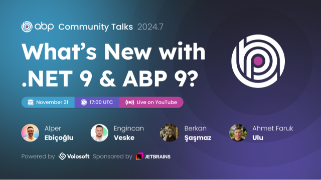

# ABP.IO Platform 9.0 Has Been Released Based on .NET 9.0


Today, [ABP](https://abp.io/) 9.0 stable version has been released based on [.NET 9.0](https://dotnet.microsoft.com/en-us/download/dotnet/9.0). You can create solutions with ABP 9.0 starting from ABP Studio v0.9.11 or by using the ABP CLI as explained in the following sections.

## What's New With Version 9.0?

All the new features were explained in detail in the [9.0 RC Announcement Post](https://abp.io/blog/announcing-abp-9-0-release-candidate), so there is no need to review them again. You can check it out for more details. 

## Getting Started with 9.0

### Creating New Solutions

You can check the [Get Started page](https://abp.io/get-started) to see how to get started with ABP. You can either download [ABP Studio](https://abp.io/get-started#abp-studio-tab) (**recommended**, if you prefer a user-friendly GUI application - desktop application) or use the [ABP CLI](https://abp.io/docs/latest/cli) to create new solutions.

By default, ABP Studio uses stable versions to create solutions. Therefore, it will be creating the solution with the latest stable version, which is v9.0 for now, so you don't need to specify the version. **You can create solutions with ABP 9.0 starting from v0.9.11.**

### How to Upgrade an Existing Solution

You can upgrade your existing solutions with either ABP Studio or ABP CLI. In the following sections, both approaches are explained:

### Upgrading via ABP Studio

If you are already using the ABP Studio, you can upgrade it to the latest version to align it with ABP v9.0. ABP Studio periodically checks for updates in the background, and when a new version of ABP Studio is available, you will be notified through a modal. Then, you can update it by confirming the opened modal. See [the documentation](https://abp.io/docs/latest/studio/installation#upgrading) for more info.

After upgrading the ABP Studio, then you can open your solution in the application, and simply click the **Switch to stable** action button to instantly upgrade your solution:


> Please note that ABP CLI & ABP Studio only upgrade the related ABP packages, so you need to upgrade the other packages for .NET 9.0 manually. 

### Upgrading via ABP CLI

Alternatively, you can upgrade your existing solution via ABP CLI. First, you need to install the ABP CLI or upgrade it to the latest version.

If you haven't installed it yet, you can run the following command:

```bash
dotnet tool install -g Volo.Abp.Studio.Cli
```

Or to update the existing CLI, you can run the following command:

```bash
dotnet tool update -g Volo.Abp.Studio.Cli
```

After installing/updating the ABP CLI, you can use the [`update` command](https://abp.io/docs/latest/CLI#update) to update all the ABP related NuGet and NPM packages in your solution as follows:

```bash
abp update
```

You can run this command in the root folder of your solution to update all ABP related packages.

> Please note that ABP CLI & ABP Studio only upgrade the related ABP packages, so you need to upgrade the other packages for .NET 9.0 manually. 

## Migration Guides

There are a few breaking changes in this version that may affect your application. Please read the migration guide carefully, if you are upgrading from v8.x: [ABP Version 9.0 Migration Guide](https://abp.io/docs/9.0/release-info/migration-guides/abp-9-0)

## Community News

### Highlights from .NET 9.0

Our team has closely followed the ASP.NET Core and Entity Framework Core 9.0 releases, read Microsoft's guides and documentation, and adapted the changes to our ABP.IO Platform. We are proud to say that we've shipped the ABP 9.0 based on .NET 9.0 just after Microsoft's .NET 9.0 release.

In addition to the ABP's .NET 9.0 upgrade, our team has created many great articles to highlight the important features coming with ASP.NET Core 9.0 and Entity Framework Core 9.0.

> You can read [this post](https://volosoft.com/blog/Highlights-for-ASP-NET-Entity-Framework-Core-NET-9-0) to see the list of all articles.

### New ABP Community Articles

In addition to [the articles to highlight .NET 9.0 features written by our team](https://volosoft.com/blog/Highlights-for-ASP-NET-Entity-Framework-Core-NET-9-0), here are some of the recent posts added to the [ABP Community](https://abp.io/community):

* [Video: Building Modular Monolith Applications with ASP.NET Core & ABP Studio](https://abp.io/community/videos/building-modular-monolith-applications-with-asp.net-core-abp-studio-66znukvf) by [Halil İbrahim Kalkan](https://x.com/hibrahimkalkan)
* [How to create your Own AI Bot on WhatsApp Using an ABP.io Template](https://abp.io/community/articles/how-to-create-your-own-ai-bot-on-whatsapp-using-the-abp-framework-c6jgvt9c) by [Michael Kokula](https://abp.io/community/members/Michal_Kokula)
* [ABP Now Supports .NET 9](https://abp.io/community/articles/abp-now-supports-.net-9-zpkznc4f) by [Alper Ebiçoğlu](https://x.com/alperebicoglu)

Thanks to the ABP Community for all the content they have published. You can also [post your ABP related (text or video) content](https://abp.io/community/posts/submit) to the ABP Community.

### ABP Community Talks 2024.7: What’s New with .NET 9 & ABP 9?



In this episode of ABP Community Talks, 2024.7; we will dive into the features that came with .NET 9.0 with [Alper Ebicoglu](https://github.com/ebicoglu), [Engincan Veske](https://github.com/EngincanV), [Berkan Sasmaz](https://github.com/berkansasmaz) and [Ahmet Faruk Ulu](https://github.com/ahmetfarukulu).

## Conclusion

This version comes with some new features and a lot of enhancements to the existing features. You can see the [Road Map](https://docs.abp.io/en/abp/9.0/Road-Map) documentation to learn about the release schedule and planned features for the next releases. Please try ABP v9.0 and provide feedback to help us release more stable versions.

Thanks for being a part of this community!
