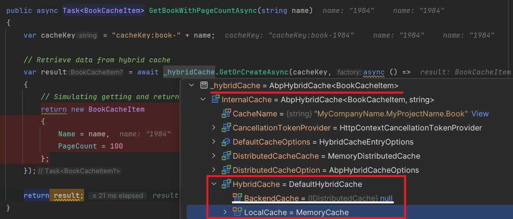

# Hybrid Cache in .NET 9

.NET 9 introduces an exciting feature: **HybridCache**, an advanced caching mechanism that seamlessly combines multiple caching strategies to maximize performance and scalability. 

It offers a flexible caching solution that combines the best aspects of local and distributed caching. **HybridCache** is particularly useful in scenarios where quick, in-memory access is desirable but data consistency across multiple application instances is also a requirement.

In this article, we’ll explore **HybridCache** in .NET 9 and how it integrates with ABP Framework using `AbpHybridCache`. This new feature offers a robust solution for applications that need to scale while maintaining efficient caching strategies.

## What is HybridCache?

**HybridCache** is designed to merge different caching layers, commonly including an in-memory cache (for high-speed access) and a distributed cache (for scalability across multiple instances). This hybrid approach allows for:

* **Improved Performance**: Frequently accessed data is stored in-memory, reducing latency.
* **Increased Scalability**: Cached data can still be shared across distributed environments, essential for load-balanced applications.
* **Automatic Synchronization**: Changes in distributed cache automatically update the in-memory cache, ensuring data consistency.

## Using HybridCache with ABP

> For more information about the implementation in the ABP side, you can refer to the pull request [here](https://github.com/abpframework/abp/pull/20859).

ABP's support for **HybridCache** is available starting from version 9.0 through the [`AbpHybridCache`](https://github.com/abpframework/abp/blob/dev/framework/src/Volo.Abp.Caching/Volo/Abp/Caching/Hybrid/AbpHybridCache.cs) implementation. By leveraging this feature, developers using ABP can implement hybrid caching in a way that aligns with ABP’s modular and extensible architecture.

To demonstrate how to use **HybridCache** in ABP, let's start with a simple example.

> You can create an ABP-based application with v9.0+, and then follow the next steps for using hybrid caching in your application.

### Configuring the `AbpHybridCacheOptions` (Optional)

First, you can configure the hybrid cache options in your module class as below (it's optional):

```csharp
using Microsoft.Extensions.Caching.Hybrid;
using Volo.Abp.Caching.Hybrid;

public class YourModule : AbpModule
{
    public override void ConfigureServices(ServiceConfigurationContext context)
    {
        //...

        Configure<AbpHybridCacheOptions>(options =>
        {
            //configuring the global hybrid cache options
            options.GlobalHybridCacheEntryOptions = new HybridCacheEntryOptions()
            {
                Expiration = TimeSpan.FromMinutes(20),
                LocalCacheExpiration = TimeSpan.FromMinutes(10)
            };
        });
    }
}
```

* You can configure the `AbpHybridCacheOptions` to set *keyPrefix* for your cache keys, throw or hide exceptions for the distributed cache (by default *it hides errors*), or configure cache for specific cache item keys and more...
* By setting the `GlobalHybridCacheEntryOptions`, you specify the caching options globally in your application. Thanks to that, you don't need to manually pass the related options whenever you use the `IHybridCache` service.

### Using the `IHybridCache` Service

After the configuration, now you can inject the `IHybridCache` and use it to set and retrieve cache values:

```csharp
using Volo.Abp.Caching.Hybrid;

public class BookAppService : ApplicationService, IBookAppService
{
    private readonly IHybridCache<BookCacheItem> _hybridCache;

    public BookAppService(IHybridCache<BookCacheItem> hybridCache)
    {
        _hybridCache = hybridCache;
    }

    public async Task<BookCacheItem> GetBookWithPageCountAsync(string name)
    {
        var cacheKey = "cacheKey:book-" + name;

        // Retrieve data from hybrid cache
        return await _hybridCache.GetOrCreateAsync(cacheKey, async () =>
        {
            // Simulating getting and returning the data if not exist in the cache
            return new BookCacheItem
            {
                Name = name,
                PageCount = 100
            };
        });
    }
}

public class BookCacheItem
{
    public string Name { get; set; }

    public int PageCount { get; set; }
}
```

* You can use the `IHybridCache<TCacheItem>` or `IHybridCache<TCacheItem, TCacheKey>` service to leverage the hybrid caching. If you use `IHybridCache<TCacheItem>`as the service, then you should pass the cache key as *string* like in the example above.
* In this example, you used the `GetOrCreateAsync` method, which first tries to get the cache item with the provided cache key, if there is no cache with the specified key, then it runs the factory method and add the returned data to the cache.
* Alternatively, you can use the `SetAsync` method to set the cache item.

### Debugging the `IHybridCache` Service (deep-dive)

When you debug the `IHybridCache` service, you'll notice the L1 and L2 cache stores. (L1 is in-memory cache store and L2 is the distributed cache store):



As you can see from the figure, it only set the cache item to the **LocalCache** (`MemoryCache`) and did not set the **BackendCache** (`DistributedCache`) because I did not configure the distributed cache and not running my application in multiple instances. But as you can notice, even without an `IDistributedCache` configuration, the `HybridCache` service will still provide in-process caching.

**Note:** If you configure distributed caching options, `HybridCache` service uses the distributed cache and sets the **BackendCache**.

## Conclusion

The **HybridCache** library in .NET 9 provides a powerful tool for applications needing both high-speed caching and consistency in distributed environments. 

With ABP Framework’s `AbpHybridCache` support, integrating this feature into an ABP-based application becomes straightforward. This setup helps ensure that cached data remains synchronized across instances, bringing a new level of flexibility to caching in .NET 9 applications.

> For more information, you can refer to the [Microsoft's official document](https://learn.microsoft.com/en-us/aspnet/core/release-notes/aspnetcore-9.0?view=aspnetcore-9.0#new-hybridcache-library).

## References

- https://learn.microsoft.com/en-us/aspnet/core/release-notes/aspnetcore-9.0?view=aspnetcore-9.0#new-hybridcache-library
- https://www.youtube.com/watch?v=TDyZc11cJfA
- https://github.com/abpframework/abp/pull/20803
- https://github.com/abpframework/abp/pull/20859
