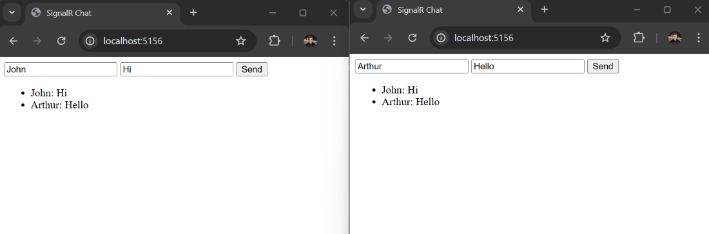

# SignalR supports trimming and Native AOT

## What is SignalR?

SignalR is a library that allows you to add real-time web functionality to your applications. It provides a simple API for creating server-to-client remote procedure calls (RPC) that can be called from the server and client. Now SignalR supports trimming and Native AOT in .NET 8.0 and .NET 9.0. You can learn more about [SignalR new features](https://abp.io/community/articles/asp.net-core-signalr-new-features-summary-kcydtdgq) in this article.

## What is trimming and Native AOT?

AOT (Ahead-of-Time) compilation is a feature that allows you to compile your application into native code before running it. This can help improve performance and reduce startup times. Trimming is a feature that allows you to remove unused code from your application, reducing its size and improving performance. You can learn more about [Native AOT Compilation](https://abp.io/community/articles/native-aot-compilation-in-.net-8-oq7qtwov) in this article.

## How to use SignalR with trimming and Native AOT?

You can create ASP.NET Core AOT application with using the following command:

```bash
dotnet new webapiaot -n Acme.Sample
```

The created application uses `CreateSlimBuilder` method to create minimal builder for the application. You can use `CreateBuilder` method to create a builder with all the services registered. However, deploying an application with `CreateSlimBuilder` method is more convenient because it reduces the size of the application. You can learn more about [CreateSlimBuilder vs CreateBuilder](https://learn.microsoft.com/en-us/aspnet/core/fundamentals/native-aot#createslimbuilder-vs-createbuilder). 

Replace the `Program.cs` file with the following code:

```csharp
using Microsoft.AspNetCore.SignalR;
using System.Text.Json.Serialization;

var builder = WebApplication.CreateSlimBuilder(args);

builder.Services.AddSignalR();
builder.Services.Configure<JsonHubProtocolOptions>(o =>
{
    o.PayloadSerializerOptions.TypeInfoResolverChain.Insert(0, AppJsonSerializerContext.Default);
});

var app = builder.Build();

app.MapHub<ChatHub>("/chatHub");
app.MapGet("/", () => Results.Content("""
<!DOCTYPE html>
<html>
<head>
    <title>SignalR Chat</title>
</head>
<body>
    <input id="userInput" placeholder="Enter your name" />
    <input id="messageInput" placeholder="Type a message" />
    <button onclick="sendMessage()">Send</button>
    <ul id="messages"></ul>

    <script src="https://cdnjs.cloudflare.com/ajax/libs/microsoft-signalr/8.0.7/signalr.min.js"></script>
    <script>
        const connection = new signalR.HubConnectionBuilder()
            .withUrl("/chatHub")
            .build();

        connection.on("ReceiveMessage", (user, message) => {
            const li = document.createElement("li");
            li.textContent = `${user}: ${message}`;
            document.getElementById("messages").appendChild(li);
        });

        async function sendMessage() {
            const user = document.getElementById("userInput").value;
            const message = document.getElementById("messageInput").value;
            await connection.invoke("SendMessage", user, message);
        }

        connection.start().catch(err => console.error(err));
    </script>
</body>
</html>
""", "text/html"));

app.Run();

[JsonSerializable(typeof(string))]
internal partial class AppJsonSerializerContext : JsonSerializerContext { }

public class ChatHub : Hub
{
    public async Task SendMessage(string user, string message)
    {
        await Clients.All.SendAsync("ReceiveMessage", user, message);
    }
}
```

It is a simple chat application that uses SignalR to send and receive messages. 



Before deploying the application, ensure that **Desktop development with C++** is installed on your machine if you're using Windows OS. For more details, you can check the [pre-requisites](https://learn.microsoft.com/en-us/dotnet/core/deploying/native-aot#prerequisites).

You can deploy the application with the following command:

```bash
dotnet publish -c Release
```

### Limitations

Since we are using Native AOT, there are some limitations that you should be aware of: 

- **Only the JSON protocol is supported**: For the payload serialization in SignalR, only the JSON protocol is supported. You need to configure the `JsonHubProtocolOptions` to use the `AppJsonSerializerContext` for serialization/deserialization.
- **Reflection**: Native AOT does not support reflection. You need to use the `JsonSerializable` attribute to specify the types that should be serialized/deserialized. In this example, we have used the `JsonSerializable` attribute for the `string` type in the `AppJsonSerializerContext` class.

For more details, you can check the [limitations](https://learn.microsoft.com/en-us/dotnet/core/deploying/native-aot#limitations-of-native-aot-deployment) of Native AOT.

## Conclusion

In this article, we learned how to use SignalR with trimming and Native AOT in .NET 8.0 and .NET 9.0. We created a simple chat application that uses SignalR to send and receive messages. We also discussed the limitations of using Native AOT and how to overcome them.

For more information, you can refer to the [Microsoft's official document](https://learn.microsoft.com/en-us/aspnet/core/release-notes/aspnetcore-9.0?view=aspnetcore-9.0#signalr-supports-trimming-and-native-aot).