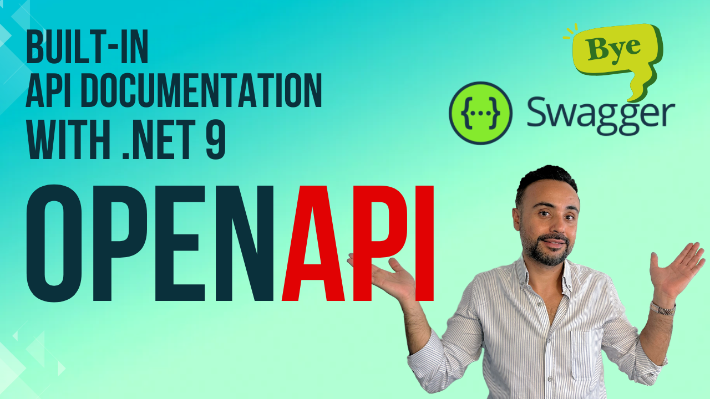
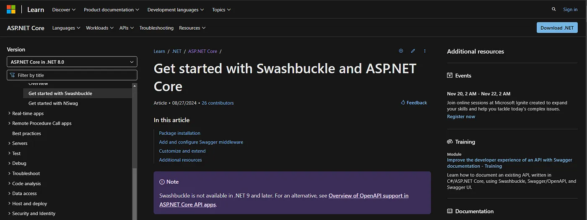
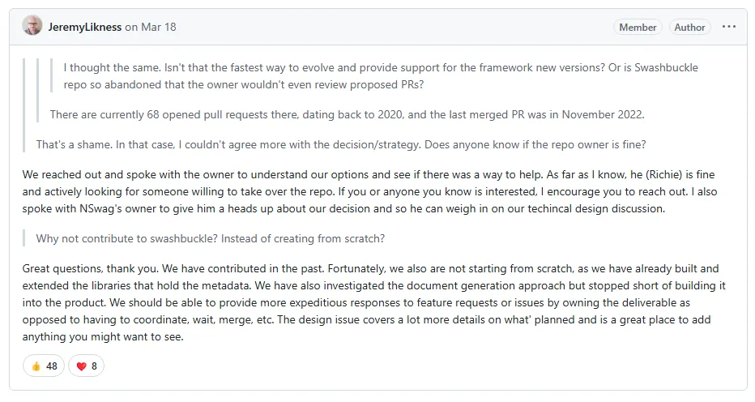
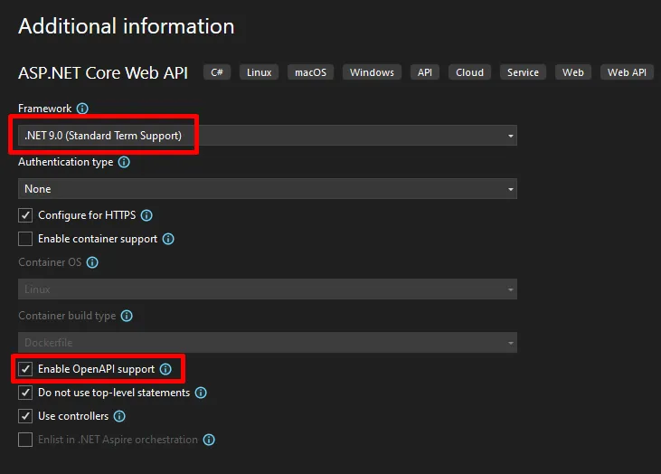
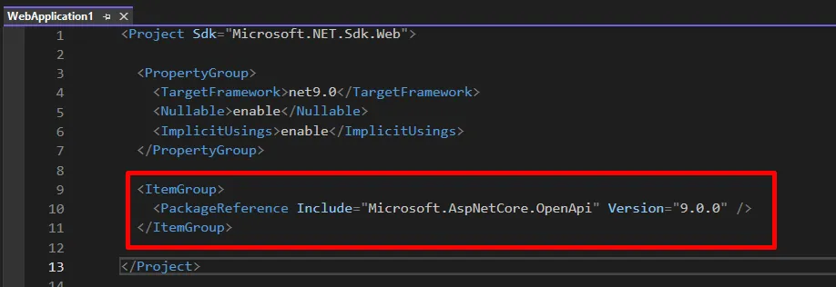
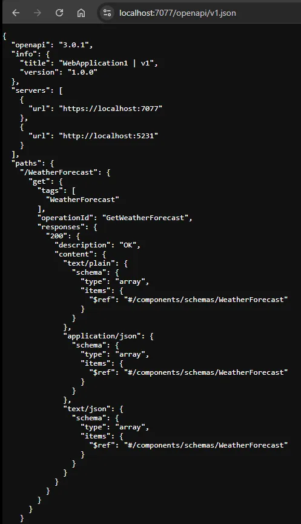

Built-in OpenAPI Document Generation with .NET 9 — No more SwaggerUI! 👋
========================================================================



What’s Swagger UI?
------------------

[Swagger UI](https://swagger.io/) is an open-source tool that automatically generates an interactive, web-based documentation interface for WebAPIs. 
It supports OpenAPI standards. It was very popular tool among the ASP.NET Core developers from 2020 to 2024. 
Because it was a built-in tool comes with ASP.NET Core default templates. 
We liked this tool because it was the first tool that allows us to make WebAPI calls for testing. 
Now it provides paid services as well as free ones.

> Previously, Swagger was included by default from **.NET 5** to **.NET 8** in .NET web templates.

---


What’s OpenAPI?
---------------

OpenAPI is a standard specification for defining REST APIs. 
The official website is [https://www.openapis.org/](https://www.openapis.org/). 
Microsoft is now using OpenAPI and here is the official documentation 👉 [https://aka.ms/aspnet/openapi](https://aka.ms/aspnet/openapi)

---


Replacement of Swagger UI with OpenAPI 
----------------------------------------------------------------------------

Swagger UI is no longer integrated into NET 9, as Microsoft wants a solution with first-class support, better control, and enhanced security. As you see in the below screenshot, Microsoft declares that it's already removed.



---


## Why is Swagger Removed from .NET 9?

In March 2024, the ASP.NET Core team announced that they are removing the `Swashbuckle.AspNetCore` dependency from web templates from .NET 9 release. 


> This decision was influenced by the project's lack of active maintenance and the absence of an official release for .NET 8.


Microsoft team created a new package `Microsoft.AspNetCore.OpenApi`. It provides built-in OpenAPI document generation just like Swagger. So Microsoft doesn't depend on external tools. Because in every .NET release, they need to ask the owners of the external tool libraries to align with their new version. And sometimes these library owners cannot update their code-base according to the recent .NET changes. And it is becoming harder for Microsoft to support the 3rd party libraries under these circumstances. Basically reducing 3rd party dependencies will help Microsoft fast release cycles.

I read Reddit, GitHub discussions and YouTube reviews about this topic. As I see community members expressed concerns about the inactivity of Swashbuckle and they are discussing alternatives like contributing to or forking the project. The Microsoft team also contacted the owners of Swashbuckle and NSwag to explore potential collaborations and ensure a smooth transition for developers.

In the below GitHub issue, you can see the details of this decision:

* [github.com/dotnet/aspnetcore/issues/54599](https://github.com/dotnet/aspnetcore/issues/54599)


**Jeremy** -Product Manager- at Microsoft, answers why they took this decision in [this post](https://github.com/dotnet/aspnetcore/issues/54599#issuecomment-2004975574).



As a summary;

**The change is due to a lack of maintenance of the Swagger library**, although it has seen some recent updates. This aims to reduce dependency on external tools and provide a streamlined, out-of-the-box experience for generating OpenAPI documentation for ASP.NET Core Web APIs.

---


What are the Benefits of the New OpenAI Package?
---------------------------------------------------------------

### Native Support and Reduced Dependency

The new `Microsoft.AspNetCore.OpenApi` package provides first-class citizen support for OpenAPI. It reduces reliance on external tools like Swashbuckle or NSwag for basic documentation needs. The native implementation leverages source generators to reduce runtime overhead.

### Simplified Configuration

No need extra setup or 3rd party integrations. Just by defining controllers and endpoints, ASP.NET Core automatically generates OpenAPI specifications.

### Well Integration with Minimal APIs

[Minimal APIs](https://learn.microsoft.com/en-us/aspnet/core/fundamentals/minimal-apis) introduced in .NET 6. There's an optimized built-in support for Minimal APIs. It automatically adds metadata for routes, request parameters, and responses. 

### Compatibility with Existing Tools

You can still use the output of OpenAPI with Swagger or NSwag... So it doesn't mean that in this case you have only one option when you use OpenAPI.

---


How to Use the New OpenAPI in .NET9?
------------------------------------

When you create a new ASP.NET Core project, you can see the below checkbox to add OpenAPI.



I created a new .NET 9 web project, I saw that OpenAPI had already been added.



## Add OpenAPI Support For Your Existing Project

Upgrade your project to .NET 9 and add the required NuGet package [Microsoft.AspNetCore.OpenApi](https://www.nuget.org/packages/Microsoft.AspNetCore.OpenApi)

```
dotnet add package Microsoft.AspNetCore.OpenApi
```

### 

Add the following services and middleware in `Program.cs`

```
var builder = WebApplication.CreateBuilder();
builder.Services.AddOpenApi(); //<<-----
var app = builder.Build();
app.MapOpenApi(); //<<-----
app.MapGet("/", () => "Test");
app.Run();
```

Your OpenAPI document URL is [_https://localhost:7077/openapi/v1.json_](https://localhost:7077/openapi/v1.json) 

Change the port to your active port. This is how it looks like:



---


Alternative 3rd Party Tool: Scalar
==================================

**Scalar** is an open-source API platform for RestAPI documentation. Also, it provides an interface for interacting with RESTful API. Generates interactive and user-friendly API documentation. Supports OpenAPI and Swagger specifications. It’s open-source with **7K stars** on GitHub. 

See the repo 👉 [https://github.com/scalar/scalar](https://github.com/scalar/scalar).


That's all from the replacement of Swagger in .NET 9.
Happy coding 👨‍💻


**References**

* [https://learn.microsoft.com/en-us/aspnet/core/release-notes/aspnetcore-9.0?view=aspnetcore-8.0#openapi](https://learn.microsoft.com/en-us/aspnet/core/release-notes/aspnetcore-9.0?view=aspnetcore-8.0#openapi)

  
