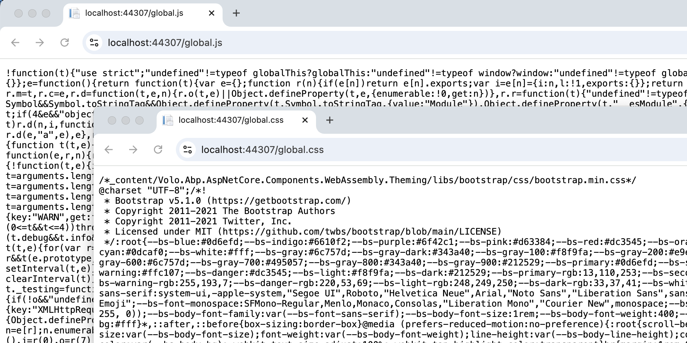

# ABP Global Assets - New way to bundle JavaScript/CSS files in Blazor WebAssembly app

We have introduced a new feature in the ABP framework to bundle the `JavaScript/CSS` files in the Blazor wasm app. This feature is called `Global Assets`.
With this feature, you don't need to run the `abp bundle` command to manually create/maintain the `global.js` and `global.css` files in your Blazor wasm app.

## How Global Assets works?

The new `Blazor wasm app` has two projects:

1. `MyProjectName` (ASP.NET Core app)
2. `MyProjectName.Client` (Blazor wasm app)

The `MyProjectName` reference the `MyProjectName.Client` project, and will be the entry point of the application, which means the `MyProjectName` project will be the `host` project of the `MyProjectName.Client` project. 

The static/virtual files of `MyProjectName` can be accessed by the `MyProjectName.Client` project, so we can create dynamic global assets in the `MyProjectName` project and use them in the `MyProjectName.Client` project.

## How it works in ABP?

We have created a new package `WebAssembly.Theme.Bundling` for the theme `WebAssembly` module and used the `Volo.Abp.AspNetCore.Mvc.UI.Bundling.BundleContributor` to add `JavaScript/CSS` files to the bundling system.

* LeptonXLiteTheme: `AbpAspNetCoreComponentsWebAssemblyLeptonXLiteThemeBundlingModule`
* LeptonXTheme: `AbpAspNetCoreComponentsWebAssemblyLeptonXThemeBundlingModule`
* LeptonTheme: `AbpAspNetCoreComponentsWebAssemblyLeptonThemeBundlingModule`
* BasicTheme: `AbpAspNetCoreComponentsWebAssemblyBasicThemeBundlingModule`

The new `ThemeBundlingModule` only depends on `AbpAspNetCoreComponentsWebAssemblyThemingBundlingModule(new package)`. It's an `abstractions module`, which only depends on `AbpAspNetCoreMvcUiBundlingAbstractionsModule`.

We will get all `JavaScript/CSS` files on `OnApplicationInitializationAsync` method of `AbpAspNetCoreMvcUiBundlingModule` from bundling system and add them to `IDynamicFileProvider` service. After that, we can access the `JavaScript/CSS` files in the Blazor wasm app.

## Add the Global Assets in the module

If your module has `JavaScript/CSS` files that need to the bundling system, You have to create a new project(`YourModuleName.Blazor.WebAssembly.Bundling`) to your module solution, and reference the new project in the `MyProjectName` project and module dependencies.

The new project should **only** depend on the `AbpAspNetCoreComponentsWebAssemblyThemingBundlingModule` and define `BundleContributor` classes to contribute the `JavaScript/CSS` files.

> Q: The new project(`YourModuleName.Blazor.WebAssembly.Bundling`) doesn't have the `libs/myscript.js` and `libs/myscript.css` files why the files can be added to the bundling system?

> A: Because the `MyProjectName.Client` will depend on the `MyBlazorModule(YourModuleName.Blazor)` that contains the `JavaScript/CSS` files, The `MyProjectName` is referencing the `MyProjectName.Client` project, so the `MyProjectName` project can access the `JavaScript/CSS` files in the `MyProjectName.Client` project and add them to the bundling system.

```csharp
[DependsOn(
    typeof(AbpAspNetCoreComponentsWebAssemblyThemingBundlingModule)
)]
public class MyBlazorWebAssemblyBundlingModule : AbpModule
{
    public override void ConfigureServices(ServiceConfigurationContext context)
    {
        Configure<AbpBundlingOptions>(options =>
        {
            // Script Bundles
            options.ScriptBundles.Get(BlazorWebAssemblyStandardBundles.Scripts.Global).AddContributors(typeof(MyModuleBundleScriptContributor));

            // Style Bundles
            options.ScriptBundles.Get(BlazorWebAssemblyStandardBundles.Scripts.Global).AddContributors(typeof(MyModuleBundleStyleBundleContributor));
        });
    }
}
```

```csharp
public class MyModuleBundleScriptContributor : BundleContributor
{
    public override void ConfigureBundle(BundleConfigurationContext context)
    {
        context.Files.AddIfNotContains("_content/MyModule.Blazor/libs/myscript.js");
    }
}

public class MyModuleBundleStyleBundleContributor : BundleContributor
{
    public override void ConfigureBundle(BundleConfigurationContext context)
    {
        context.Files.AddIfNotContains("_content/MyModule.Blazor/libs/myscript.css");
    }
}
```

## Use the Global Assets in the Blazor WASM

### MyCompanyName.MyProjectName.Blazor

Convert your `MyCompanyName.MyProjectName.Blazor` project to integrate the `ABP module` system and depend on the `AbpAspNetCoreMvcUiBundlingModule` and `AbpAspNetCoreComponentsWebAssemblyLeptonXLiteThemeBundlingModule/AbpAspNetCoreComponentsWebAssemblyLeptonXThemeBundlingModule`:

* The `AbpAspNetCoreMvcUiBundlingModule` uses to create the `JavaScript/CSS` files to virtual files.
* The `AbpAspNetCoreComponentsWebAssemblyLeptonXLiteThemeBundlingModule/AbpAspNetCoreComponentsWebAssemblyLeptonXThemeBundlingModule` uses to add theme `JavaScript/CSS` to the bundling system.

Here is how your project files look like:

**`Program.cs`:**

```csharp
public class Program
{
    public async static Task<int> Main(string[] args)
    {
        //...

        var builder = WebApplication.CreateBuilder(args);
        builder.Host.AddAppSettingsSecretsJson()
            .UseAutofac()
            .UseSerilog();
        await builder.AddApplicationAsync<MyProjectNameBlazorModule>();
        var app = builder.Build();
        await app.InitializeApplicationAsync();
        await app.RunAsync();
        return 0;

	//...
	}
}
```

**`MyProjectNameBlazorModule.cs`:**

```csharp
[DependsOn(
    typeof(AbpAutofacModule),
    typeof(AbpAspNetCoreMvcUiBundlingModule),
    typeof(AbpAspNetCoreComponentsWebAssemblyLeptonXLiteThemeBundlingModule/AbpAspNetCoreComponentsWebAssemblyLeptonXThemeBundlingModule) //Should be added!
)]
public class MyProjectNameBlazorModule : AbpModule
{
    public override void ConfigureServices(ServiceConfigurationContext context)
    {
        //https://github.com/dotnet/aspnetcore/issues/52530
        Configure<RouteOptions>(options =>
        {
            options.SuppressCheckForUnhandledSecurityMetadata = true;
        });

        // Add services to the container.
        context.Services.AddRazorComponents()
            .AddInteractiveWebAssemblyComponents();
    }

    public override void OnApplicationInitialization(ApplicationInitializationContext context)
    {
        var env = context.GetEnvironment();
        var app = context.GetApplicationBuilder();

        // Configure the HTTP request pipeline.
        if (env.IsDevelopment())
        {
            app.UseWebAssemblyDebugging();
        }
        else
        {
            // The default HSTS value is 30 days. You may want to change this for production scenarios, see https://aka.ms/aspnetcore-hsts.
            app.UseHsts();
        }

        app.UseHttpsRedirection();
        app.MapAbpStaticAssets();
        app.UseRouting();
        app.UseAntiforgery();

        app.UseConfiguredEndpoints(builder =>
        {
            builder.MapRazorComponents<App>()
                .AddInteractiveWebAssemblyRenderMode()
                .AddAdditionalAssemblies(WebAppAdditionalAssembliesHelper.GetAssemblies<MyProjectNameBlazorClientModule>());
        });
    }
}
```

**`MyCompanyName.MyProjectName.Blazor.csproj`:**

```xml
<ItemGroup>
	<PackageReference Include="Microsoft.AspNetCore.Components.WebAssembly.Server" Version="9.0.0.0" />
	<PackageReference Include="Volo.Abp.Autofac" Version="9.0.0" />
	<PackageReference Include="Volo.Abp.AspNetCore.Mvc.UI.Bundling" Version="9.0.0" />
	<PackageReference Include="Volo.Abp.AspNetCore.Components.WebAssembly.LeptonXLiteTheme.Bundling" Version="9.0.0" />
	<!-- <PackageReference Include="Volo.Abp.AspNetCore.Components.WebAssembly.LeptonXTheme.Bundling" Version="9.0.0" />  --> if you're using LeptonXTheme
	<ProjectReference Include="..\MyProjectName.Blazor.Client\MyProjectName.Blazor.Client.csproj" />
</ItemGroup>
```

### BlazorWebAssemblyBundlingModule in the ABP commercial

Here is the list of `Bundling Modules` in the ABP commercial. If you're using the pro template, you should add them to the `MyCompanyName.MyProjectName.Blazor` project.

| BundlingModules                             | Nuget Package                                        |
|---------------------------------------------|-----------------------------------------------------|
| AbpAuditLoggingBlazorWebAssemblyBundlingModule | Volo.Abp.AuditLogging.Blazor.WebAssembly.Bundling   |
| FileManagementBlazorWebAssemblyBundlingModule | Volo.FileManagement.Blazor.WebAssembly.Bundling    |
| SaasHostBlazorWebAssemblyBundlingModule       | Volo.Saas.Host.Blazor.WebAssembly.Bundling         |
| ChatBlazorWebAssemblyBundlingModule           | Volo.Chat.Blazor.WebAssembly.Bundling              |
| CmsKitProAdminBlazorWebAssemblyBundlingModule | Volo.CmsKit.Pro.Admin.Blazor.WebAssembly.Bundling  |


### MyCompanyName.MyProjectName.Blazor.Client

1. Remove the `global.JavaScript/CSS` files from the `MyCompanyName.MyProjectName.Blazor`'s `wwwroot` folder.
2. Remove the `AbpCli:Bundle` section from the `appsettings.json` file.
3. Remove all BundleContributor classes that inherit from IBundleContributor. Then, create `MyProjectNameStyleBundleContributor` and `MyProjectNameScriptBundleContributor` classes to add your style and JavaScript files. Finally, add them to `AbpBundlingOptions`.


```cs
public class MyProjectNameStyleBundleContributor : BundleContributor
{
    public override void ConfigureBundle(BundleConfigurationContext context)
    {
        context.Files.Add(new BundleFile("main.css", true));
    }
}


public class MyProjectNameScriptBundleContributor : BundleContributor
{
    public override void ConfigureBundle(BundleConfigurationContext context)
    {
        context.Files.Add(new BundleFile("main.js", true));
    }
}
```

```cs
Configure<AbpBundlingOptions>(options =>
{
	var globalStyles = options.StyleBundles.Get(BlazorWebAssemblyStandardBundles.Styles.Global);
	globalStyles.AddContributors(typeof(MyProjectNameStyleBundleContributor));
	
	var globalScripts = options.ScriptBundles.Get(BlazorWebAssemblyStandardBundles.Scripts.Global);
	globalScripts.AddContributors(typeof(MyProjectNameScriptBundleContributor));
});
```

## Use the Global Assets in the Blazor WebApp

### MyCompanyName.MyProjectName.Blazor.WebApp

Depending on the `AbpAspNetCoreComponentsWebAssemblyLeptonXLiteThemeBundlingModule/AbpAspNetCoreComponentsWebAssemblyLeptonXThemeBundlingModule` in your `MyCompanyName.MyProjectName.Blazor.WebApp` project.

* The `AbpAspNetCoreComponentsWebAssemblyLeptonXLiteThemeBundlingModule/AbpAspNetCoreComponentsWebAssemblyLeptonXThemeBundlingModule` uses to add theme `JavaScript/CSS` to the bundling system.


### BlazorWebAssemblyBundlingModule in the ABP commercial

Here is the list of `Bundling Modules` in the ABP commercial. If you're using the pro template, you should add them to the `MyCompanyName.MyProjectName.Blazor.WebApp` project.

| BundlingModules                             | Nuget Package                                        |
|---------------------------------------------|-----------------------------------------------------|
| AbpAuditLoggingBlazorWebAssemblyBundlingModule | Volo.Abp.AuditLogging.Blazor.WebAssembly.Bundling   |
| FileManagementBlazorWebAssemblyBundlingModule | Volo.FileManagement.Blazor.WebAssembly.Bundling    |
| SaasHostBlazorWebAssemblyBundlingModule       | Volo.Saas.Host.Blazor.WebAssembly.Bundling         |
| ChatBlazorWebAssemblyBundlingModule           | Volo.Chat.Blazor.WebAssembly.Bundling              |
| CmsKitProAdminBlazorWebAssemblyBundlingModule | Volo.CmsKit.Pro.Admin.Blazor.WebAssembly.Bundling  |


### MyCompanyName.MyProjectName.Blazor.WebApp.Client

1. Remove the `global.JavaScript/CSS` files from the `MyCompanyName.MyProjectName.Blazor.WebApp.Client`'s `wwwroot` folder.
2. Remove the `AbpCli:Bundle` section from the `appsettings.json` file.
3. Remove all BundleContributor classes that inherit from IBundleContributor. Then, create `MyProjectNameStyleBundleContributor` and `MyProjectNameScriptBundleContributor` classes to add your style and JavaScript files. Finally, add them to `AbpBundlingOptions`.

```cs
public class MyProjectNameStyleBundleContributor : BundleContributor
{
    public override void ConfigureBundle(BundleConfigurationContext context)
    {
        context.Files.Add(new BundleFile("main.css", true));
    }
}


public class MyProjectNameScriptBundleContributor : BundleContributor
{
    public override void ConfigureBundle(BundleConfigurationContext context)
    {
        context.Files.Add(new BundleFile("main.js", true));
    }
}
```

```cs
Configure<AbpBundlingOptions>(options =>
{
	var globalStyles = options.StyleBundles.Get(BlazorWebAssemblyStandardBundles.Styles.Global);
	globalStyles.AddContributors(typeof(MyProjectNameStyleBundleContributor));
	
	var globalScripts = options.ScriptBundles.Get(BlazorWebAssemblyStandardBundles.Scripts.Global);
	globalScripts.AddContributors(typeof(MyProjectNameScriptBundleContributor));
});
```

### Check the Global Assets

Run the `MyProject` project and check the `https://localhost/global.js` and `https://localhost/global.css` files. You should be able to see the `JavaScript/CSS` files content from the Bundling system: 



## GlobalAssets(AbpBundlingGlobalAssetsOptions)

You can configure the JavaScript and CSS file names in the `GlobalAssets` property of the `AbpBundlingOptions` class. 

The default values are `global.js` and `global.css`.

## Conclusion

With the new `Global Assets` feature, you can easily bundle the `JavaScript/CSS` files in the Blazor wasm app. This feature is very useful for the Blazor wasm app, and it will save you a lot of time and effort. We hope you will enjoy this feature and use it in your projects.

## References

* [Virtual Files](https://docs.abp.io/en/abp/latest/Virtual-Files)
* [Bundle Contributors](https://abp.io/docs/latest/framework/ui/mvc-razor-pages/bundling-minification#bundle-contributors)
* [Global Assets Pull Request](https://github.com/abpframework/abp/pull/19968)

