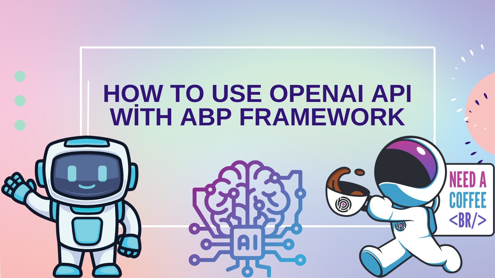
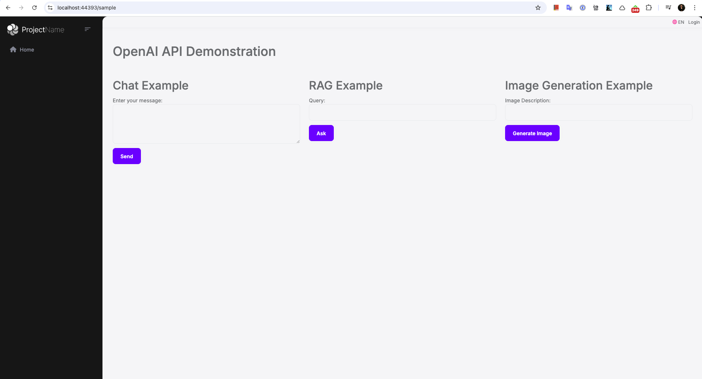
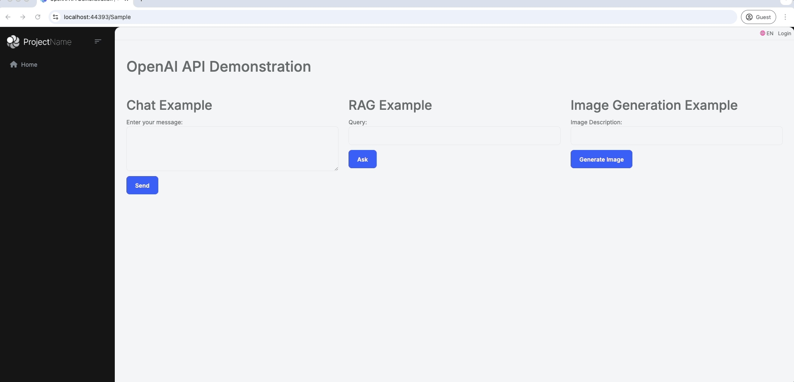
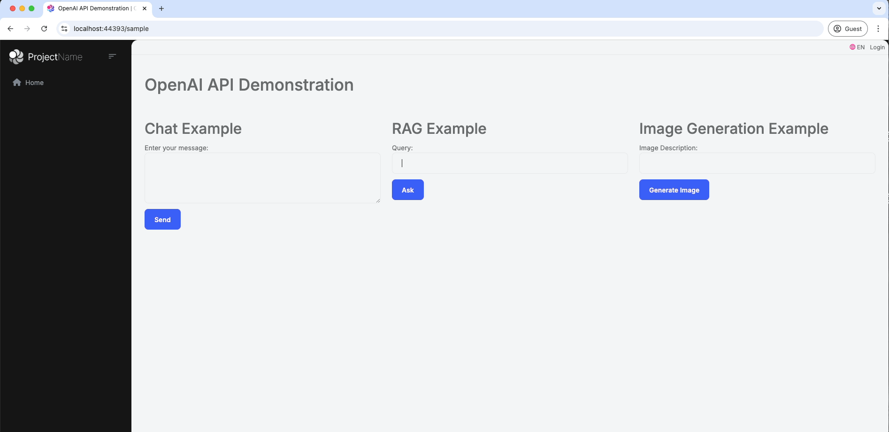
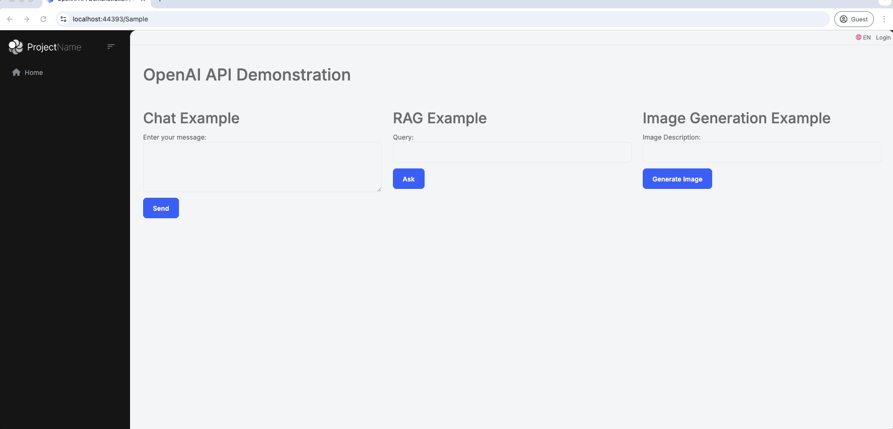

# How to Use OpenAI API with ABP Framework

In this article, I will show you how to integrate and use the [OpenAI API](https://github.com/openai/openai-dotnet?tab=readme-ov-file#getting-started) with the [ABP Framework](https://abp.io/). We will explore step-by-step how these technologies can work together to enhance your application with powerful AI capabilities, such as natural language processing, image generation, and more.



## Creating an ABP Project

To begin integrating OpenAI API with ABP Framework, you first need to create an ABP project. Follow these steps to create and set up your ABP project:
### Step 1: Install ABP CLI

The ABP CLI is a command-line interface tool that helps you create and manage ABP projects easily. To install the ABP CLI, run the following command in your terminal:

```bash
dotnet tool install -g Volo.Abp.Studio.Cli
```

### Step 2: Create a New ABP Project

Once you have installed the ABP CLI, you can create a new ABP project using the following command:

```bash
abp new Acme.OpenAIIntegration -t app --ui-framework mvc --database-provider ef -dbms PostgreSQL --csf
```

> This command will generate a complete ABP project with an [MVC UI](https://abp.io/docs/latest/framework/ui/mvc-razor-pages/overall). The examples provided in this article make use of UI controllers for demonstration purposes. However, the same approach can easily be applied to other UI types supported by ABP, such as Blazor or Angular. You can find other options [here](https://abp.io/docs/latest/cli).
## OpenAI Integration Setup

To begin integrating OpenAI API with ABP Framework, follow these steps:

### Step 1: Create an API Key

To use the OpenAI services, you first need an API key. To obtain one, first [create a new OpenAI account](https://platform.openai.com/signup) or [log in](https://platform.openai.com/login). Next, navigate to the [API key page](https://platform.openai.com/account/api-keys) and select "Create new secret key", optionally naming the key. Make sure to save your API key somewhere safe and do not share it with anyone.

This key will be used to authenticate your application when making requests to the OpenAI endpoints.

### Step 2: Adding *Microsoft.Extensions.AI* Package

To integrate OpenAI API with ABP, we use [Microsoft.Extensions.AI](https://www.nuget.org/packages/Microsoft.Extensions.AI.OpenAI/). This package offers a unified API for integrating AI services, making it easy for developers to work with different AI providers. You can find more details in [this blog post](https://devblogs.microsoft.com/dotnet/introducing-microsoft-extensions-ai-preview/).

To begin integrating OpenAI API with ABP Framework, follow these steps:

1. Add the **Microsoft.Extensions.AI** and **Microsoft.Extensions.AI.OpenAI** (used to interact specifically with OpenAI services. Additionally, this package has alternatives like [Azure OpenAI](https://www.nuget.org/packages/Microsoft.Extensions.AI.OpenAI/), [Azure AI Inference](https://www.nuget.org/packages/Microsoft.Extensions.AI.AzureAIInference/), and [Ollama](https://www.nuget.org/packages/Microsoft.Extensions.AI.Ollama/), offering flexibility for developers to choose the AI provider that best fits their needs) packages:

```bash
dotnet add package Microsoft.Extensions.AI --prerelease
dotnet add package Microsoft.Extensions.AI.OpenAI --prerelease
```

2. Add the required configuration to the `appsettings.json` file located inside the `Acme.OpenAIIntegration.Web` project and dependencies to your `ConfigureServices` method:

```json
"AI": {
    "OpenAI": {
        "Key": "YOUR-API-KEY",
        "Chat": {
            "ModelId": "gpt-4o-mini"
        }
    }
}
```

> Replace the value of the `Key` with your OpenAI API key.

Next, add the following code to the `ConfigureServices` method in `OpenAIIntegrationBlazorModule`:

```csharp
context.Services.AddSingleton(new OpenAIClient(configuration["AI:OpenAI:Key"]));
  
context.Services.AddChatClient(services =>  
    services.GetRequiredService<OpenAIClient>().AsChatClient(configuration["AI:OpenAI:Chat:ModelId"] ?? "gpt-4o-mini"));
```

## Creating a Sample Page

To demonstrate the use of OpenAI API, let's create a page named `Sample` in the `Acme.OpenAIIntegration.Web` project:

Create a `Sample` folder under the `Pages` folder of the `Acme.OpenAIIntegration.Web` project. Add a new Razor Page by right-clicking the `Sample` folder then selecting `Add > Razor Page`. Name it `Index`.

Open the `Index.cshtml` and change the whole content as shown below:

> Note: This example demonstrates a simple implementation of a sample page that interacts with the OpenAI API, covering chat, [retrieval-augmented generation (RAG)](https://github.com/openai/openai-dotnet?tab=readme-ov-file#how-to-use-assistants-with-retrieval-augmented-generation-rag), and image generation features. Each example is explained in detail in the next section, so feel free to continue for a better understanding of the steps and logic involved.

```html
@page
@model Acme.OpenAIIntegration.Web.Pages.Sample
@{
    ViewData["Title"] = "OpenAI API Demonstration";
}

<h1>@ViewData["Title"]</h1>

<br/><br/>

<div class="row">
    <div class="col-md-4">
        <h2>Chat Example</h2>
        <form method="post" asp-page-handler="Chat">
            <div class="form-group">
                <label asp-for="ChatInput">Enter your message:</label>
                <textarea asp-for="ChatInput" class="form-control" rows="4"></textarea>
            </div>
            <button type="submit" class="btn btn-primary mt-2">Send</button>
        </form>
        @if (!string.IsNullOrEmpty(Model.ChatResponse))
        {
            <h3 class="mt-3">Response:</h3>
            <p>@Model.ChatResponse</p>
        }
    </div>

    <div class="col-md-4">
        <h2>RAG Example</h2>
        <form method="post" asp-page-handler="RAG">
            <div class="form-group mt-2">
                <label asp-for="RAGQuery">Query:</label>
                <input asp-for="RAGQuery" class="form-control" />
            </div>
            <button type="submit" class="btn btn-primary mt-2">Ask</button>
        </form>
        @if (!string.IsNullOrEmpty(Model.RAGResponse))
        {
            <h3 class="mt-3">Result:</h3>
            <p>@Model.RAGResponse</p>
        }
    </div>

    <div class="col-md-4">
        <h2>Image Generation Example</h2>
        <form method="post" asp-page-handler="ImageGeneration">
            <div class="form-group">
                <label asp-for="ImagePrompt">Image Description:</label>
                <input asp-for="ImagePrompt" class="form-control" />
            </div>
            <button type="submit" class="btn btn-primary mt-2">Generate Image</button>
        </form>
        @if (Model.GeneratedImageBytes != null)
        {
            <h3 class="mt-3">Generated Image:</h3>
            
        }
    </div>
</div>
```

`Index.cshtml.cs` content should be like that:

```csharp
using System;
using System.ClientModel;
using System.IO;
using System.Text;
using System.Threading;
using System.Threading.Tasks;
using Microsoft.AspNetCore.Mvc;
using Microsoft.AspNetCore.Mvc.RazorPages;
using Microsoft.Extensions.AI;
using OpenAI;
using OpenAI.Assistants;
using OpenAI.Files;
using OpenAI.Images;

namespace Acme.OpenAIIntegration.Web.Pages;

public class Sample : PageModel
{
    [BindProperty]
    public string ChatInput { get; set; }
    public string ChatResponse { get; set; }

    [BindProperty]
    public string RAGQuery { get; set; }
    public string RAGResponse { get; set; }

    [BindProperty]
    public string ImagePrompt { get; set; }
    public byte[] GeneratedImageBytes { get; set; }
    
    private readonly IChatClient _chatClient;
    private readonly OpenAIClient _openAiClient;

    public Sample(
        IChatClient chatClient,
        OpenAIClient openAiClient)
    {
        _chatClient = chatClient;
        _openAiClient = openAiClient;
    }

    public async Task<IActionResult> OnPostChatAsync()
    {
        ChatResponse = $"Chat response: {(await _chatClient.CompleteAsync(ChatInput)).Message}";
        return Page();
    }

    public async Task<IActionResult> OnPostRAGAsync()
    {
#pragma warning disable OPENAI001
        var fileClient = _openAiClient.GetOpenAIFileClient();
        var assistantClient = _openAiClient.GetAssistantClient();

        using var document = BinaryData.FromBytes(GetExceptionHandlingDocumentContent().ToArray()).ToStream();
        var exceptionHandlingDoc = await fileClient.UploadFileAsync(
            document,
            "ExceptionHandling.md",
            FileUploadPurpose.Assistants);

        AssistantCreationOptions assistantOptions = new()
        {
            Name = "Exception Handling Assistant",
            Instructions =
                """
                This assistant helps you with exception handling in ABP Framework. You can ask questions about exception handling and get answers.

                - Do not make any assumptions when asked for information that is not in the document
                - Give the most accurate information possible
                - Give short(max 1-2 sentence) and concise answers
                - Do not provide file citations
                """,

            Tools =
            {
                new FileSearchToolDefinition(),
            },
            ToolResources = new()
            {
                FileSearch = new()
                {
                    NewVectorStores =
                    {
                        new VectorStoreCreationHelper([exceptionHandlingDoc.Value.Id]),
                    }
                }
            },
        };

        var assistant = await assistantClient.CreateAssistantAsync("gpt-4o", assistantOptions);

        ThreadCreationOptions threadOptions = new()
        {
            InitialMessages = { RAGQuery }
        };

        ThreadRun threadRun = assistantClient.CreateThreadAndRun(assistant.Value.Id, threadOptions);

        do
        {
            Thread.Sleep(TimeSpan.FromSeconds(1));
            threadRun = assistantClient.GetRun(threadRun.ThreadId, threadRun.Id);
        } while (!threadRun.Status.IsTerminal);

        CollectionResult<ThreadMessage> messages
            = assistantClient.GetMessages(threadRun.ThreadId,
                new MessageCollectionOptions() { Order = MessageCollectionOrder.Ascending });

        var response = new StringBuilder();

        foreach (var message in messages)
        {
            response.AppendLine($"[{message.Role.ToString().ToUpper()}]: ");
            foreach (var contentItem in message.Content)
            {
                if (!string.IsNullOrEmpty(contentItem.Text))
                {
                    response.AppendLine(contentItem.Text);

                    if (contentItem.TextAnnotations.Count > 0)
                    {
                        response.AppendLine("");
                    }
                }
            }

            response.AppendLine("");
#pragma warning restore OPENAI001
        }
        
        RAGResponse = response.ToString();
        
        return Page();
    }

    public async Task<IActionResult> OnPostImageGenerationAsync()
    {
        var client = _openAiClient.GetImageClient("dall-e-3");

        var image = await client.GenerateImageAsync(ImagePrompt, new ImageGenerationOptions
        {
            ResponseFormat = GeneratedImageFormat.Bytes
        });
        
        var imageBytes = image.Value.ImageBytes;
        
        using var memoryStream = new MemoryStream();
        await imageBytes.ToStream().CopyToAsync(memoryStream);
        GeneratedImageBytes = memoryStream.ToArray();
        
        return Page();
    }

    public ReadOnlySpan<byte> GetExceptionHandlingDocumentContent()
    {
        return """
               # Exception Handling

               ABP provides a built-in infrastructure and offers a standard model for handling exceptions.

               * Automatically **handles all exceptions** and sends a standard **formatted error message** to the client for an API/AJAX request.
               * Automatically hides **internal infrastructure errors** and returns a standard error message.
               * Provides an easy and configurable way to **localize** exception messages.
               * Automatically maps standard exceptions to **HTTP status codes** and provides a configurable option to map custom exceptions.

               ## Automatic Exception Handling

               `AbpExceptionFilter` handles an exception if **any of the following conditions** are met:

               * Exception is thrown by a **controller action** which returns an **object result** (not a view result).
               * The request is an AJAX request (`X-Requested-With` HTTP header value is `XMLHttpRequest`).
               * Client explicitly accepts the `application/json` content type (via `accept` HTTP header).

               If the exception is handled it's automatically **logged** and a formatted **JSON message** is returned to the client.
               
               ## Business Exceptions
               
               Most of your own exceptions will be business exceptions. The `IBusinessException` interface is used to mark an exception as a business exception.
               
               `BusinessException` implements the `IBusinessException` interface in addition to the `IHasErrorCode`, `IHasErrorDetails` and `IHasLogLevel` interfaces. The default log level is `Warning`.
               
               Usually you have an error code related to a particular business exception. For example:
               
               ````C#
               throw new BusinessException(QaErrorCodes.CanNotVoteYourOwnAnswer);
               ````

               ### User Friendly Exception
               
               If an exception implements the `IUserFriendlyException` interface, then ABP does not change it's `Message` and `Details` properties and directly send it to the client.
               
               `UserFriendlyException` class is the built-in implementation of the `IUserFriendlyException` interface. Example usage:
               
               ````C#
               throw new UserFriendlyException(
                   "Username should be unique!"
               );
               ````
               * The `IUserFriendlyException` interface is derived from the `IBusinessException` and the `UserFriendlyException` class is derived from the `BusinessException` class.
    
               """u8;
    }
}
```

## Running the Application

After completing the setup, you can run the application using the following command:

```bash
 dotnet run --project ./src/Acme.OpenAIIntegration.Web
```

Once the application is running, open your browser and navigate to `/Sample`. You should see the `Sample` page we created, which contains sections for Chat, RAG (Retrieval-Augmented Generation), and Image Generation. You can find the screenshot of the page below:



## Examples Overview

To showcase the integration of the OpenAI API with the ABP Framework, we implemented three different examples:

1. **Chat Example**: This example demonstrates how to use OpenAI's chat capabilities by allowing users to enter a message and receive an AI-generated response. The implementation involves setting up a simple form on the `Sample` page where users can input their message. The form submission triggers the `OnPostChatAsync` method, which uses the `IChatClient` to generate a response. 



2. **Retrieval-Augmented Generation (RAG) Example**: In this example, we use OpenAI to answer user queries by referencing custom documents uploaded to the OpenAI API. The implementation involves uploading a document using the `OpenAIFileClient` and creating an assistant with specific instructions to handle the uploaded content. In this case, the document is a section from ABP's Exception Handling documentation, which includes examples on how ABP handles exceptions, user-friendly error messages, and business exceptions. Users can input their query on the `Sample` page, and the `OnPostRAGAsync` method processes the query to generate precise answers based on the document content. If users ask questions that are not covered in the document, the assistant clearly indicates that the information is not available, as per the instructions provided. For example, when asked about `Object Extensions`, the response begins with: "The uploaded document does not contain information about `Object Extensions`...". This demonstrates how the assistant adheres to the provided instructions. You can also find this example illustrated in the GIF below.




3. **Image Generation Example**: This example leverages the [DALL-E](https://openai.com/index/dall-e-3/) model to generate images based on user-provided prompts. On the `Sample` page, users can provide a description of the image they want to generate, and the `OnPostImageGenerationAsync` method uses the `OpenAIClient` to generate the image.



## Conclusion

In this article, we covered how to integrate the OpenAI API with the ABP Framework by creating a sample project, setting up the OpenAI services, and implementing examples for conversational AI, knowledge-based assistance, and image generation. By following these steps, you can add powerful AI-driven capabilities to your application, making it more interactive, intelligent, and capable of meeting user needs effectively.