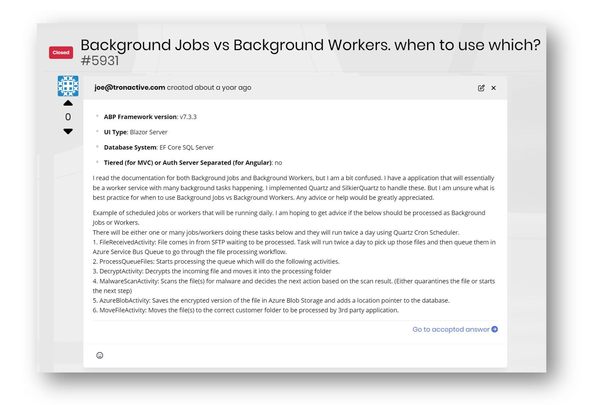

# ABP Framework: Background Jobs vs Background Workers — When to Use Which?


In the ABP Framework, **Background Jobs** and **Background Workers** serve different purposes but can sometimes seem interchangeable. Sometimes it can be confusing. Let’s clarify their differences, and I'll show you some real-world cases to help you understand how to decide between these two. We have official documents for these:

📕 **Background Workers ABP Document**  https://abp.io/docs/latest/framework/infrastructure/background-workers

📘 **Background Jobs ABP Document** https://abp.io/docs/latest/framework/infrastructure/background-jobs


---

I posted this article because recently, I came across [this support ticket](https://abp.io/support/questions/5931/Background-Jobs-vs-Background-Workers-when-to-use-which) on the ABP support website. I thought these terms could be confusing for devs. He has two tasks and is asking whether he needs to use Background Worker or Background Job. 

* The first one is `FileRecievedActivity.` He says it's running 2 times a day. So, it's a recurring activity that needs to run in the background. So `FileRecievedActivity` is a "Background Worker". 
* The second one is `ProcessQueueFiles`. It sounds like a polling task. It runs whenever a new file comes to the directory. So, it's also a recurring task that needs to be scheduled every 1 minute. Hence the `ProcessQueueFiles` is also "Backgrounder Worker."




## Background Workers  🔄 */Looping/*

The background workers are stateless and runs in-memory as long as the application is up and ready.

- **Purpose**: Long-running, periodic tasks that run continuously in the background. They are queued and executed asynchronously.
- **Lifetime:** Runs throughout the application's lifetime. 
- **Scheduling:** Executes on a fixed schedule, like every X minutes / hours... 
- **Infrastructure**: ABP uses an in-memory implementation for running background workers.  You can also use the 3rd party tools for running your background worker:
  * [Quartz + ABP integration](https://abp.io/docs/latest/framework/infrastructure/background-workers/quartz)
  * [Hangfire + ABP integration](https://abp.io/docs/latest/framework/infrastructure/background-workers/hangfire)


**Use Cases:** Use background workers for any task that needs to run repeatedly at fixed intervals. For example "Health checks", "Periodic cleanup tasks", "Monitoring tasks", "Processing daily data"...  In the last section, you will find real-world examples.


> In Microsoft Docs, this topic is called "Background Tasks". Check out [Microsoft's official doc for running background tasks](https://learn.microsoft.com/en-us/aspnet/core/fundamentals/host/hosted-services).


---


## Background Jobs ▶ */One time/*

* **Purpose:** One-time tasks that need to be queued and can be executed in the background. Here the main goal is not to block the application to run the task. 

- **Lifetime**: Executes one time and completes.

- **Scheduling**: Can be delayed/scheduled for a specific time.

- **Infrastructure**: ABP uses in-memory implementation but you can also use the below 3rd party tools:

  * [Hangfire + ABP implementation](https://abp.io/docs/latest/framework/infrastructure/background-jobs/hangfire) 

  * [RabbitMQ + ABP implementation](https://abp.io/docs/latest/framework/infrastructure/background-jobs/rabbitmq)

  * [Quartz + ABP implementation](https://abp.io/docs/latest/framework/infrastructure/background-jobs/quartz)


**Use Cases:** Use background jobs to send emails, process uploaded files, generating reports, any fire-and-forget tasks or tasks that need retry mechanisms.


>  In Microsoft docs this topic is called as "Background Tasks". Check out [Microsoft's official background jobs doc](https://learn.microsoft.com/en-us/azure/architecture/best-practices/background-jobs).


## When to Use Which?

### Use Background Workers when:

- You need continuous, recurring execution

- The task should run as long as the application is running

- You don't need persistence in task state

- You want in-memory, efficient execution

  

### Use Background Jobs when:

- You need one-time execution

- The task should survive application restarts

- You need guaranteed execution

- You want built-in retry mechanisms

- You need to queue multiple instances of the same task

  

## Technical Differences 

```csharp
// A Background Worker Example
public class MyBackgroundWorker : AsyncPeriodicBackgroundWorkerBase
{
    public MyBackgroundWorker(AbpAsyncTimer timer, IServiceScopeFactory serviceScopeFactory) 
        : base(timer, serviceScopeFactory)
    {
        Timer.Period = 5000; // Runs every 5 seconds
    }
}

// A Background Job Example
public class MyBackgroundJob : AsyncBackgroundJob<MyArgs>
{
    public override async Task ExecuteAsync(MyArgs args)
    {
        // Executes once when triggered
    }
}

// Triggering a Background Job
await _backgroundJobManager.EnqueueAsync(
    new MyArgs { /* ... */ },
    delay: TimeSpan.FromHours(2)
);
```


> While background workers no additional infrastructure needed, background jobs requires a database to persist jobs (or a distributed cache/message broker depending on the implementation)


## 🚩 Background Worker Examples 


### 1) Querying an external API

- **Scenario**: Continuously fetch data from an external API at regular intervals.
- **Why a Background Worker?**: You need a long-running process to poll the API and handle the results.

```csharp
public class ApiPollingWorker : AsyncPeriodicBackgroundWorkerBase
{
    private readonly IAmazonPriceService _apiService;

    public ApiPollingWorker(AbpAsyncTimer timer, IServiceScopeFactory serviceScopeFactory, IAmazonPriceService apiService)
        : base(timer, serviceScopeFactory)
    {
        _apiService = apiService;
        Timer.Period = 60000; // Run every 1 minute
    }

    protected override async Task DoWorkAsync(PeriodicBackgroundWorkerContext workerContext)
    {
        var data = await _apiService.FetchPricesAsync();
        // Process the data
    }
}
```

Here are practical examples of **Background Workers** that demonstrate how to use them effectively within the ABP Framework. Background Workers are ideal for long-running or periodic tasks that require stateful or persistent execution.


### 2) Polling an External API

- **Scenario**: Continuously fetch data from an external API at regular intervals.
- **Why a Background Worker?**: You need a long-running process to poll the API and handle the results.

```
csharpCopy codepublic class ApiPollingWorker : AsyncPeriodicBackgroundWorkerBase
{
    private readonly IApiService _apiService;

    public ApiPollingWorker(AbpAsyncTimer timer, IServiceScopeFactory serviceScopeFactory, IApiService apiService)
        : base(timer, serviceScopeFactory)
    {
        _apiService = apiService;
        Timer.Period = 60000; // Run every 1 minute
    }

    protected override async Task DoWorkAsync(PeriodicBackgroundWorkerContext workerContext)
    {
        var data = await _apiService.FetchDataAsync();
        // Process the data
    }
}
```


### 3) Processing a Queue

- **Scenario**: Continuously process items from a queue, such as Azure Service Bus or RabbitMQ.
- **Why a Background Worker?**: This requires a stateful, persistent process to monitor and handle the queue.

```csharp
public class QueueProcessingWorker : AsyncBackgroundWorker
{
    private readonly IQueueService _queueService;

    public QueueProcessingWorker(IServiceScopeFactory serviceScopeFactory, IQueueService queueService)
        : base(serviceScopeFactory)
    {
        _queueService = queueService;
    }

    protected override async Task ExecuteAsync(CancellationToken stoppingToken)
    {
        while (!stoppingToken.IsCancellationRequested)
        {
            var message = await _queueService.GetNextMessageAsync();
            if (message != null)
            {
                await _queueService.ProcessMessageAsync(message);
            }
            await Task.Delay(1000, stoppingToken); // Delay for throttling
        }
    }
}
```


### 4) Maintaining a Database

- **Scenario**: Perform periodic database maintenance, rebuild indices or cleanup tasks.
- **Why a Background Worker?**: These are recurring tasks requiring regular execution.

```csharp
public class DatabaseCleanupWorker : AsyncPeriodicBackgroundWorkerBase
{
    private readonly ICleanupService _cleanupService;

    public DatabaseCleanupWorker(AbpAsyncTimer timer, IServiceScopeFactory serviceScopeFactory, ICleanupService cleanupService)
        : base(timer, serviceScopeFactory)
    {
        _cleanupService = cleanupService;
        Timer.Period = 3600000; // Run every hour
    }

    protected override async Task DoWorkAsync(PeriodicBackgroundWorkerContext workerContext)
    {
        await _cleanupService.DeleteOldRecordsAsync();
    }
}
```


### 5) Running a Health Check Service

- **Scenario**: Periodically check the health of connected services and log their status.
- **Why a Background Worker?**: Periodic health checks are naturally suited to background workers.

```csharp
public class HealthCheckWorker : AsyncPeriodicBackgroundWorkerBase
{
    private readonly IHealthCheckService _healthCheckService;

    public HealthCheckWorker(AbpAsyncTimer timer, IServiceScopeFactory serviceScopeFactory, IHealthCheckService healthCheckService)
        : base(timer, serviceScopeFactory)
    {
        _healthCheckService = healthCheckService;
        Timer.Period = 60000; // Run every minute
    }

    protected override async Task DoWorkAsync(PeriodicBackgroundWorkerContext workerContext)
    {
        await _healthCheckService.PerformChecksAsync();
    }
}
```


---


## 🚩 Background Job Examples 


### 1) Email Notifications

- **Scenario**: Sending a welcome email to new users.
- **Why a Background Job?**: The email sending process doesn’t need to block the main application thread. It can run in the background, and failed jobs can be retried.

```csharp
public class SendWelcomeEmailJob : IBackgroundJob<string>
{
    private readonly IEmailSender _emailSender;

    public SendWelcomeEmailJob(IEmailSender emailSender)
    {
        _emailSender = emailSender;
    }

    public async Task ExecuteAsync(string emailAddress)
    {
        await _emailSender.SendAsync(
            emailAddress,
            "Welcome!",
            "Thank you for signing up to our service."
        );
    }
}
```


### 2) Data Import/Export

- **Scenario**: Exporting a large dataset to a CSV file and notifying the user once complete.
- **Why a Background Job?**: Long-running tasks like file generation can be processed asynchronously.

```csharp
public class ExportDataJob : IBackgroundJob<int>
{
    private readonly IDataExporter _dataExporter;
    private readonly INotificationService _notificationService;

    public ExportDataJob(IDataExporter dataExporter, INotificationService notificationService)
    {
        _dataExporter = dataExporter;
        _notificationService = notificationService;
    }

    public async Task ExecuteAsync(int userId)
    {
        var filePath = await _dataExporter.ExportAsync(userId);
        await _notificationService.NotifyAsync(userId, "Your data export is complete: " + filePath);
    }
}
```


### 3) Push Notifications

- **Scenario**: Sending push notifications to users about specific events (e.g., “Your order has been shipped!”).
- **Why a Background Job?**: Push notifications are non-blocking and can be handled in bulk in the background.

```csharp
public class SendPushNotificationJob : IBackgroundJob<PushNotificationInput>
{
    private readonly IPushNotificationService _pushNotificationService;

    public SendPushNotificationJob(IPushNotificationService pushNotificationService)
    {
        _pushNotificationService = pushNotificationService;
    }

    public async Task ExecuteAsync(PushNotificationInput input)
    {
        await _pushNotificationService.SendAsync(input.UserId, input.Message);
    }
}
```


### 4) File Upload Processing

- **Scenario**: Processing a file uploaded by a user (e.g., parsing, validating, and saving to a database).
- **Why a Background Job?**: File processing can be offloaded to the background, ensuring quick user feedback.

```csharp
public class ProcessFileUploadJob : IBackgroundJob<FileProcessingInput>
{
    private readonly IFileParser _fileParser;
    private readonly IDataService _dataService;

    public ProcessFileUploadJob(IFileParser fileParser, IDataService dataService)
    {
        _fileParser = fileParser;
        _dataService = dataService;
    }

    public async Task ExecuteAsync(FileProcessingInput input)
    {
        var parsedData = await _fileParser.ParseAsync(input.FilePath);
        await _dataService.SaveAsync(parsedData);
    }
}
```


## Final Words

Use **Background Workers** for stateful, continuous operations and **Background Jobs** for isolated, retriable units of work. 

I hope this article will clarify these terms in ABP Framework.

https://abp.io/ a complete web application platform. 

Happy coding😊


