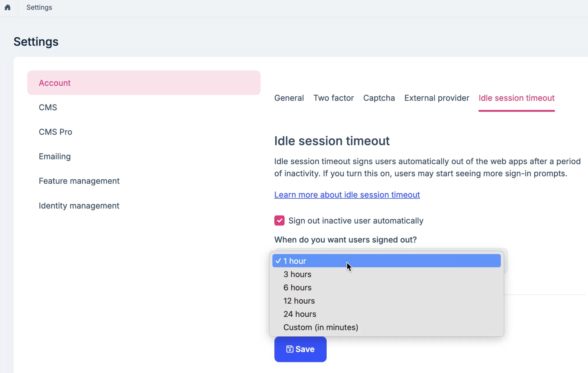
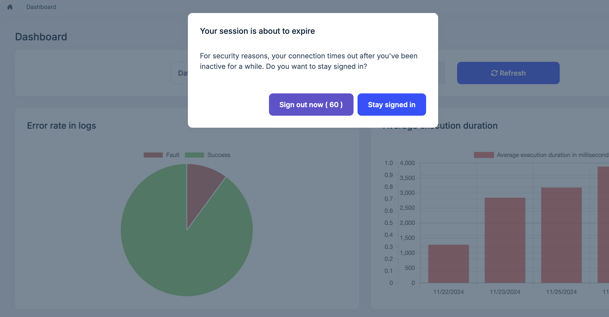

# Idle Session Timeout

The `Idle Session Timeout` feature allows you to automatically log out users after a certain period of inactivity.

## Configure Idle Session Timeout

You can enable/disable the `Idle Session Timeout` feature in the `Setting > Account > Idle Session Timeout` page.

The default idle session timeout is 1 hour. You can change it by selecting a different value from the dropdown list or entering a custom value(in minutes).

Once the idle session timeout is reached, the user will see a warning modal before being logged out. if user does not respond for 60 seconds, the user will be logged out automatically.

## How it works

There is JavaScript code running in the background to detect user activity. such as mouse movement, key press, click, etc. If there is no activity detected for setting time, The warning modal will be shown to the user.
