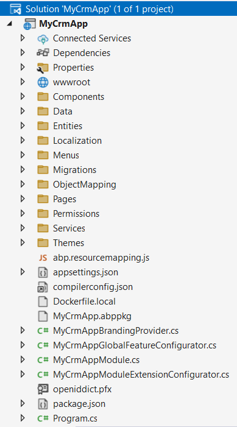
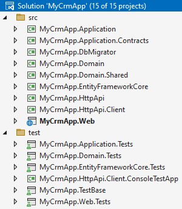
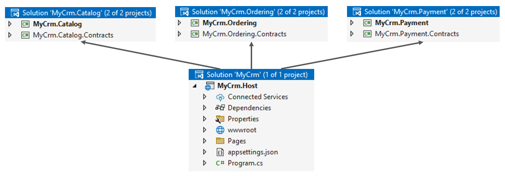

# Solution Templates: A Guide to Select the Right One For You

ABP provides several [startup templates](index.md) to you. It is important to start with the right startup template that is suitable for your **project** and **team**. This guide aims to lead you to select the most proper startup template for your requirements.

The following **architectures** will be discussed based on ABP startup templates:

* **Single-Layer** (non-layered) application
* **N-Layered** application
* **Modular** application
* **Microservice** solution

## What is a Startup Template?

In the following section, you will understand what a startup template is and what it provides.

### Pre-Architected Solution Structure

A startup solution template is a **pre-architected** structure. For example, the [layered startup template](layered-web-application/index.md) is a great starting point if you want to build a layered application code-base based on [Domain-Driven Design](../framework/architecture/domain-driven-design/index.md) principles and patterns.

However, starting with any startup template **doesn't limit you** on adding or removing projects, layers, integration packages, and creating other applications/services. You can even start with a [single-layer application template]() and convert it to a microservice solution. However, if you want to build a microservice solution, starting with the [microservice startup template](microservice/index.md) is the best.

So, it is **best to start with the most suitable startup template** for your purpose and then modify the solution to fit your custom requirements.

### Well-Structured Code Organization

Besides the overall solution structure, the internals of each project in a solution template are well-structured. It is clear where will you place your [entities](../framework/architecture/domain-driven-design/entities.md), [repositories](../framework/architecture/domain-driven-design/repositories.md), [data access code](../framework/data/index.md), [application services](../framework/architecture/domain-driven-design/application-services.md), [API controllers](../framework/api-development/index.md), [UI elements](../framework/ui/index.md), etc. You don't spend time thinking about how to **organize your codebase** in every new project. If you prefer to build automated tests for your application, the test projects are also included and pre-configured.

### Library Integrations & Configurations

When you use ABP startup solution templates to create a new solution, some **fundamental library installations** ([Serilog](https://serilog.net/), [Autofac](https://autofac.org/), [AutoMapper](https://automapper.org/), [Swagger](https://swagger.io/), [HealthCheck](https://github.com/Xabaril/AspNetCore.Diagnostics.HealthChecks) and others..) and their fine-tuned configurations are already prepared for you. Also, required **[ABP packages](https://abp.io/packages)** are just installed based on your preferences and configured for **development and production environments**.

### Development Ready

When you create a new solution, or when a new teammate starts to work on your existing solution, it is pretty **easy to understand** the solution structure, design decisions and the development flow by the help of [solution structure documents](index.md) and [development tutorials](../tutorials/index.md).

### Production Ready

ABP's startup templates are ready for production out of the box. You can just create a new solution and **deploy it** to your production environment. It is not only about **technical readiness**, but also about **functional readiness**.

When you create a new ABP solution, **fundamental modules are already installed**. Your application has a robust [account module](../modules/account.md) (user registration, login, social logins, 2-factor authentication, user lockout, password complexity control...), an advanced [identity module](../modules/identity.md) (user, role and permission management), and many other production-ready [pre-built application modules](../modules/index.md) are just working as a part your application in the first day.

## The Startup Solution Templates

Up to this point, it is explained what a startup template is and the features it offers. In the following section, you will see the types of  startup solution templates and  **which one is best for you**.

### Single-Layer Application Solution Template

The [single-layer solution template](single-layer-web-application/index.md) is the simplest. It provides a **minimal solution architecture** while starting a new project. Your .NET solution typically contains a **single, or a few .NET projects** depending on your UI and other preferences while creating your solution.

The following figure shows a single-project web application that has [MVC (Razor Pages) UI](../framework/ui/mvc-razor-pages/overall.md) and [Entity Framework Core](../framework/data/entity-framework-core/index.md) database provider with the default configuration:

As you see in the preceding figure, all the application code (entities, data access, services, UI pages, etc.) are located in a **single .NET project**.

#### When Should You Start a Single-Layer Solution Template?

In the following conditions, you may consider to use the single-layer solution template:

* If **your project is small** and you don't expect that it will grow by the time. But remember that many projects are thought of as small in the beginning.
* If your project is a **temporary project** and it will be trash in a short time. It can be a POC project or a temporary application for a demo or advertisement campaign.
* If you are a **single developer** or there are only 2-3 developers working on your solution, and these developers are not experienced and are not willing to understand the structure and benefits of a layered application.

If the preceding conditions are met with your case, you can consider starting with this solution template. 
However, keep in mind that your solution can quickly become a **[big ball of mud](https://thedomaindrivendesign.io/big-ball-of-mud/)**. 
We think that only a **very small portion of applications** are suitable for that kind of solution structure.

Note that the single-layer solution template doesn't provide the following options/features:

* Mobile application integration
* Public website (a second web application for landing page of your product)
* Tiered architecture (for MVC applications, separates UI and service layers)
* Separate tenant schema (for multi-tenant applications)
* Kubernetes / Helm configuration
* Automated (unit/integration) test projects

These options are not implemented to keep the solution structure as simple as possible. If you need some of these, please feel free to use the layered solution template.

### Layered Solution Template

The [layered application startup template](layered-web-application/index.md) is a .NET solution that consists of several projects. 
Each project represents a layer of the application or has a specific functionality for the solution.

The exact project count in your solution depends on the options you have selected. 
The following figure shows a solution with [MVC (Razor Pages) UI](../framework/ui/mvc-razor-pages/overall.md) and [Entity Framework Core](../framework/data/entity-framework-core/index.md) database provider with the default configuration:

The solution is layered based on Domain-Driven Design principles and extended based on real-world business application requirements. It includes test projects for each layer. Layering the solution has great benefits:

* It makes your business code (domain & application layers) independent from infrastructure (UI and database) that makes it more **maintainable and long-living**.
* Different developers can **focus on different layers**. It is valuable when multiple developers (with different roles) touching to the same solution.
* It **separate concerns**, so you can focus on a single concern at a time. You can optimize your data access code without touching other layers, you can change your UI code without breaking your business logic.
* It provides **maximum code reusability**. If you have multiple applications (e.g. one back office application, one end-user application, and a mobile application), it is easy to separate these application's codebases (simply create new application & UI layers for each application type) while they can share the same domain and data access layers.
* Separating **UI layer** gives an opportunity to **replace/modify** it in the future without affecting other parts of your solution. You know, UI is the fastest changing technology in software industry.

While it may seem a little complicated at the beginning, once you **complete the [Book Store tutorial](../tutorials/book-store/index.md)**, you will easily understand the purpose and usage of each project.

#### When Should You Start a Layered Solution Template?

In the following conditions, you may consider to use the layered solution template:

* If your project **code-base** is relatively **larger**.
* If your project is **relatively complex** and involves multiple business domains or complex workflows.
* If your project is a **long-term** project and you want to design it as **maintainable** for long years.
* If you are **a team of developers** working on your solution. When multiple teams or developers work on different parts of the system.
* If your solution will have **multiple** web, mobile or other type of **applications** that need to **share** the same business logic.
* If your project needs **scalability**, solutions that may need to scale in functionality or user load over time.
* If your project needs **extensibility**, which requires the addition of new features or integration with third-party services.

### Modular Monolith Applications

ABP does not provide a specific modular monolith application startup template. However, it is not needed. Let us explain why.

The ABP Framework and [ABP Studio](../studio/index.md) are already designed to support modular application development from their beginning. ABP framework provides all the **necessary infrastructure** for [modularity](../framework/architecture/modularity/basics.md) and all other framework features are **compatible with modular solutions**.

On the other hand, the main purpose of ABP Studio's [Solution Explorer panel](../studio/solution-explorer.md) is to **architect and build modular and complex software solutions**. You can easily create new modules, arrange dependencies between the modules and import/install these modules into a monolith application. While you can do all these manually yourself, ABP Studio makes it extremely easy to do and understand it.

#### How to Build a Modular Monolith Application?

A **modular monolith** application consists of a **single host** application and **multiple sub-modules**. Typically, each module has its own .NET solution that contains the code related to that module. So, the general structure is shown in the following figure:

In this example, `MyCrm.Host` is an almost-empty host application that has package references to other modules. Every module consists of two packages: implementation and contract packages.

You can follow the steps below to create such a modular solution with ABP Studio:

* **Create a new application** using either [single-layer](single-layer-web-application/index.md) or [layered](layered-web-application/index.md) application startup template. That application will be the **host application** of your solution.
* **Create new modules** (right-click to the solution root, select the *Add* -> *New Module* -> ... command).
* **Import & Install** these **modules** to the host application.

> You can follow the **[Modular Monolith Application Development Tutorial](../tutorials/modular-crm/index.md)** to learn how to build a modular application step by step.

#### Which Startup Template should be used for a Modular Application?

So, both [single-layer](single-layer-web-application/index.md) and [layered](layered-web-application/index.md) application startup templates are inherently modular. Just use one of them and start your modular solution. You may wonder which one to start:

* Use the **[single-layer startup template](single-layer-web-application/index.md)** for the host application of your modular monolith if you will leave the host application as empty. It will contain some configuration code of course, but it won't contain any actual application code. **This is the suggested approach.**
* Use the **[layered application startup template](layered-web-application/index.md)** if you will write some application code into the hosting application. You may want to write some code that makes multiple module operations that are not easy to implement in a particular module. In that case, a layered hosting application will be a better way to organize your codebase. However, this approach can quickly move your solution away from a modular system. So, take your own risk.

#### When Should You Start a Modular Monolith Application?

In the following conditions, you may consider to build a modular software solution:

* If your **domain is too complex** to develop and maintain in a single monolith codebase.
* If your business domain has clear functional boundaries and is possible to **split into sub-domains**. 
* If you have **multiple teams** that will work on the solution.
* When you need to **reduce complexity** early on. And if you are considering migrating your application to a **microservice system**.

While all these are also suitable for microservice solutions (which will be discussed in the next section), a modular solution is more suitable than microservices for most of the projects. 
Especially if you don't need to have technology diversity, deploy and scale services independently and serve too many users concurrently with a fault-tolerant system, a modular monolith application would be a better choice to not deal with the complexity of a microservice system. Also, it is better to start with a thin architecture when you have a small team that can focus on building features without spending time managing distributed architecture complexities. Another advantage is that the modular monoliths avoid the network latency and communication overhead inherent in microservices, so debugging and monitoring are easier as all modules run within a single application. In summary, if you anticipate that your application may grow to require a microservices architecture in the future, a modular monolith is a great starting point.

> Build for Now, Scale for Tomorrow
 
Even if you are considering building a microservice architecture, it is usually advised to [start with a monolith modular first](https://martinfowler.com/bliki/MonolithFirst.html), then migrate to microservices later once your business and module boundaries are more stable.

### Microservice Solution Template

ABP's [microservice startup template](microservice/index.md) includes multiple services, API gateways and applications that are well integrated into each other and ready to be a great **base solution for your microservice system**. 
In the following picture, you can see an overall diagram that shows the main components of the solution (they vary based on the options while you are creating your solution):

####  When Should You Start a Microservice Solution Template?

In the following conditions, you may consider to build a microservice system:

* If your **domain is too complex** to develop and maintain in a single monolith codebase.
* If your business domain is possible to **split into sub-domains**.
* If you have **multiple teams** that will work on the solution in parallel.
* If you need to **develop**, **test**, **deploy** and **scale services** independently.
* If you need to use **multiple technology stacks** so, some services can be built with .NET, and others can be built with Java, Python, etc...
* If you need to serve **too many users** concurrently with a **high available** and **fault tolerant** system.
* If you have **DevOps** knowledge and culture in your company. If you can deal with **complex** development, build, test, deployment and production environments.

**Use Case Examples**
* **E-Commerce Platforms**: Separate services for cart, checkout, inventory, and shipping.
* **Streaming Services**: Modules for content delivery, user preferences, and recommendations.
* **SaaS Platforms**: Independent services for billing, user accounts, and analytics.

## Conclusion

In summary, the ABP Platform offers a variety of solution templates tailored to different architectural needs, including layered applications, microservices, and modular development. These templates provide a great foundation for building robust applications by implementing best practices and providing essential features. By selecting the right template, you can streamline the development process, ensuring scalability and maintainability in your project.
