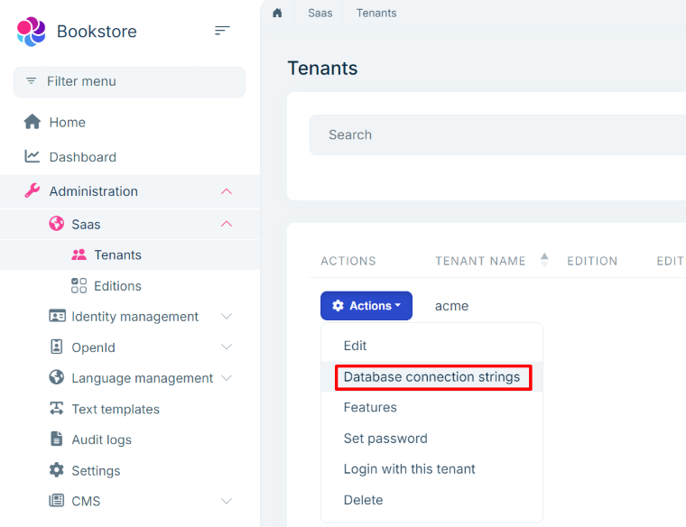
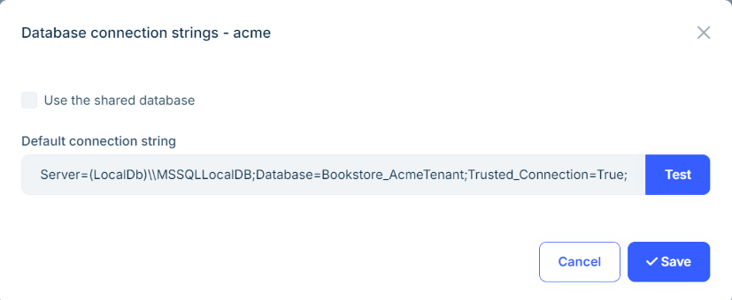
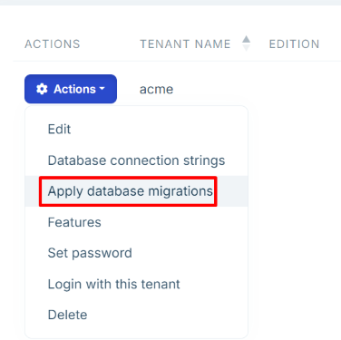

# Layered Solution: Database configurations

```json
//[doc-nav]
{
  "Previous": {
    "Name": "Authentication",
    "Path": "solution-templates/layered-web-application/authentication"
  },
  "Next": {
    "Name": "Logging (with Serilog)",
    "Path": "solution-templates/layered-web-application/logging"
  }
}
```

> Some of the features mentioned in this document may not be available in the free version. We're using the **\*** symbol to indicate that a feature is available in the **[Team](https://abp.io/pricing)** and **[Higher](https://abp.io/pricing)** licenses.

ABP Studio's Layered Solution Template includes pre-configured database settings. This document explains how to manage database configurations in your solution.

## Connection Strings

Connection strings are stored in the `appsettings.json` file. You can customize them for different environments by modifying the respective `appsettings.json` files. The `*.DbMigrator` project and one of the [Web Application](web-applications.md) projects use the `Default` connection string by default.

To change the connection string for the `Default` key, update the `appsettings.json` file in your project. Connection strings are defined under the `ConnectionStrings` section, as shown below:

```json
{
  "ConnectionStrings": {
    "Default": "Server=(LocalDb)\\MSSQLLocalDB;Database=Bookstore;Trusted_Connection=True;TrustServerCertificate=true"
  }
}
```

### The DbContext Class

In the `*.EntityFrameworkCore` project, the `DbContext` class is defined. The `DbContext` class is derived from the `AbpDbContext` class, which is a part of the ABP Framework.

```csharp
[ReplaceDbContext(typeof(IIdentityProDbContext))]
[ReplaceDbContext(typeof(ISaasDbContext))]
[ConnectionStringName("Default")]
public class BookstoreDbContext :
    AbpDbContext<BookstoreDbContext>,
    ISaasDbContext,
    IIdentityProDbContext
{
    #region Entities from the modules

    // Identity
    public DbSet<IdentityUser> Users { get; set; }
    public DbSet<IdentityRole> Roles { get; set; }
    public DbSet<IdentityClaimType> ClaimTypes { get; set; }
    public DbSet<OrganizationUnit> OrganizationUnits { get; set; }
    public DbSet<IdentitySecurityLog> SecurityLogs { get; set; }
    public DbSet<IdentityLinkUser> LinkUsers { get; set; }
    public DbSet<IdentityUserDelegation> UserDelegations { get; set; }
    public DbSet<IdentitySession> Sessions { get; set; }

    // SaaS
    public DbSet<Tenant> Tenants { get; set; }
    public DbSet<Edition> Editions { get; set; }
    public DbSet<TenantConnectionString> TenantConnectionStrings { get; set; }

    #endregion

    public BookstoreDbContext(DbContextOptions<BookstoreDbContext> options)
        : base(options)
    {

    }

    protected override void OnModelCreating(ModelBuilder builder)
    {
        base.OnModelCreating(builder);

        builder.ConfigurePermissionManagement();
        builder.ConfigureSettingManagement();
        builder.ConfigureBackgroundJobs();
        builder.ConfigureAuditLogging();
        builder.ConfigureFeatureManagement();
        builder.ConfigureIdentityPro();
        builder.ConfigureOpenIddictPro();
        builder.ConfigureLanguageManagement();
        builder.ConfigureSaas();
        builder.ConfigureTextTemplateManagement();
        builder.ConfigureGdpr();
        builder.ConfigureCmsKit();
        builder.ConfigureCmsKitPro();
        builder.ConfigureBlobStoring();
        
        /* Configure your own tables/entities inside here */

        //builder.Entity<YourEntity>(b =>
        //{
        //    b.ToTable(BookstoreConsts.DbTablePrefix + "YourEntities", BookstoreConsts.DbSchema);
        //    b.ConfigureByConvention(); //auto configure for the base class props
        //    //...
        //});
    }
}
```

#### ConnectionStringName Attribute

We're using the *Default* connection string in the `BookstoreDbContext` class. You can change the connection string name by updating the `ConnectionStringName` attribute.

```csharp
[ConnectionStringName("Default")]
```

[The `ConnectionStringName` attribute](../../framework/fundamentals/connection-strings.md#set-the-connection-string-name) defines the unique name of the connection string that is being used by that `DbContext` class. It matches with the connection string defined in the `appsettings.json` file. That name is also used in database migrations to distinguish different database schemas, and used as the key while storing tenant connection strings for a multi-tenant system.

#### ReplaceDbContext Attribute

```csharp
[ReplaceDbContext(typeof(IIdentityProDbContext))]
[ReplaceDbContext(typeof(ISaasDbContext))]
```

The application DbContext utilizes the [Identity](../../modules/identity.md) and [Saas **\***](../../modules/saas.md) modules and creates a single database that contains these modules database schemas. These modules define their own `DbContext` class normally. But [the `ReplaceDbContext` attribute](../../framework/data/entity-framework-core/index.md#replace-other-dbcontextes) tells to ABP to use this (`BookstoreDbContext`) `DbContext` class instead of the `DbContext` classes defined by these modules. Technically, it replaces the given `DbContext` classes on runtime. We are doing that to ensure that we have a single (merged) database schema, single database migration path and a single database transaction operation when we work these multiple modules. When we replace a `DbContext`, we should implement its interface as done with the `BookstoreDbContext` class:

````csharp
public class BookstoreDbContext :
    AbpDbContext<BookstoreDbContext>,
    ISaasDbContext,
    IIdentityProDbContext
````

* That class implements `ISaasDbContext` and `IIdentityProDbContext`, so these modules can use it.

As the next part, the `BookstoreDbContext` class defines the following properties those are forced by the implemented interfaces:

```csharp
// Identity
public DbSet<IdentityUser> Users { get; set; }
public DbSet<IdentityRole> Roles { get; set; }
public DbSet<IdentityClaimType> ClaimTypes { get; set; }
public DbSet<OrganizationUnit> OrganizationUnits { get; set; }
public DbSet<IdentitySecurityLog> SecurityLogs { get; set; }
public DbSet<IdentityLinkUser> LinkUsers { get; set; }
public DbSet<IdentityUserDelegation> UserDelegations { get; set; }
public DbSet<IdentitySession> Sessions { get; set; }

// SaaS
public DbSet<Tenant> Tenants { get; set; }
public DbSet<Edition> Editions { get; set; }
public DbSet<TenantConnectionString> TenantConnectionStrings { get; set; }
```

#### OnModelCreating Method

The `OnModelCreating` method is used to configure the database schema. It calls the `Configure*` methods of the ABP Framework to configure the database schema for the modules. You can also configure your own tables/entities inside this method.

```csharp
protected override void OnModelCreating(ModelBuilder builder)
{
    base.OnModelCreating(builder);

    builder.ConfigurePermissionManagement();
    builder.ConfigureSettingManagement();
    builder.ConfigureBackgroundJobs();
    builder.ConfigureAuditLogging();
    builder.ConfigureFeatureManagement();
    builder.ConfigureIdentityPro();
    builder.ConfigureOpenIddictPro();
    builder.ConfigureLanguageManagement();
    builder.ConfigureSaas();
    builder.ConfigureTextTemplateManagement();
    builder.ConfigureGdpr();
    builder.ConfigureCmsKit();
    builder.ConfigureCmsKitPro();
    builder.ConfigureBlobStoring();
    
    /* Configure your own tables/entities inside here */

    //builder.Entity<YourEntity>(b =>
    //{
    //    b.ToTable(BookstoreConsts.DbTablePrefix + "YourEntities", BookstoreConsts.DbSchema);
    //    b.ConfigureByConvention(); //auto configure for the base class props
    //    //...
    //});
}
```

> The `Configure*` methods are extension methods defined in each module's `EntityFrameworkCore` project. These methods are used to configure the database schema for their respective modules. At runtime, the `DbContext` class is replaced by the `BookstoreDbContext` class only for the `DbContext` classes that use the `ReplaceDbContext` attribute. For other modules, their own dedicated `DbContext` classes are used without replacement.

### The `IDesignTimeDbContextFactory` Implementation

The `IDesignTimeDbContextFactory` interface is used to create a `DbContext` instance at design time. It is used by EF Core tools to create migrations and update the database. The `BookstoreDbContextFactory` class implements the `IDesignTimeDbContextFactory` interface to create a `BookstoreMigrationsDbContext` instance.

```csharp
public class BookstoreDbContextFactory : IDesignTimeDbContextFactory<BookstoreDbContext>
{
    public BookstoreDbContext CreateDbContext(string[] args)
    {
        var configuration = BuildConfiguration();
        
        BookstoreEfCoreEntityExtensionMappings.Configure();

        var builder = new DbContextOptionsBuilder<BookstoreDbContext>()
            .UseSqlServer(configuration.GetConnectionString("Default"));
        
        return new BookstoreDbContext(builder.Options);
    }

    private static IConfigurationRoot BuildConfiguration()
    {
        var builder = new ConfigurationBuilder()
            .SetBasePath(Path.Combine(Directory.GetCurrentDirectory(), "../Acme.Bookstore.DbMigrator/"))
            .AddJsonFile("appsettings.json", optional: false);

        return builder.Build();
    }
}
```

### Configuration

In the `*.EntityFrameworkCore` project, the `BookstoreEntityFrameworkCoreModule` class is used to configure the database context.

```csharp
public override void ConfigureServices(ServiceConfigurationContext context)
{
    context.Services.AddAbpDbContext<BookstoreDbContext>(options =>
    {
            /* Remove "includeAllEntities: true" to create
              * default repositories only for aggregate roots */
        options.AddDefaultRepositories(includeAllEntities: true);
    });

    Configure<AbpDbContextOptions>(options =>
    {
            /* The main point to change your DBMS.
              * See also BookstoreDbContextFactory for EF Core tooling. */
        options.UseSqlServer();
    });
    
}
```

We are basically setting the SQL Server as the default DBMS for this application. and registering the `BookstoreDbContext` class to the [dependency injection](../../framework/fundamentals/dependency-injection.md) system.

### SaaS Module: The Tenant Management UI **\***

SaaS module provides the necessary UI to set and change connection string for tenants and trigger the database migrations.

#### The Connection String Management Modal

You can click to the *Database Connection Strings* command in the *Actions* dropdown button for a tenant in the *Tenants* page of the SaaS module:



It opens the *Database Connection Strings* modal as shown below:



Here, we can set a *Default connection string* for the tenant.

When you make the changes and save the dialog, the database is automatically created and migrated. If you later update the connection string (for example if you change the database name), it will also trigger the database migration process again.

#### Manually Applying the Database Migrations

If you need to manually trigger the database migrations for a specific tenant, click the *Actions* dropdown for the related tenant and select the *Apply Database Migrations* command on the *Tenant Management* page of the SaaS module:


