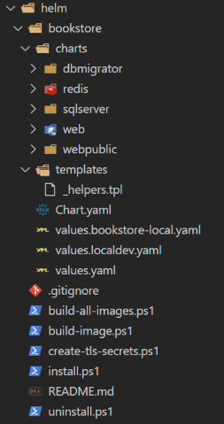
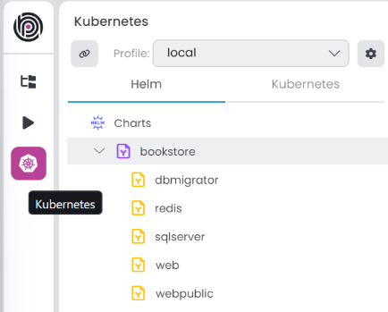

# Layered Solution: Helm Charts and Kubernetes

````json
//[doc-nav]
{
  "Previous": {
    "Name": "CORS configuration",
    "Path": "solution-templates/layered-web-application/cors-configuration"
  }
}
````

> You must have an ABP Business or a higher license to be able to use the Kubernetes features.

This document explains how to deploy the layered solution to a Kubernetes cluster using [Helm](https://helm.sh/) charts. The layered solution template includes Helm charts for each application and infrastructure (Redis, RabbitMQ, etc). You can use these charts to deploy the solution to a Kubernetes cluster. You can see the Helm charts in the `etc/helm` folder of the solution.

## Folder Structure

The folder structure of the Helm charts is as follows:



> You might have different charts based on the solution template options you selected while creating the solution.

* **bookstore**: The Helm chart for the `Bookstore` solution. The folder name should be the same as your project name.
  * **charts**: The sub-charts of the solution. Each application and infrastructure has its own chart.
  * **templates**: The templates of the solution. It includes the ingress host URLs.
  * **Chart.yaml**: The chart metadata.
  * **values.bookstore-local.yaml**: The override values file for the [Kubernetes profile](../../studio/kubernetes.md#profile). It should follow the naming convention for your project name.
  * **values.yaml**: The default values file for the chart.
* **build-all-images.ps1**: A PowerShell script to build all Docker images of the solution.
* **build-image.ps1**: A PowerShell script to build a Docker image of a specified project.
* **create-tls-secrets.ps1**: A PowerShell script to create local TLS secrets for the ingress controller. It's important when you try to [intercept a service](../../studio/kubernetes.md#intercept-a-service) and run it locally.
* **install.ps1**: A PowerShell script to install the solution to a Kubernetes cluster. You can override the default argument values.
* **uninstall.ps1**: A PowerShell script to uninstall the solution from a Kubernetes cluster. You can override the default argument values.

## Installing the Helm Charts

You can install the solution to a Kubernetes cluster using the `install.ps1` script. The script has the following arguments:

* **ChartName**: Default value is the project name. You can create different charts and specify the chart name. In ABP Studio [Kubernetes Main Chart](../../studio/kubernetes.md#main-chart) *Install Chart(s)* command automatically sets the chart name.
* **Namespace**: The namespace to install the Kubernetes resources. Default value is the project name with the `-local` suffix.
* **ReleaseName**: The release name of the Helm chart. Default value is the project name with the `-local` suffix.
* **DotnetEnvironment**: The environment to run the application. Default value is `Staging`.
* **User**: The user responsible for installing the Kubernetes resources. The application will automatically set the user name if you configure it under [Specify the User](../../studio/kubernetes.md#specify-the-user).  

Before running the script, you need to build the Docker images of the solution. You can use the `build-all-images.ps1` script to build all Docker images of the solution. Afterwards, make sure that you have a Kubernetes TLS secret for the ingress controller. It is automatically created when you create the solution; however, if you clone the solution from a repository, you need to create it manually. You can use the `create-tls-secrets.ps1` script to create the TLS secret. Then you can run the `install.ps1` script to install the solution to a Kubernetes cluster.

## Uninstalling the Helm Charts

You can uninstall the solution from a Kubernetes cluster using the `uninstall.ps1` script. The script has the following arguments:

* **Namespace**: The namespace to uninstall the helm chart. Default value is the project name with the `-local` suffix.
* **ReleaseName**: The release name of the Helm chart. Default value is the project name with the `-local` suffix.
* **User**: The user responsible for uninstalling the Kubernetes resources. The application will automatically set the user name if you configure it under [Specify the User](../../studio/kubernetes.md#specify-the-user).  

You can run the `uninstall.ps1` script to uninstall the solution from a Kubernetes cluster.

```bash
./uninstall.ps1
```

Additionally, in ABP Studio [Kubernetes](../../studio/kubernetes.md) feature, you can do the same operations more easily. You can use the Install Chart(s) and Uninstall Chart(s) commands to install and uninstall the solution to a Kubernetes cluster. Also, use the Build Docker Image(s) command to build the Docker images of the solution.

