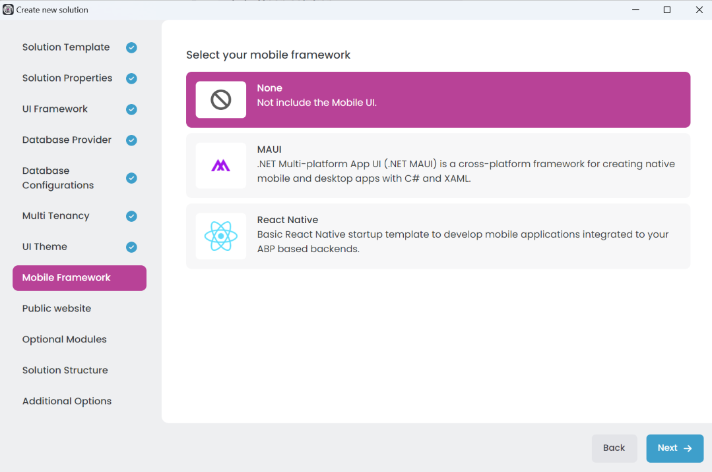
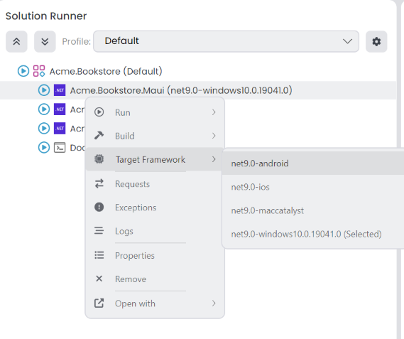

# Layered Solution: Mobile Applications

```json
//[doc-nav]
{
  "Previous": {
    "Name": "Db Migrator",
    "Path": "solution-templates/layered-web-application/db-migrator"
  },
  "Next": {
    "Name": "Built-In Features",
    "Path": "solution-templates/layered-web-application/built-in-features"
  }
}
```

> You must have an ABP Team or a higher license to be able to create a mobile application project with ABP Studio.

Mobile applications are an essential part of modern software solutions. They provide a user-friendly interface to the end-users and allow them to access the system from anywhere. ABP Studio allows you to create mobile applications for your layered solution. You can create a new mobile application project, configure it, and run it on your device.

## Mobile Application Types

ABP Studio supports the following mobile application types:

- **None**: No mobile application project is created. It is the default option.
- **MAUI**: Cross-platform mobile applications with .NET MAUI (Multi-platform App UI). You can create MAUI projects with ABP Studio.
- **React Native**: Cross-platform mobile applications that share code between iOS and Android platforms. You can create React Native projects with ABP Studio.

You can select the mobile application type when creating a new layered application project during the *Mobile Framework* step.



### The MAUI Application

This is the mobile application that is built based on Microsoft's [MAUI framework](https://learn.microsoft.com/en-us/dotnet/maui). It will be in the solution only if you've selected the MAUI as your mobile application option.

#### Project Structure
Entire MAUI application is built on the AppShell pattern of MAUI. You can find the AppShell class in the `Acme.Bookstore.Maui` project. It is the entry point of the application. It is responsible for initializing the application and registering the services. You find all the pages and routing information in the `AppShell.xaml` file.

- **Pages**: Pages are located in the `Pages` folder of the project. Each page has a XAML & C# file. XAML file is responsible for the UI and C# file is responsible for the initialization of the page.

- **ViewModels**: ViewModels are located in the `ViewModels` folder of the project. Each ViewModel has a C# file. ViewModels are responsible for the business logic of the pages.

- **Oidc**: Oidc folder contains the logic for the authentication of the application. It contains the `MauiAuthenticationBrowser` class which manages the authentication process of the application.

- **Localization**: Localization folder contains the localization logic of the application. It contains regular ABP Localization logic and the `LocalizationResourceManager` class which is wrapper for the ABP localization logic on MAUI.

- **Messages**: Messages folder contains the message data for the communication inside application. Messages are used to send data between pages and viewmodels. It's designed on the [MVVM Toolkit Messenger](https://learn.microsoft.com/en-us/dotnet/communitytoolkit/mvvm/messenger) feature.

- **Storage**: Storage folder contains the storage logic of the application. It contains the `IStorage` class which is wrapper for the [SecureStorage](https://learn.microsoft.com/en-us/dotnet/maui/platform-integration/storage/secure-storage) feature. It is used to store the authentication data of the user and preferences of the application.

_Rest of the folders are MAUI default folders. You can check the [.NET MAUI single project documentatipon](https://learn.microsoft.com/en-us/dotnet/maui/fundamentals/single-project?view=net-maui-8.0) for more information._

#### Running the application
Before running the MAUI Application, rest of the applications in the solution must be running. Such as AuthServer, MobileGateway and the microservices. 

Make sure that you prepared devices for debugging. You can check the following documentation for each platform.

- [Android](https://learn.microsoft.com/en-us/dotnet/maui/android/emulator/)
- [iOS](https://learn.microsoft.com/en-us/dotnet/maui/ios/pair-to-mac)
- [MacCatalyst](https://learn.microsoft.com/en-us/dotnet/maui/mac-catalyst/cli)
- [Windows](https://learn.microsoft.com/en-us/dotnet/maui/windows/setup)

##### Network

All the platforms including iOS, MacCataylst and Windows, runs the applications in the same network of the host. So, you can use the `localhost` address to connect to the applications.

But in the **Android Emulator**, you need to use the `adb reverse` command to connect to the applications. You can use the following command to connect to the AuthServer application:

```bash
adb reverse tcp:44300 tcp:44300
```

> `44300` is an example port. You need to change it based on the port of the AuthServer & MobileGateway application.

> You need to run the command for a running emulator. If you run the emulator after running the command, you need to run the command again.


##### Target Framework

Since MAUI Applications have multiple target frameworks, you need to select the target framework before running the application. You can select the target framework from the context menu of the Solution Runner.



##### Running with ABP Studio
You can start the MAUI application with the solution runner. You can click the start button of the MAUI application in the solution runner tree. It will start the application on the selected target framework. Since they're not running on a process and they're running on a device, you can't see them as running state in the solution runner. After the application is deployed, it'll be opened on the device and it'll be shown as stopped in the solution runner.

#### Development on MAUI Application

You can follow [Mobile Application Development Tutorial - MAUI](../../tutorials/mobile/maui/index.md) to learn how to develop on MAUI Application.

### The React Native Application

This is the mobile application that is built based on Facebook's [React Native framework](https://reactnative.dev/) and [Expo](https://expo.dev/). It will be in the solution only if you've selected React Native as your mobile application option.

#### Project Structure
- **Environment.js**: file using for provide application level variables like `apiUrl`, `oAuthConfig` and etc.

- **api**: The `api` folder contains HTTP request files that simplify API management in the React Native starter template
  - `API.js:` exports **axiosInstance**. It provides axios instance filled api url

- **components**: In the `components` folder you can reach built in react native components that you can use in your app. These components **facilitates** your list, select and etc. operations

- **contexts**: `contexts` folder contains [react context](https://react.dev/reference/react/createContext). You can expots your contexts in this folder. `Localization context provided in here`

- **navigators**: folder contains [react-native stacks](https://reactnavigation.org/docs/stack-navigator/). After create new *FeatureName*Navigator we need to provide in `DrawerNavigator.js` file as `Drawer.Screen`

- **screens**: is the content of navigated page. We'll pass as component property to [Stack.Screen](https://reactnavigation.org/docs/native-stack-navigator/)

- **store**: folder manages state-management operations. We will define `actions`, `reducers`, `sagas` and `selectors` here.

- **styles**: folder contains app styles. `system-style.js` comes built in template we can also add new styles.

- **utils**: folder contains helper functions that we can use in application

#### Running the Application

React Native applications can't be run with the solution runner. You need to run them with the React Native CLI. You can check the [React Native documentation](https://reactnative.dev/docs/environment-setup) to learn how to setup the environment for React Native development.

Before running the React Native application, rest of the applications in the solution must be running. Such as AuthServer, MobileGateway and the microservices.

Then you can run the React Native application by following this documentation: [Getting Started with the React Native](../../framework/ui/react-native/index.md).