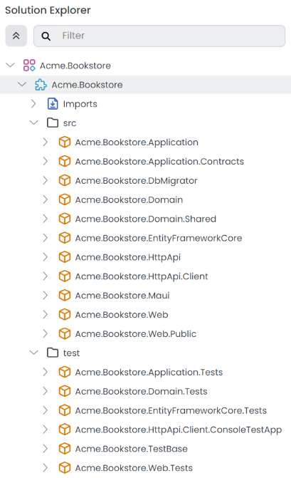
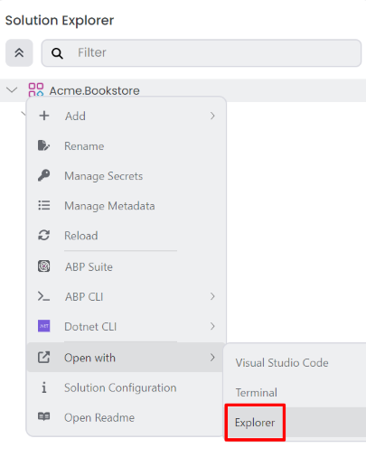
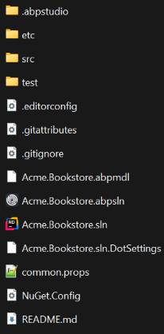
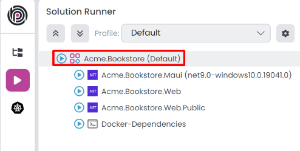
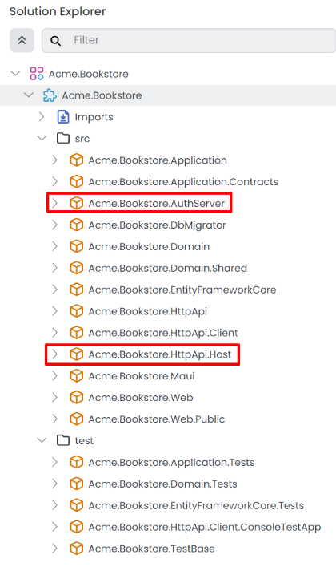

# Layered Solution: The Structure

````json
//[doc-nav]
{
  "Previous": {
    "Name": "Overview",
    "Path": "solution-templates/layered-web-application/overview"
  },
  "Next": {
    "Name": "Main Components",
    "Path": "solution-templates/layered-web-application/main-components"
  }
}
````

> Some of the features mentioned in this document may not be available in the free version. We're using the **\*** symbol to indicate that a feature is available in the **[Team](https://abp.io/pricing)** and **[Higher](https://abp.io/pricing)** licenses.

This document explains the solution and folder structure of ABP Studio's [layered solution template](index.md).

> This document assumes that you've created a new layered solution by following the *[Quick Start: Creating a Layered Web Application with ABP Studio](../../get-started/layered-web-application.md)* guide. (Choose the *Entity Framework Core* as the database provider.)

## Understanding the ABP Solution Structure

When you create a new layered solution, you will see a tree structure similar to the one below in the *Solution Explorer* panel:



`Acme.Bookstore` is the main **ABP Studio module** of the solution. It includes two folders: `src` and `test`, as shown in the image above. The `src` folder contains the source code of the solution, which is structured according to [DDD](../../framework/architecture/domain-driven-design/index.md) principles, while the `test` folder holds the unit and integration tests.

> Refer to the *[Concepts](../../studio/concepts.md)* document for a comprehensive definition of ABP Studio solution, module, and package terms.

## Exploring the Folder Structure

You can right-click the root item in the solution explorer (`Acme.Bookstore` for this example) and select the *Open with* -> *Explorer* command to open the folder containing the solution in your file system:



The root folder of the solution will be similar to the following:



* `.abpstudio` folder stores your personal preferences for this solution and is excluded from source control (Git ignored). It is created and used by ABP Studio.  
* `etc` folder contains additional files for the solution, organized into the following sub-folders:  
  * `abp-studio` folder holds settings managed by ABP Studio. This folder is included in source control and shared among developers.  
  * `docker` folder provides docker-compose configurations to easily run infrastructure dependencies (e.g., RabbitMQ, Redis) for the solution on your local machine.  
  * `helm` folder contains Helm charts and related scripts for deploying the solution to Kubernetes. **\***  
* `src` folder contains the solution's source code, structured according to [DDD](../../framework/architecture/domain-driven-design/index.md) principles. It also includes database migrations and, depending on your project creation options, may include mobile and web application projects.  
* `test` folder contains unit and integration tests for the solution.

## Understanding the Layered Solution Structure

The diagram below illustrates the application's layers and project dependencies:


### .Domain.Shared Project

This project contains constants, enums and other objects these are actually a part of the domain layer, but needed to be used by all layers/projects in the solution.

A `BookType` enum and a `BookConsts` class (which may have some constant fields for the `Book` entity, like `MaxNameLength`) are good candidates for this project.

* This project has no dependency on other projects in the solution. All other projects depend on this one directly or indirectly.

### .Domain Project

This is the domain layer of the solution. It mainly contains [entities, aggregate roots](../../framework/architecture/domain-driven-design/entities.md), [domain services](../../framework/architecture/domain-driven-design/domain-services.md), [value objects](../../framework/architecture/domain-driven-design/value-objects.md), [repository interfaces](../../framework/architecture/domain-driven-design/repositories.md) and other domain objects.

A `Book` entity, a `BookManager` domain service and an `IBookRepository` interface are good candidates for this project.

* Depends on the `.Domain.Shared` because it uses constants, enums and other objects defined in that project.

### .Application.Contracts Project

This project mainly contains [application service](../../framework/architecture/domain-driven-design/application-services.md) **interfaces** and [Data Transfer Objects](../../framework/architecture/domain-driven-design/data-transfer-objects.md) (DTO) of the application layer. It exists to separate the interface & implementation of the application layer. In this way, the interface project can be shared to the clients as a contract package.

An `IBookAppService` interface and a `BookCreationDto` class are good candidates for this project.

* Depends on the `.Domain.Shared` because it may use constants, enums and other shared objects of this project in the application service interfaces and DTOs.

### .Application Project

This project contains the [application service](../../framework/architecture/domain-driven-design/application-services.md) **implementations** of the interfaces defined in the `.Application.Contracts` project.

A `BookAppService` class is a good candidate for this project.

* Depends on the `.Application.Contracts` project to be able to implement the interfaces and use the DTOs.
* Depends on the `.Domain` project to be able to use domain objects (entities, repository interfaces... etc.) to perform the application logic.

### .EntityFrameworkCore Project

This is the integration project for the EF Core. It defines the `DbContext` and implements repository interfaces defined in the `.Domain` project.

* Depends on the `.Domain` project to be able to reference to entities and repository interfaces.

> This project is available only if you are using EF Core as the database provider. If you select another database provider, its name will be different.

### .DbMigrator Project

This is a console application that simplifies the execution of database migrations on development and production environments. When you run this application, it:

* Creates the database if necessary.
* Applies the pending database migrations.
* Seeds initial data if needed.

> This project has its own `appsettings.json` file. So, if you want to change the database connection string, remember to change this file too.

Especially, seeding initial data is important at this point. ABP has a modular data seed infrastructure. See [its documentation](../../framework/infrastructure/data-seeding.md) for more about the data seeding.

While creating database & applying migrations seem only necessary for relational databases, this project comes even if you choose a NoSQL database provider (like MongoDB). In that case, it still seeds the initial data which is necessary for the application.

* Depends on the `.EntityFrameworkCore` project (for EF Core) since it needs to access to the migrations.
* Depends on the `.Application.Contracts` project to be able to access permission definitions, because the initial data seeder grants all permissions to the admin role by default.

### .HttpApi Project

This project is used to define your API Controllers.

Most of the time you don't need to manually define API Controllers since ABP's [Auto API Controllers](../../framework/api-development/auto-controllers.md) feature creates them automagically based on your application layer. However, in case of you need to write API controllers, this is the best place to do it.

* Depends on the `.Application.Contracts` project to be able to inject the application service interfaces.

### .HttpApi.Client Project

This is a project that defines C# client proxies to use the HTTP APIs of the solution. You can share this library to 3rd-party clients, so they can easily consume your HTTP APIs in their Dotnet applications (For other types of applications, they can still use your APIs, either manually or using a tool in their own platform)

Most of the time you don't need to manually create C# client proxies, thanks to ABP's [Dynamic C# API Clients](../../framework/api-development/dynamic-csharp-clients.md) feature.

`.HttpApi.Client.ConsoleTestApp` project is a console application created to demonstrate the usage of the client proxies.

* Depends on the `.Application.Contracts` project to be able to share the same application service interfaces and DTOs with the remote service.

> You can delete this project & dependencies if you don't need to create C# client proxies for your APIs.

### .Web Project

This project contains the User Interface (UI) of the application if you are using ASP.NET Core MVC UI. It contains Razor pages, JavaScript files, CSS files, images and so on...

This project contains the main `appsettings.json` file that contains the connection string and other configurations of the application.

* Depends on the `.HttpApi` project since the UI layer needs to use APIs and the application service interfaces of the solution.

> If you check the source code of the `.Web.csproj` file, you will see the references to the `.Application` and the `.EntityFrameworkCore` projects.
>
> These references are actually not needed while coding your UI layer, because the UI layer normally doesn't depend on the EF Core or the Application layer's implementation. These startup templates are ready for tiered deployment, where the API layer is hosted on a separate server than the UI layer.
>
> However, if you don't choose the `--tiered` option, these references will be in the .Web project to be able to host the Web, API and application layers in a single application endpoint.
>
> This gives you the ability to use domain entities & repositories in your presentation layer. However, this is considered as a bad practice according to DDD.

### Test Projects

The solution has multiple test projects, one for each layer:

* `.Domain.Tests` is used to test the domain layer.
* `.Application.Tests` is used to test the application layer.
* `.EntityFrameworkCore.Tests` is used to test EF Core configuration and custom repositories.
* `.Web.Tests` is used to test the UI (if you are using ASP.NET Core MVC UI).
* `.TestBase` is a base (shared) project for all tests.

In addition, `.HttpApi.Client.ConsoleTestApp` is a console application (not an automated test project) which demonstrate the usage of HTTP APIs from a .NET application.

Test projects are prepared for integration testing;

* It is fully integrated into the ABP and all services in your application.
* It uses SQLite in-memory database for EF Core. For MongoDB, it uses the [EphemeralMongo](https://github.com/asimmon/ephemeral-mongo) library.
* Authorization is disabled, so any application service can be easily used in tests.

You can still create unit tests for your classes which will be harder to write (because you will need to prepare mock/fake objects), but faster to run (because it only tests a single class and skips all the initialization processes).

### How to Run?

You can open the [Solution Runner](../../studio/running-applications.md) panel and start the all applications. The default username is `admin` and the password is `1q2w3E*`.



See [Getting Started With the ASP.NET Core MVC Template](../../get-started/layered-web-application.md) for more information.

## Tiered Structure **\*** 

If you have selected the ASP.NET Core UI and specified the `--tiered` option, the solution created will be a tiered solution. The purpose of the tiered structure is to be able to **deploy Web applications and HTTP API to different servers**:


* Browser runs your UI by executing HTML, CSS & JavaScript.
* Web servers host static UI files (CSS, JavaScript, image... etc.) & dynamic components (e.g. Razor pages). It performs HTTP requests to the API server to execute the business logic of the application.
* The API Server hosts the HTTP APIs which then use the application & domain layers of the application to perform the business logic.
* Finally, database server hosts your database.

> Unless you actually need such a 4-tiered deployment, it's suggested to go with the default structure which is simpler to develop, deploy and maintain.

The solution structure is shown below:



As different from the default structure, two new projects come into play: `.AuthServer` & `.HttpApi.Host`.

### .AuthServer Project

This project is used as an authentication server for other projects. `.Web` project uses OpenId Connect Authentication to get identity and access tokens for the current user from the AuthServer. Then uses the access token to call the HTTP API server. HTTP API server uses bearer token authentication to obtain claims from the access token to authorize the current user.


ABP uses the [OpenIddict Module](../../modules/openiddict.md) that uses the open-source [OpenIddict-core](https://github.com/openiddict/openiddict-core) library for the authentication between applications. See [OpenIddict documentation](https://documentation.openiddict.com/) for details about the OpenIddict and OpenID Connect protocol.

It has its own `appsettings.json` that contains database connection and other configurations.

### .HttpApi.Host Project

This project is an application that hosts the API of the solution. It has its own `appsettings.json` that contains database connection and other configurations.

### .Web Project

Just like the default structure, this project contains the User Interface (UI) of the application. It contains razor pages, JavaScript files, style files, images and so on...

This project contains an `appsettings.json` file, but this time it does not have a connection string because it never connects to the database. Instead, it mainly contains the endpoint of the remote API server and the authentication server.
