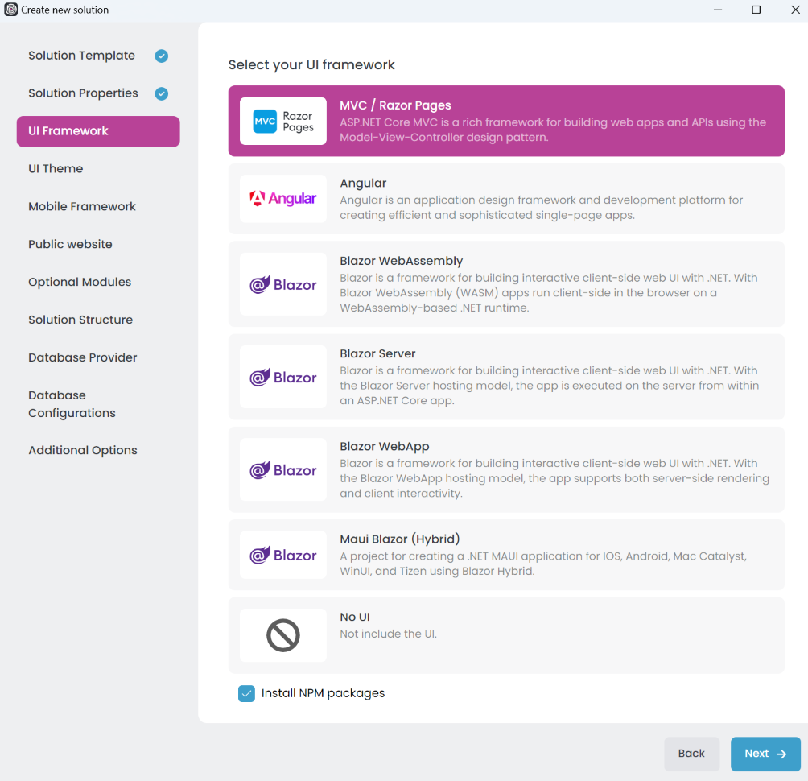
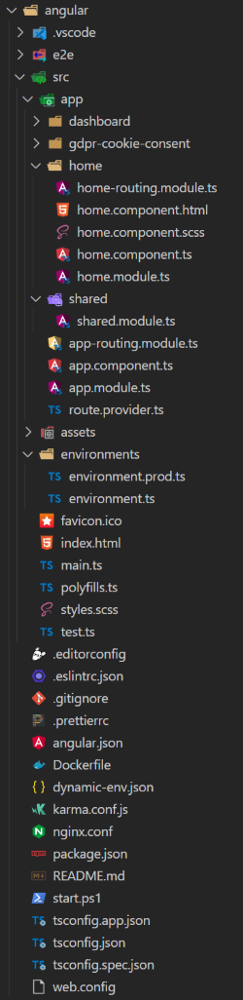

# Layered Solution: Web Applications

````json
//[doc-nav]
{
  "Previous": {
    "Name": "Main Components",
    "Path": "solution-templates/layered-web-application/main-components"
  },
  "Next": {
    "Name": "Db Migrator",
    "Path": "solution-templates/layered-web-application/db-migrator"
  }
}
````

> Some of the features mentioned in this document may not be available in the free version. We're using the **\*** symbol to indicate that a feature is available in the **[Team](https://abp.io/pricing)** and **[Higher](https://abp.io/pricing)** licenses.

The web applications are the main user interfaces of the solution. They are the entry points for users to interact with the system. The Layered Solution Template supports the following web applications:

- **MVC / Razor Pages**: This is an ASP.NET Core MVC application. It is a traditional web application that serves HTML pages to users and is suitable for building web applications with server-side rendering.  
- **Angular**: This is an Angular application, a single-page application (SPA) that runs on the client side. It communicates with the server using HTTP requests and is ideal for building modern web applications with rich user interfaces.  
- **Blazor UI**: A flexible framework for building web applications with .NET. It supports various hosting models:
  - **Blazor WebAssembly**: This is a client-side SPA that runs entirely in the user's browser. It communicates with the server using HTTP requests and is suitable for modern web applications with rich interactivity and offline capabilities.  
  - **Blazor Server**: This is a server-side SPA that runs on the server and communicates with the client in real time using SignalR. It is ideal for applications requiring constant connectivity and rapid server updates.  
  - **Blazor WebApp**: This is a combination of Blazor technologies optimized for building hybrid web applications that can leverage both client-side and server-side capabilities.  
  - **Maui Blazor (Hybrid)** **\***: This enables building cross-platform applications that combine Blazor for the UI with .NET MAUI for native device integration. It is suitable for building apps that work across desktop and mobile platforms.  
- **No UI**: This option creates a backend-only solution without a web interface, suitable for scenarios like API-only applications or headless services.  

You can select the web application type that fits your requirements during the solution creation process in the *UI Framework* step. The Layered Solution Template generates the selected web applications with the necessary configurations and integrations.



## MVC / Razor Pages

MVC (Model-View-Controller) is a design pattern commonly used for building web applications. Razor Pages, on the other hand, is a page-based programming model designed to make building web applications simpler and more productive.  

When you select the MVC / Razor Pages option in the Layered Solution Template, it generates an ASP.NET Core MVC application named something like `Acme.BookStore.Web`. This application serves as the web interface for your solution, using server-side rendering to deliver dynamic HTML pages to users.

## Angular

Angular is a popular front-end framework for building single-page applications (SPAs). It offers a rich set of features for creating modern web applications with dynamic and interactive user interfaces.  

When you select the Angular option in the Layered Solution Template, it generates:  
- An Angular application located under the solution's root folder, typically named `angular`.  
- An ASP.NET Core application, usually named something like `Acme.Bookstore.HttpApi.Host`.  

The Angular application runs as a client-side SPA in the user's browser and communicates with the server by sending HTTP requests to the `*.HttpApi.Host` application.



Each of ABP modules is an NPM package. Some ABP modules are added as a dependency in `package.json`. These modules install with their dependencies. To see all ABP packages, you can run the following command in the `angular` folder:

```bash
yarn list --pattern abp
```

Angular application module structure:


### AppModule

`AppModule` is the root module of the application. Some of the ABP modules and some essential modules are imported to `AppModule`.

ABP Config modules have also been imported to `AppModule` for initial requirements of the lazy-loadable ABP modules.

### AppRoutingModule

There are lazy-loadable ABP modules in the `AppRoutingModule` as routes.

> Paths of ABP Modules should not be changed.

You should add `routes` property in the `data` object to add a link on the menu to redirect to your custom pages.

```js
{
   path: 'dashboard',
   loadChildren: () => import('./dashboard/dashboard.module').then(m => m.DashboardModule),
   canActivate: [authGuard, permissionGuard],
   data: {
      routes: {
         name: 'ProjectName::Menu:Dashboard',
         order: 2,
         iconClass: 'fa fa-dashboard',
         requiredPolicy: 'ProjectName.Dashboard.Host'
      } as ABP.Route
   }
}
```
In the above example;
*  If the user is not logged in, authGuard blocks access and redirects to the login page.
*  permissionGuard checks the user's permission with the `requiredPolicy` property of the `routes` object. If the user is not authorized to access the page, the 403 page appears.
*  The `name` property of `routes` is the menu link label. A localization key can be defined.
*  The `iconClass` property of the `routes` object is the menu link icon class.
*  The `requiredPolicy` property of the `routes` object is the required policy key to access the page.

After the above `routes` definition, if the user is authorized, the dashboard link will appear on the menu.

### Shared Module

The modules that may be required for all modules have been imported to the `SharedModule`. You should import `SharedModule` to all modules.

See the [Sharing Modules](https://angular.io/guide/sharing-ngmodules) document.

### Environments

The files under the `src/environments` folder have the essential configuration of the application.

### Home Module

Home module is an example lazy-loadable module that loads on the root address of the application.

### Styles

The required style files are added to the `styles` array in `angular.json`. `AppComponent` loads some style files lazily via `LazyLoadService` after the main bundle is loaded to shorten the first rendering time.

### Testing

You should create your tests in the same folder as the file you want to test.

See the [testing document](https://angular.io/guide/testing).

### Depended Packages

* [NG Bootstrap](https://ng-bootstrap.github.io/) is used as UI component library.
* [NGXS](https://www.ngxs.io/) is used as state management library.
* [angular-oauth2-oidc](https://github.com/manfredsteyer/angular-oauth2-oidc) is used to support for OAuth 2 and OpenId Connect (OIDC).
* [Chart.js](https://www.chartjs.org/) is used to create widgets.
* [ngx-validate](https://github.com/ng-turkey/ngx-validate) is used for dynamic validation of reactive forms.

## Blazor UI

Blazor is a flexible framework for building web applications with .NET. It supports various hosting models, including Blazor WebAssembly, Blazor Server, Blazor WebApp, and Maui Blazor (Hybrid).

### Blazor WebAssembly

Blazor WebAssembly is a client-side SPA that runs entirely in the user's browser. It communicates with the server using HTTP requests and is suitable for modern web applications with rich interactivity and offline capabilities.

When you select the Blazor WebAssembly option in the Layered Solution Template, it generates:  
- A Blazor application located under the solution's root folder, typically named `*.Blazor`, which serves as the main Blazor host project.
- A Blazor client application, named `*.Blazor.Client`, where you can write the client-side (UI logic) code.  
- An ASP.NET Core application, named `*.HttpApi.Host`, where the server-side (business logic) code runs.  

The Blazor client application communicates with the server by sending HTTP requests to the `*.HttpApi.Host` application.

### Blazor Server

Blazor Server is a server-side SPA that runs on the server and communicates with the client in real time using SignalR. It is ideal for applications requiring constant connectivity and rapid server updates.

When you select the Blazor Server option in the Layered Solution Template, it generates:  
- A Blazor application located under the solution's root folder, typically named `*.Blazor`, which serves as the main Blazor host project.  

### Blazor WebApp

Blazor WebApp is a combination of Blazor technologies optimized for building hybrid web applications that can leverage both client-side and server-side capabilities.

When you select the Blazor WebApp option in the Layered Solution Template, it generates:  
- A Blazor application located under the solution's root folder, typically named `*.Blazor`, which serves as the main Blazor host project.
- A Blazor client application, named `*.Blazor.Client`, where you can write the client-side (UI logic) code.

The Blazor client application communicates with the server by sending HTTP requests to the `*.Blazor` application.

### Maui Blazor (Hybrid) **\***

Maui Blazor (Hybrid) enables building cross-platform applications that combine Blazor for the UI with .NET MAUI for native device integration. It is suitable for building apps that work across desktop and mobile platforms.

When you select the Maui Blazor (Hybrid) option in the Layered Solution Template, it generates:  
- A Maui Blazor (Hybrid) application located under the solution's root folder, typically named `*.MauiBlazor`, which serves as the main UI host project.  
- An ASP.NET Core application, named `*.HttpApi.Host`, where the server-side (business logic) code runs.  

The Maui Blazor (Hybrid) application communicates with the server by sending HTTP requests to the `*.HttpApi.Host` application.

## No UI

This option creates a backend-only solution without a web interface, suitable for scenarios like API-only applications or headless services.  

When you select the No UI option in the Layered Solution Template, it generates an ASP.NET Core application named `*.HttpApi.Host` that serves as the backend API for your solution.
