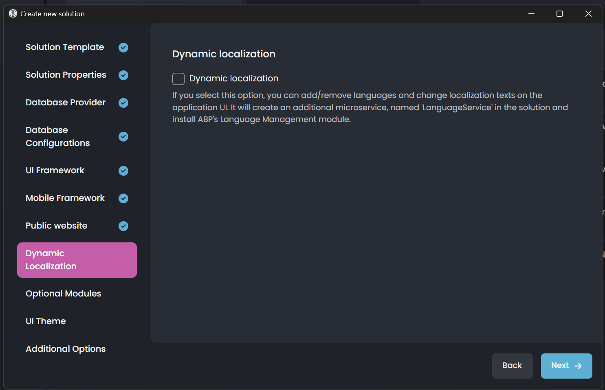
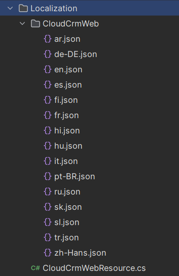

# Microservice Solution: Localization System

````json
//[doc-nav]
{
  "Next": {
    "Name": "Background jobs in the Microservice solution",
    "Path": "solution-templates/microservice/background-jobs"
  }
}
````

> You must have an ABP Business or a higher license to be able to create a microservice solution.

The *Administration* microservice is responsible for managing localization. It is used by all the services and applications in the solution. This document explains how localization works in the microservice solution. When we send a request to `/api/abp/application-localization`, the gateway application forwards the request to the *Administration* microservice. The *Administration* microservice returns the application localization, which includes the localization resources of the solution. You can see the details of the [application localization](../../framework/api-development/standard-apis/localization.md) endpoint.

Like the other fundamental feature modules ([Permission Management](permission-management.md), [Feature Management](feature-management.md)), each microservice depends on the *Volo.Abp.LanguageManagement.EntityFrameworkCore* or *Volo.Abp.LanguageManagement.MongoDB* package. These modules provide the necessary infrastructure (such as `IExternalLocalizationStore`) to access all localization. Additionally, the *Administration* microservice might depend on the *Volo.Abp.LanguageManagement.Application* and *Volo.Abp.LanguageManagement.HttpApi* packages to manage localization if you check the *Language Management* module while creating the solution.

## Language Management

> If the dynamic localization option is enabled, then the *Language Management Module** will be removed from the optional modules and a new microservice named `LanguageService` will be created. The `LanguageService` uses *Language Management Module* behind the scene.

The *Administration* microservice provides a set of APIs to manage localization. The localization resources are defined in each microservice, and when a microservice starts, it registers its localization resources to the related localization tables automatically. After that, you can see the localization resources from the [language texts](../../modules/language-management.md#language-texts) and manage them.


> The *Language Management* module is optional. If you don't need to manage localization resources from the UI, you can uncheck the *Language Management* module while creating the solution. However, each microservice's localization resources are still registered to the database and can be used by the applications.

## Dynamic Localization

When you create a new microservice solution, you can **enable dynamic localization** option, which allows you to add/remove languages and change localization texts on the application UI:



When you enable this option, a new microservice named **LanguageService** will be added (with the language management module integrated) and you can use its `LanguageServiceResource` class to use the localization entries in your UI application. It's already configured in your final host application, so you don't need to make any configuration related to that. To define a new localization entry you can either use the language files in the `LanguageService` or update the already defined localization entries in the UI (on the *Language Texts* page). 

After defining localization entries or updating them, you can inject the `IStringLocalizer<>` or `IHtmlLocalizer<>` services and use the localized values in your pages for MVC/Razor Pages UI, for instance:

```html
@page
@using Microsoft.Extensions.Localization
@inject IStringLocalizer<MyProjectNameWebResource> L

<div>
  <h1>@L["LongWelcomeMessage"]</h1>
</div>  
```

## UI Localizations

In the microservice architecture, localizations also can be defined in the final host application, if they only need to be defined in the UI. When you create a new microservice solution template, independent from the UI, all configurations are made and you can directly define localization entries and use them in your final UI application.

> **Note:** When you define localization entries in the host application, then you can't make dynamic localization with the language management module! (Because the language management module, would be unaware of the defined localization entries on the UI side)

### MVC/Razor Pages & Blazor UIs

For MVC & Blazor UIs, you can see the **Localization** directory in your final application, like in the following figure:



In this directory, you can see the language files, those are pre-defined for you to directly add localization entries. The related configurations are already made for you, in the module class (inside the `ConfigureLocalization` method) as below:

```csharp
    private void ConfigureLocalization(IWebHostEnvironment hostingEnvironment)
    {
        //code abbreviated for brevity...

        Configure<AbpLocalizationOptions>(options =>
        {
            options.Resources
                .Add<CloudCrmWebResource>("en")
                .AddVirtualJson("/Localization/CloudCrmWeb");

            options.DefaultResourceType = typeof(CloudCrmWebResource);
        });
    }
```

You can define new localization entries in the language files under the **Localization** folder and directly use them in your application by using the `IStringLocalizer<>` or `IHtmlLocalizer<>` services:

```html
@page
@using Microsoft.Extensions.Localization
@inject IStringLocalizer<CloudCrmWebResource> L

<div>
  <h1>@L["LongWelcomeMessage"]</h1>
</div>  
```

### Angular UI

Angular UI gets the localization resources from the [`application-localization`](../../framework/api-development/standard-apis/localization.md) API's response and merges these resources in the `ConfigStateService` for the localization entries/resources coming from the backend side.

In addition, you may need to define some localization entries and only use them on the UI side. ABP already provides the related configuration for you, so you don't need to make any configurations related to that and instead you can directly define localization entries in the `app.-module.ts` file of your angular application as follows:

```ts
import { provideAbpCore, withOptions } from '@abp/ng.core';

@NgModule({
  providers: [
    // ...
    provideAbpCore(
      withOptions({
        environment,
        registerLocaleFn: registerLocale(),
        localizations: [
            {
                culture: 'en',
                resources: [
                    {
                        resourceName: 'MyProjectName',
                        texts: {
                            "LongWelcomeMessage": "Welcome to the application. This is a startup project based on the ABP framework. For more information visit"
                        }
                    }
                ]
            }
        ]
      }),
    ),
    ...
  ],
})
export class AppModule {}

```

After defining the localization entries, it can be used as below:



> For more information, please refer to [UI Localization section of the Angular Localization document](../../framework/ui/angular/localization.md).

## Creating a New Localization Resource

To create a new localization resource, you can create a class named *MicroservicenameResource* in the *Contracts* project for the related microservice, which is already created by the solution template. For example, the *Identity* microservice has an *IdentityServiceResource* class and localization JSON files.

```csharp
[LocalizationResourceName("IdentityService")]
public class IdentityServiceResource
{

}
```

Additionally, it configures the localization resource in the *IdentityServiceContractsModule* class.

```csharp	
public override void ConfigureServices(ServiceConfigurationContext context)
{
    Configure<AbpVirtualFileSystemOptions>(options =>
    {
        options.FileSets.AddEmbedded<BookstoreIdentityServiceContractsModule>();
    });

    Configure<AbpLocalizationOptions>(options =>
    {
        options.Resources
            .Add<IdentityServiceResource>("en")
            .AddBaseTypes(typeof(AbpValidationResource), typeof(AbpUiResource))
            .AddVirtualJson("/Localization/IdentityService");
    });

    Configure<AbpExceptionLocalizationOptions>(options =>
    {
        options.MapCodeNamespace("IdentityService", typeof(IdentityServiceResource));
    });
}
```

> Existing microservices in the solution don't contain the localization text. These localization resources are defined in their own modules. You can add new localization resources to the existing microservices by following the steps above.
