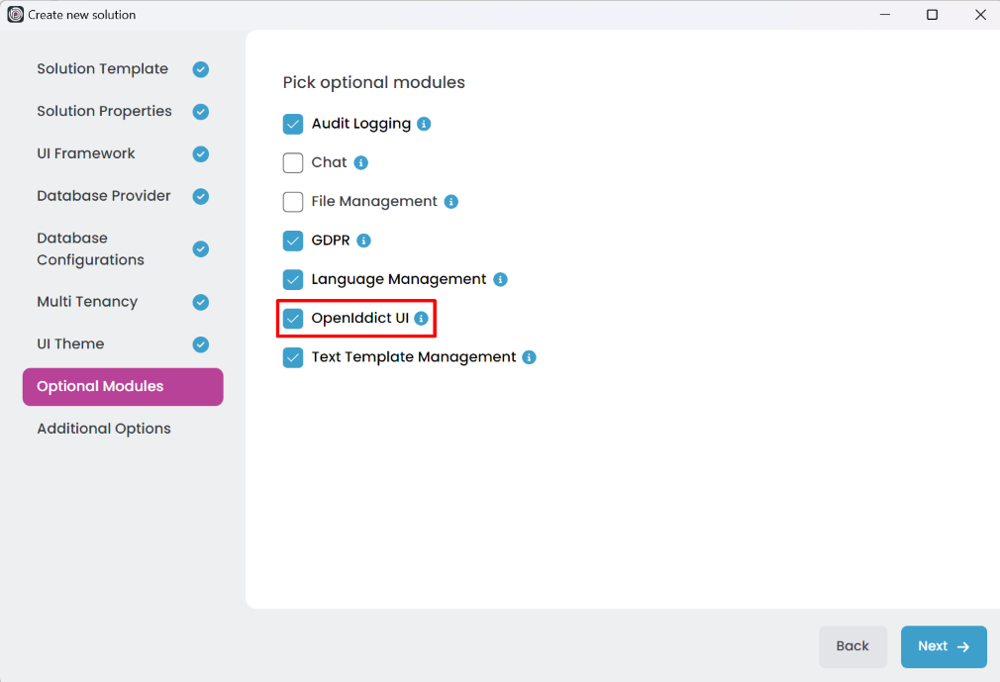
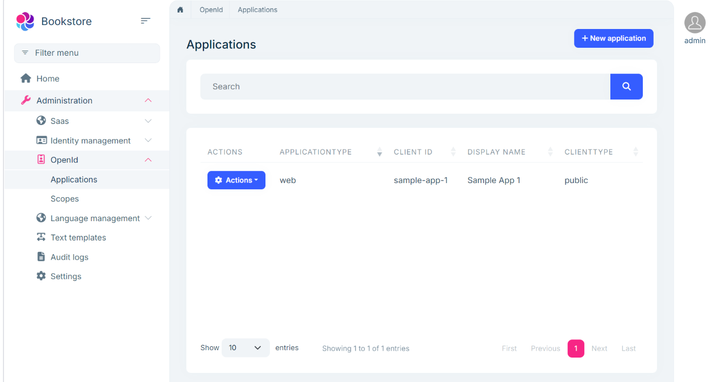

# Single Layer Solution: Authentication

```json
//[doc-nav]
{
  "Previous": {
    "Name": "Built-In Features",
    "Path": "solution-templates/layered-web-application/built-in-features"
  },
  "Next": {
    "Name": "Database configurations in the Single-Layer solution",
    "Path": "solution-templates/layered-web-application/database-configurations"
  }
}
```

> Some of the features mentioned in this document may not be available in the free version. We're using the **\*** symbol to indicate that a feature is available in the **[Team](https://abp.io/pricing)** and **[Higher](https://abp.io/pricing)** licenses.

The [Single Layer solution template](index.md) is fully configured for authentication. All the services and applications are configured to use the [OpenIddict](https://documentation.openiddict.com) library for authentication. They are configured in a common way for authentication. This document explains that common authentication structure.

## OpenIddict

[OpenIddict](https://documentation.openiddict.com) is an open-source library that provides a simple and easy way to implement an OpenID Connect server in your application. ABP has built-in modules ([OpenIddict](../../modules/openiddict.md), [OpenIddict UI **\***](../../modules/openiddict-pro.md)) to integrate OpenIddict into the solution.

## Initial Data Seeding

The Single Layer solution template includes an initial data seeding mechanism to create default clients (applications) and scopes for the solution, if necessary (e.g., when using an Angular UI). The `OpenIddictDataSeedContributor` class can be found in the `Data` folder of the host project. If authentication is handled by the UI application(e.g., MVC / Razor Pages), this class is not included.

The [OpenIddict UI **\***](../../modules/openiddict-pro.md) module is added only if you select it while creating the solution.  



The OpenIddict UI **\*** module provides a user interface to manage the OpenIddict entities such as applications, scopes, etc. You can manage these entities from the application UI.



### External Providers

The authentication server handles token generation, validation, and user account management (e.g., login, registration). It uses the [Account](../../modules/account.md) or [Account Pro **\***](../../modules/account-pro.md) module. The [Account Pro **\***](../../modules/account-pro.md) module additionally supports [social logins](../../modules/account-pro.md#social--external-logins) (e.g., Google, Facebook). Social logins can be enabled, disabled, and configured directly from the application's user interface.


## Authentication Flows

Applications in the solution use different authentication flows depending on the application type:

- **MVC UI Web Application**:  
  Uses the [Hybrid Flow](https://openid.net/specs/openid-connect-core-1_0.html#HybridFlowAuth) (OpenID Connect Authentication) for user authentication.  
- **SPA and Swagger Applications**:  
  Use the [Authorization Code Flow](https://openid.net/specs/openid-connect-core-1_0.html#CodeFlowAuth) to authenticate users.  

If the UI is a SPA application (such as an Angular app), the API host uses [JWT Bearer Authentication](https://jwt.io/introduction/) to authorize user actions.