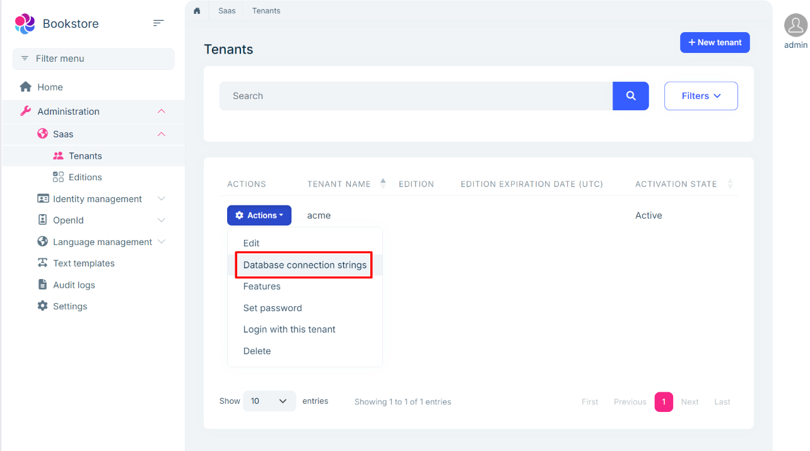

# Single Layer Solution: Database configurations

```json
//[doc-nav]
{
  "Previous": {
    "Name": "Authentication",
    "Path": "solution-templates/single-layer-web-application/authentication"
  },
  "Next": {
    "Name": "Logging (with Serilog)",
    "Path": "solution-templates/single-layer-web-application/logging"
  }
}
```

> Some of the features mentioned in this document may not be available in the free version. We're using the **\*** symbol to indicate that a feature is available in the **[Team](https://abp.io/pricing)** and **[Higher](https://abp.io/pricing)** licenses.

ABP Studio's Single-Layer Solution Template includes pre-configured database settings. This document explains how to manage database configurations in your solution.

## Connection String

Connection strings are stored in the `appsettings.json` file and can be customized for different environments by editing this file. [Web Application](web-applications.md) projects use the `Default` connection string by default.

To update the connection string for the `Default` key, modify the `appsettings.json` file in your project. Connection strings are defined under the `ConnectionStrings` section, as shown below:  

```json
{
  "ConnectionStrings": {
    "Default": "Server=(LocalDb)\\MSSQLLocalDB;Database=Bookstore;Trusted_Connection=True;TrustServerCertificate=true"
  }
}
```

## The DbContext Class

In the Single-Layer Solution Template, the `DbContext` class is defined in the main project. This class manages the database schema and is derived from the `AbpDbContext` class, which offers additional features and configurations. You can customize the `DbContext` class to add new entities, relationships, and configurations. It is located in the `Data` folder of the main project.  

```csharp
public class BookstoreDbContext : AbpDbContext<BookstoreDbContext>
{
    
    public const string DbTablePrefix = "App";
    public const string DbSchema = null;

    public BookstoreDbContext(DbContextOptions<BookstoreDbContext> options)
        : base(options)
    {
    }

    protected override void OnModelCreating(ModelBuilder builder)
    {
        base.OnModelCreating(builder);

        /* Include modules to your migration db context */

        builder.ConfigureSettingManagement();
        builder.ConfigureBackgroundJobs();
        builder.ConfigureAuditLogging();
        builder.ConfigureFeatureManagement();
        builder.ConfigurePermissionManagement();
        builder.ConfigureBlobStoring();
        builder.ConfigureIdentityPro();
        builder.ConfigureOpenIddictPro();
        builder.ConfigureGdpr();
        builder.ConfigureLanguageManagement();
        builder.ConfigureSaas();
        builder.ConfigureTextTemplateManagement();
        
        /* Configure your own entities here */
    }
}
```

### OnModelCreating Method

The `OnModelCreating` method is used to configure the database schema. It calls the `Configure*` methods of the ABP Framework to configure the database schema for the modules. You can also configure your own tables/entities inside this method.

```csharp
protected override void OnModelCreating(ModelBuilder builder)
{
    base.OnModelCreating(builder);

    builder.ConfigurePermissionManagement();
    builder.ConfigureSettingManagement();
    builder.ConfigureBackgroundJobs();
    builder.ConfigureAuditLogging();
    builder.ConfigureFeatureManagement();
    builder.ConfigureIdentityPro();
    builder.ConfigureOpenIddictPro();
    builder.ConfigureLanguageManagement();
    builder.ConfigureSaas();
    builder.ConfigureTextTemplateManagement();
    builder.ConfigureGdpr();
    builder.ConfigureCmsKit();
    builder.ConfigureCmsKitPro();
    builder.ConfigureBlobStoring();
    
    /* Configure your own tables/entities inside here */

    //builder.Entity<YourEntity>(b =>
    //{
    //    b.ToTable(DbTablePrefix + "YourEntities", DbSchema);
    //    b.ConfigureByConvention(); //auto configure for the base class props
    //    //...
    //});
}
```

> The `Configure*` methods are extension methods defined in each module's `EntityFrameworkCore` project. These methods are used to configure the database schema for their respective modules.

### Configuration

In the `BookstoreModule` class, the `ConfigureEfCore` method is used to configure the database context. It registers the `BookstoreDbContext` class to the [dependency injection](../../framework/fundamentals/dependency-injection.md) system and sets the SQL Server as the default DBMS for the application.

```csharp
private void ConfigureEfCore(ServiceConfigurationContext context)
{
    context.Services.AddAbpDbContext<BookstoreDbContext>(options =>
    {
        /* You can remove "includeAllEntities: true" to create
            * default repositories only for aggregate roots
            * Documentatidon: https://docs.abp.io/en/abp/latest/Entity-Framework-Core#add-default-repositories
            */
        options.AddDefaultRepositories(includeAllEntities: true);
    });

    Configure<AbpDbContextOptions>(options =>
    {
        options.Configure(configurationContext =>
        {
            configurationContext.UseSqlServer();
        });
    });
    
}
```

## The `IDesignTimeDbContextFactory` Implementation

The `IDesignTimeDbContextFactory` interface is used to create a `DbContext` instance at design time. It is used by EF Core tools to create migrations and update the database. The `BookstoreDbContextFactory` class implements the `IDesignTimeDbContextFactory` interface to create a `BookstoreMigrationsDbContext` instance.

```csharp
public class BookstoreDbContextFactory : IDesignTimeDbContextFactory<BookstoreDbContext>
{
    public BookstoreDbContext CreateDbContext(string[] args)
    {
        BookstoreEfCoreEntityExtensionMappings.Configure();
        var configuration = BuildConfiguration();

        var builder = new DbContextOptionsBuilder<BookstoreDbContext>()
            .UseSqlServer(configuration.GetConnectionString("Default"));

        return new BookstoreDbContext(builder.Options);
    }

    private static IConfigurationRoot BuildConfiguration()
    {
        var builder = new ConfigurationBuilder()
            .SetBasePath(Directory.GetCurrentDirectory())
            .AddJsonFile("appsettings.json", optional: false);

        return builder.Build();
    }
}
```

## SaaS Module: The Tenant Management UI **\***

SaaS module provides the necessary UI to set and change connection string for tenants and trigger the database migrations.

### The Connection String Management Modal

You can click to the *Database Connection Strings* command in the *Actions* dropdown button for a tenant in the *Tenants* page of the SaaS module:



It opens the *Database Connection Strings* modal as shown below:


Here, we can set a *Default connection string* for the tenant.

When you make the changes and save the dialog, the database is automatically created and migrated. If you later update the connection string (for example if you change the database name), it will also trigger the database migration process again.

### Manually Applying the Database Migrations

If you need to manually trigger the database migrations for a specific tenant, click the *Actions* dropdown for the related tenant and select the *Apply Database Migrations* command on the *Tenant Management* page of the SaaS module:


