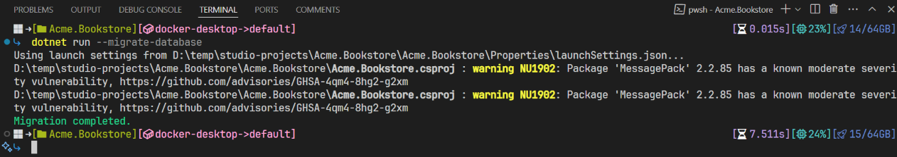

# Single Layer Solution: Db Migrator

````json
//[doc-nav]
{
  "Previous": {
    "Name": "Web Applications",
    "Path": "solution-templates/single-layer-web-application/web-applications"
  },
  "Next": {
    "Name": "Built-In Features",
    "Path": "solution-templates/single-layer-web-application/built-in-features"
  }
}
````

Unlike the Layered solution template, the Single Layer solution template does not include a separate database migrator project. Instead, the main application project handles database migration and seed data operations. The `*.DbMigrator` project is excluded from this template. To manage database migrations and seed data, you can use the `migrate-database.ps1` script in the root directory or run the `dotnet run --migrate-database` command from the main application project directory.



After the migration completes, a message will appear in the console. You can verify the success of the migration by checking the database.

## Database Migration Service

Under the `Data` folder of the project, the `BookstoreDbMigrationService` class is responsible for database migration and seed data operations. The `MigrateAsync` method is called in the `Program` class to migrate the database when the application starts with the `--migrate-database` argument.

First, it checks if the database is created and applies the pending migrations. Then, it seeds the initial data using the `SeedAsync` method. 

```csharp
public async Task MigrateAsync()
{
    var initialMigrationAdded = AddInitialMigrationIfNotExist();

    if (initialMigrationAdded)
    {
        return;
    }

    Logger.LogInformation("Started database migrations...");

    await MigrateDatabaseSchemaAsync();
    await SeedDataAsync();

    Logger.LogInformation($"Successfully completed host database migrations.");

    var tenants = await _tenantRepository.GetListAsync(includeDetails: true);

    var migratedDatabaseSchemas = new HashSet<string>();
    foreach (var tenant in tenants)
    {
        using (_currentTenant.Change(tenant.Id))
        {
            if (tenant.ConnectionStrings.Any())
            {
                var tenantConnectionStrings = tenant.ConnectionStrings
                    .Select(x => x.Value)
                    .ToList();

                if (!migratedDatabaseSchemas.IsSupersetOf(tenantConnectionStrings))
                {
                    await MigrateDatabaseSchemaAsync(tenant);

                    migratedDatabaseSchemas.AddIfNotContains(tenantConnectionStrings);
                }
            }

            await SeedDataAsync(tenant);
        }

        Logger.LogInformation($"Successfully completed {tenant.Name} tenant database migrations.");
    }

    Logger.LogInformation("Successfully completed all database migrations.");
    Logger.LogInformation("You can safely end this process...");
}
```

The `BookstoreDbSchemaMigrator` class is used in the `MigrateDatabaseSchemaAsync` method for the database migration process. It is responsible for applying migrations to the database.

```csharp
public class BookstoreDbSchemaMigrator : ITransientDependency
{
    private readonly IServiceProvider _serviceProvider;

    public BookstoreDbSchemaMigrator(
        IServiceProvider serviceProvider)
    {
        _serviceProvider = serviceProvider;
    }

    public async Task MigrateAsync()
    {
        
        /* We intentionally resolving the BookstoreDbContext
         * from IServiceProvider (instead of directly injecting it)
         * to properly get the connection string of the current tenant in the
         * current scope.
         */

        await _serviceProvider
            .GetRequiredService<BookstoreDbContext>()
            .Database
            .MigrateAsync();

    }
}
```