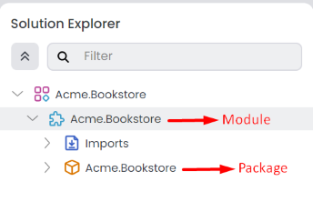
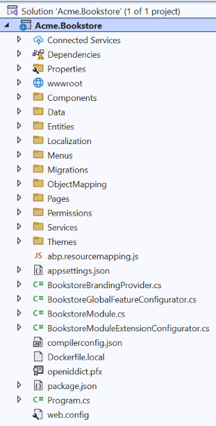
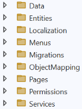
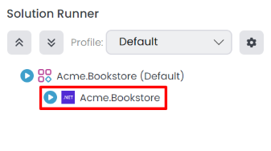

# Single Layer Solution: The Structure

````json
//[doc-nav]
{
  "Previous": {
    "Name": "Overview",
    "Path": "solution-templates/single-layer-web-application/overview"
  },
  "Next": {
    "Name": "Main Components",
    "Path": "solution-templates/single-layer-web-application/main-components"
  }
}
````

> Some of the features mentioned in this document may not be available in the free version. We're using the **\*** symbol to indicate that a feature is available in the **[Team](https://abp.io/pricing)** and **[Higher](https://abp.io/pricing)** licenses.

This document explains the solution and folder structure of ABP Studio's [single layer solution template](index.md).

> This document assumes that you've created a new single-layer solution by following the *[Quick Start: Creating a Single Layer Web Application with ABP Studio](../../get-started/single-layer-web-application.md)* guide. (Choose the *Entity Framework Core* as the database provider.)

## Understanding the ABP Solution Structure

The single-layer solution template is designed to be simple and easy to understand. It includes a single project that contains all the necessary components to build a monolithic application. The solution structure is as follows:



`Acme.Bookstore` is the main **ABP Studio module** in the solution. It also includes the **ABP Studio package** `Acme.Bookstore` as the host application.

> Refer to the *[Concepts](../../studio/concepts.md)* document for a comprehensive definition of ABP Studio solution, module, and package terms.

## The Solution Structure

If you create the solution based on *[Quick Start: Creating a Single Layer Web Application with ABP Studio](../../get-started/single-layer-web-application.md)* guide, the solution structure will be as follows:



### Folder Structure

This template uses a single-project structure, with concerns separated into folders instead of projects. The pre-defined folders are shown below:



* **Data**: Define your database mappings (for [EF Core](../../framework/data/entity-framework-core) or [MongoDB](../../framework/data/mongodb) and [repositories](../../framework/architecture/domain-driven-design/repositories.md)) in this folder.
* **Entities**: Define your [entities](../../framework/architecture/domain-driven-design/entities.md) in this folder.
* **Localization**: Define your UI localization keys/values in this folder.
* **Menus**: Define your UI menu items in this folder.
* **Migrations**: Contains the database migration files. It is created automatically by EF Core.
* **ObjectMapping**: Define your [object-to-object mapping](../../framework/infrastructure/object-to-object-mapping.md) classes in this folder.
* **Pages**: Define your UI pages (Razor Pages) in this folder (create `Controllers` and `Views` folders yourself if you prefer the MVC pattern).
* **Permissions**: Define your [permissions](../../framework/fundamentals/authorization.md) in this folder.
* **Services**: Define your [application services](../../framework/architecture/domain-driven-design/application-services.md) in this folder.

### How to Run?

When you create a new solution it automatically creates initial migration and run database migrator for you (unless you uncheck these options). However, you can run the following command in the directory of your project (in the same folder of the `.csproj` file) to create the database and seed the initial data:

```bash
dotnet run --migrate-database
```

This command will create the database and seed the initial data for you. Then you can run the application with the ABP Studio [Solution Runner](../../studio/running-applications.md). The default username is `admin` and the password is `1q2w3E*`.



> While creating a database & applying migrations seem only necessary for relational databases, you should run this command even if you choose a NoSQL database provider (like MongoDB). In that case, it still seeds the initial data which is necessary for the application.

## See Also

* [Video tutorial](https://abp.io/video-courses/essentials/app-template)