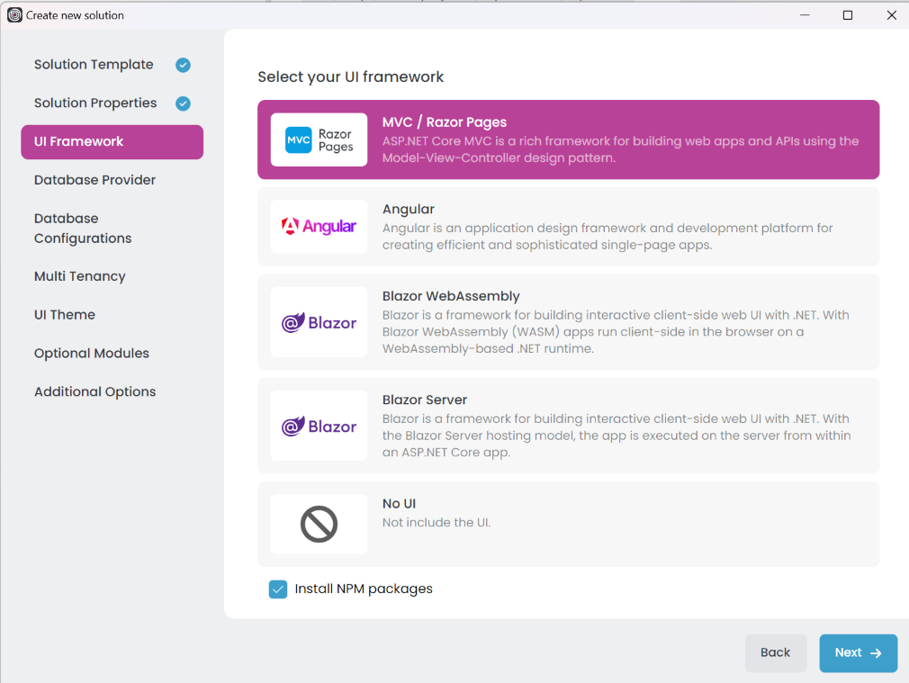

# Single Layer Solution: Web Applications

````json
//[doc-nav]
{
  "Previous": {
    "Name": "Main Components",
    "Path": "solution-templates/single-layer-web-application/main-components"
  },
  "Next": {
    "Name": "Db Migrator",
    "Path": "solution-templates/single-layer-web-application/db-migrator"
  }
}
````

The single-layer solution template includes a web application project that acts as the main application. This ASP.NET Core application hosts the API endpoints and may also serve the user interface, depending on the selected UI framework.  

- **MVC / Razor Pages**: This is an ASP.NET Core MVC application. It is a traditional web application that serves HTML pages to users and is suitable for building web applications with server-side rendering.  
- **Angular**: This is an Angular application, a single-page application (SPA) that runs on the client side. It communicates with the server using HTTP requests and is ideal for building modern web applications with rich user interfaces.  
- **Blazor UI**: A flexible framework for building web applications with .NET. It supports various hosting models:
  - **Blazor WebAssembly**: This is a client-side SPA that runs entirely in the user's browser. It communicates with the server using HTTP requests and is suitable for modern web applications with rich interactivity and offline capabilities.  
  - **Blazor Server**: This is a server-side SPA that runs on the server and communicates with the client in real time using SignalR. It is ideal for applications requiring constant connectivity and rapid server updates.   
- **No UI**: This option creates a backend-only solution without a web interface, suitable for scenarios like API-only applications or headless services. 

You can select the web application type that fits your requirements during the solution creation process in the *UI Framework* step. The single-layer solution template generates the selected web applications with the necessary configurations and integrations.



## MVC / Razor Pages

MVC (Model-View-Controller) is a design pattern commonly used for building web applications. Razor Pages, on the other hand, is a page-based programming model designed to make building web applications simpler and more productive.  

When you select the MVC / Razor Pages option in the single-layer solution template, it generates an ASP.NET Core MVC application named something like `Acme.BookStore`. This application serves as the web interface for your solution, using server-side rendering to deliver dynamic HTML pages to users.

## Angular

Angular is a popular front-end framework for building single-page applications (SPAs). It offers a rich set of features for creating modern web applications with dynamic and interactive user interfaces.

When you select the Angular option in the single-layer solution template, it generates:  
- An Angular application located under the solution's root folder, typically named `angular`.  
- An ASP.NET Core application, usually named something like `Acme.Bookstore`.

The Angular application runs as a client-side SPA in the user's browser and communicates with the server by sending HTTP requests to the ASP.NET Core host application.

## Blazor UI

Blazor is a flexible framework for building web applications with .NET. It supports various hosting models, including Blazor WebAssembly, Blazor Server, Blazor WebApp, and Maui Blazor (Hybrid).

### Blazor WebAssembly

Blazor WebAssembly is a client-side SPA that runs entirely in the user's browser. It communicates with the server using HTTP requests and is suitable for modern web applications with rich interactivity and offline capabilities.

When you select the Blazor WebAssembly option in the Layered Solution Template, it generates:  
- A Blazor application located under the solution's root folder, typically named `*.Blazor`, which serves as the main Blazor host project.
- A Blazor client application, named `*.Blazor.Client`, where you can write the client-side (UI logic) code.  
- An ASP.NET Core application, named `*.HttpApi.Host`, where the server-side (business logic) code runs.  

The Blazor client application communicates with the server by sending HTTP requests to the `*.HttpApi.Host` application.

### Blazor Server

Blazor Server is a server-side SPA that runs on the server and communicates with the client in real time using SignalR. It is ideal for applications requiring constant connectivity and rapid server updates.

When you select the Blazor Server option in the Layered Solution Template, it generates:  
- A Blazor application located under the solution's root folder, typically named `*.Blazor`, which serves as the main Blazor host project.  

## No UI

This option creates a backend-only solution without a web interface, suitable for scenarios like API-only applications or headless services.  

When you select the No UI option in the Layered Solution Template, it generates an ASP.NET Core application named `*.HttpApi.Host` that serves as the backend API for your solution.
