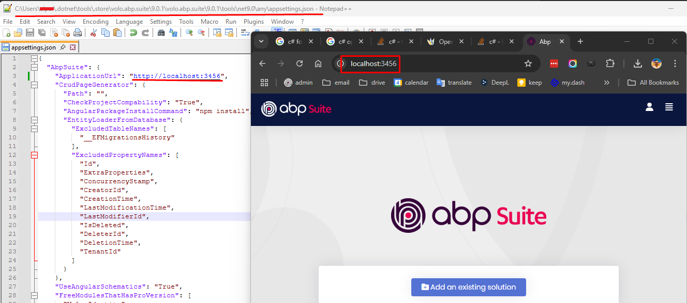

# How to start ABP Suite?

````json
//[doc-nav]
{
  "Previous": {
    "Name": "How to install ABP Suite?",
    "Path": "suite/how-to-install"
  },
  "Next": {
    "Name": "Adding solutions to ABP Suite?",
    "Path": "suite/add-solution"
  }
}
````

[ABP Studio](../studio/index.md) has a shortcut for running ABP Suite to allow using it without starting it externally and using it on a browser. Thanks to that, you can use both ABP Studio and ABP Suite as a united platform. 

> You can check the [ABP Studio: Working with ABP Suite](../studio/working-with-suite.md) documentation for more info.

Alternatively, to start the ABP Suite, you can write the following command to the command line terminal and execute it:

```bash
abp suite
```

If you run the ABP Suite with ABP CLI, then it will open in your default browser. Do not close the command line window until you finish your work, otherwise the Suite will not function. When you finish your work, you can return to the command line and press `CTRL+C` to close the Suite.

Remember that, first access to the Suite requires to have an active internet connection, so make sure you are connected to the internet. 

## Starting ABP Suite in Different Port

ABP Suite runs at port 3000 by default. If you want to run the ABP Suite in a different port, you can choose one of the following options:

1. You can pass the `--AbpSuite:ApplicationUrl` commandline parameter to run in a different port:

```bash
abp-suite --AbpSuite:ApplicationUrl="http://localhost:4000"
```

2. Update the `ApplicationUrl` in the _appsettings.json_ file of the dotnet tools directory (_%USERPROFILE%\.dotnet\tools\.store\volo.abp.suite\9.0.0\volo.abp.suite\9.0.0\tools\net9.0\any\appsettings.json_):



> **Note:** Also, you can use this file to configure ABP Suite options.