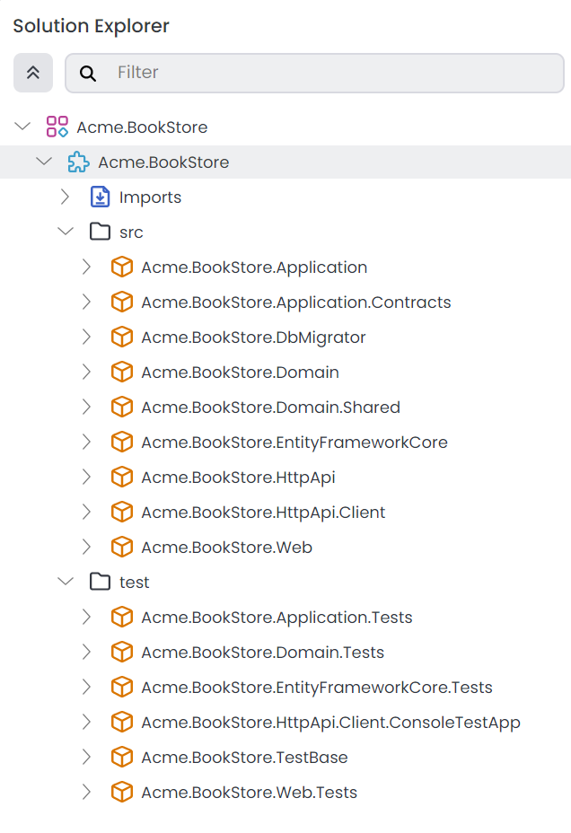

# Web Application Development Tutorial (with ABP Suite) - Part 1: Creating the Solution

````json
//[doc-nav]
{
  "Previous": {
    "Name": "Overview",
    "Path": "tutorials/book-store-with-abp-suite/index"
  },
  "Next": {
    "Name": "Creating the Books",
    "Path": "tutorials/book-store-with-abp-suite/part-02"
  }
}
````

Before starting the development, create a new solution named `Acme.BookStore` and run it by following the [getting started tutorial](../../get-started/layered-web-application.md).

You can use the following configurations:

* **Solution Template:** Application (Layered)
* **Solution Name:** `Acme.BookStore`
* **UI Framework:** {{if UI=="MVC"}} ASP.NET Core MVC / Razor Pages {{end}}
* **UI Theme:** LeptonX
* **Mobile Framework:** None
* **Database Provider:** {{if DB=="EF"}} Entity Framework Core {{end}}
* **Public Website:** No
* **Tiered:** No

You can select the other options based on your preference.

> **Please complete the [Get Started](../../get-started/layered-web-application.md) guide and run the web application before going further.**

The initial solution structure should be like the following in the ABP Studio's [Solution Explorer](../../studio/solution-explorer.md):



## Summary

We've created the initial layered monolith solution. In the next part, we will learn how to create entities, and generate CRUD pages based on the specified options (including tests, UI, customizable code support etc.) with [ABP Suite](../../suite/index.md).
