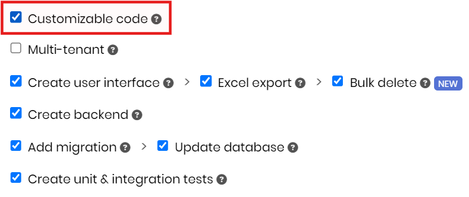
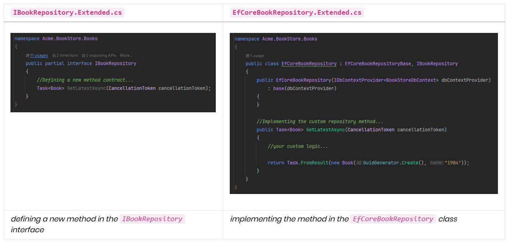
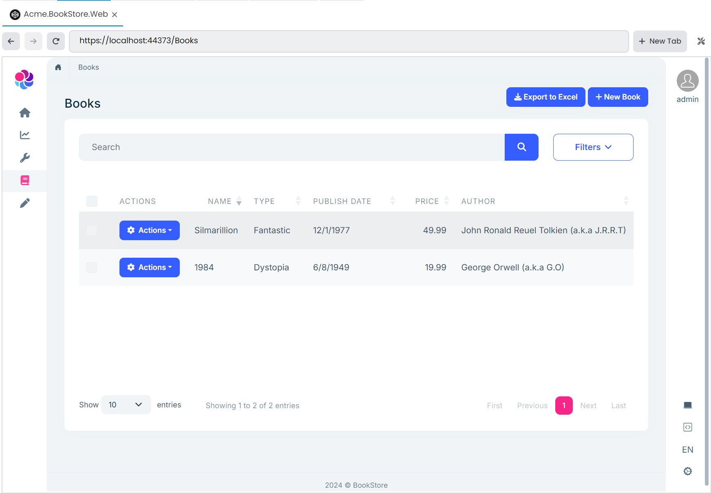

# Web Application Development (with ABP Suite) Tutorial - Part 5: Customizing the Generated Code
````json
//[doc-params]
{
    "UI": ["MVC"],
    "DB": ["EF"]
}
````
````json
//[doc-nav]
{
  "Previous": {
    "Name": "Book to Author Relation",
    "Path": "tutorials/book-store-with-abp-suite/part-04"
  }
}
````

So far, you have created the all functionality for the bookstore application without needing to write any single line of code. In this part, let's write some code and check one of the great features of the ABP Suite, which is [Customizable Code Support](../../suite/customizing-the-generated-code.md).

## Customizable Code Support

ABP Suite allows you to customize the generated code blocks and preserve your custom code changes in the next CRUD Page Generation. It specifies hook points to allow adding custom code blocks. Then, the code written by you to these hook points will be respected and will not be overridden in the next CRUD Page Generation.

To enable custom code support, you should check the *Customizable code* option in the **CRUD Page Generation** page (it's selected by default), and you enabled it for both entities:



## Custom Code Hookpoints

When you enable the *custom code support*, ABP Suite adds some hookpoints that you can write your own custom code without worrying about, are my codes being overridden with the next CRUD page generation.

On the C# side, ABP Suite adds abstract base classes for entities, application services, interfaces, domain services and so on...  (and partial classes for interfaces) 

You can write your custom code in those classes (with the `*.Extended.cs` extension) and next time when you need to re-generate the entity, your custom code will not be overridden (only the base abstract classes will be re-generated and your changes on Suite will be respected):



> For example, you can create a new repository method like in the example above, and in the next CRUD page generation, you will ABP Suite won't override your custom code.

On the UI side, ABP Suite provides convenient comment placeholders within pages for MVC, Blazor, and Angular UIs. These comment sections serve as hook points where you can add your custom code.

For example, if you open *Books/Index.cshtml* file in your IDE, you will see those placeholders like follows:

```xml
<!-- Code omitted for brevity -->

@section styles
{
@*//<suite-custom-code-block-1>*@
@*//</suite-custom-code-block-1>*@
}

<!-- ... -->
```

You can write your custom codes between the _**<suite-custom-code-block-n></suite-custom-code-block-n>**_ placeholders and you can also extend these placeholders by customizing the [ABP Suite templates](../../suite/editing-templates.md).

> For more information, please refer to [Customizing the Generated Code documentation](../../suite/customizing-the-generated-code.md)

## Adding Custom Code to Application Services

Let's see the custom code support in action. We can demonstrate this feature with an easy sample.

Assume that we want to show author name with his abbrevated name. For example, for the author *John Ronald Reuel Tolkien*, we want to show the name as *John Ronald Reuel Tolkien (a.k.a J.R.R.T)*. Achiving that is pretty straightforward.

We just need to open the *src/Acme.BookStore.Application/Books/BooksAppService.Extended.cs* file and override the base `GetListAsync` method, which is called on the books page:

```csharp
using System;
using System.Linq;
using System.Collections.Generic;
using System.Threading.Tasks;
using Volo.Abp.Application.Dtos;
using Volo.Abp.Domain.Repositories;
using Volo.Abp.Caching;

namespace Acme.BookStore.Books
{
    public class BooksAppService : BooksAppServiceBase, IBooksAppService
    {
        //<suite-custom-code-autogenerated>
        public BooksAppService(IBookRepository bookRepository, BookManager bookManager, IDistributedCache<BookDownloadTokenCacheItem, string> downloadTokenCache, IRepository<Acme.BookStore.Authors.Author, Guid> authorRepository)
            : base(bookRepository, bookManager, downloadTokenCache, authorRepository)
        {
        }
        //</suite-custom-code-autogenerated>

        //Write your custom code...
        public override async Task<PagedResultDto<BookWithNavigationPropertiesDto>> GetListAsync(GetBooksInput input)
        {
            var result = await base.GetListAsync(input);

            foreach (var book in result.Items)
            {
                var akaName = book.Author.Name.Split(" ").Select(q => q[0]).JoinAsString(".");
                book.Author.Name += $" (a.k.a {akaName})";
            }
            
            return result;
        }
    }
}
```

Here, we have overriden the `GetListAsync` method and changed its result according to our need. Now, we can open ABP Suite and try to regenerate the book entity and see if our custom code is gone or not:


After the regeneration has been completed, we can check the **BooksAppService.Extended.cs** file and we should see our custom code is there without any modification. ABP Suite didn't override our custom code, and finally we can run the application to see the final result:



ABP Suite's custom code support is not limited with backend side. You can also override the UI. You can refer to the [Customizing the Generated Code document](../../suite/customizing-the-generated-code.md) for further info.

## Conclusion

In this tutorial, you created the bookstore application without needing to write a single line of code with ABP Suite. Then, in this last part, you have written custom code in the specified hookpoints and it did not override by ABP Suite.