# Microservice Tutorial Part 03: Building the Catalog service

````json
//[doc-nav]
{
  "Previous": {
    "Name": "Creating the initial Catalog service",
    "Path": "tutorials/microservice/part-02"
  },
  "Next": {
    "Name": "Creating the initial Ordering service",
    "Path": "tutorials/microservice/part-04"
  }
}
````

In the previous part, we've created a new microservice named Catalog. In this part, we will build functionality to create and manage products in our system.

In this part, we will use [ABP Suite](../../suite/index.md) to automatically create all the necessary code for us. So, you will see how to use ABP Suite in a microservice solution. We will do everything manually while we will create the Ordering microservice in next parts, so you will learn the details better. We suggest to use ABP Suite wherever it is possible, because it saves a lot of time. You can then investigate the changes done by ABP Suite to understand what it produced.

## Opening the ABP Suite

First of all, **stop all the applications** in ABP Studio's *Solution Runner* panel, because ABP Suite will make changes in the solution and it will also needs to build the solution in some steps. Running the solution prevents to build it.

Now, select the *ABP Suite* -> *Open* command on the main menu to open ABP Suite:

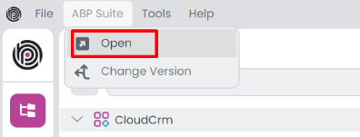

It will ask to you which module you want to use:

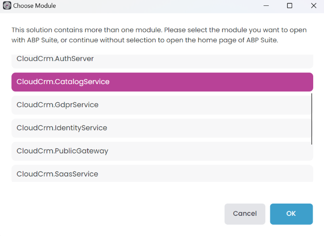

The `CloudCrm` microservice solution contains more than one .NET solution. Typically, each ABP Studio module represents a separate .NET solution (see the [concepts](../../studio/concepts.md) document). ABP Suite works on a single .NET solution to generate code, so we should select a module here.

Select the `CloudCrm.CatalogService` module and click the *OK* button. It will open ABP Suite as shown below:

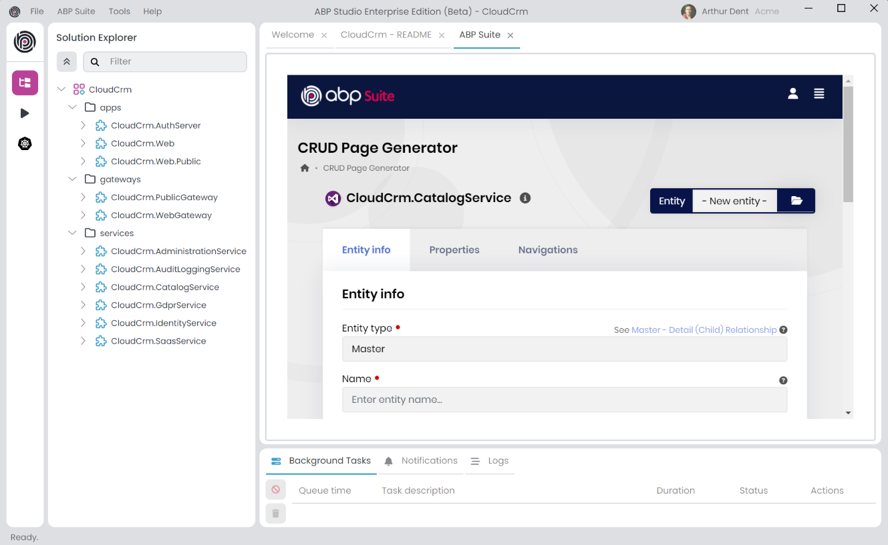

## Generating a Products Page

In the next section, we will use ABP Suite to create a fully functional CRUD page with ABP Suite. The UI part will be in the main web application (`CloudCrm.Web`) and the application service and others parts will be generated in the Catalog microservice.

### Configuring the Product Entity Information

Type `Product` for the *Name* field and leave the other options as is. ABP Suite will automatically calculate proper values for your:

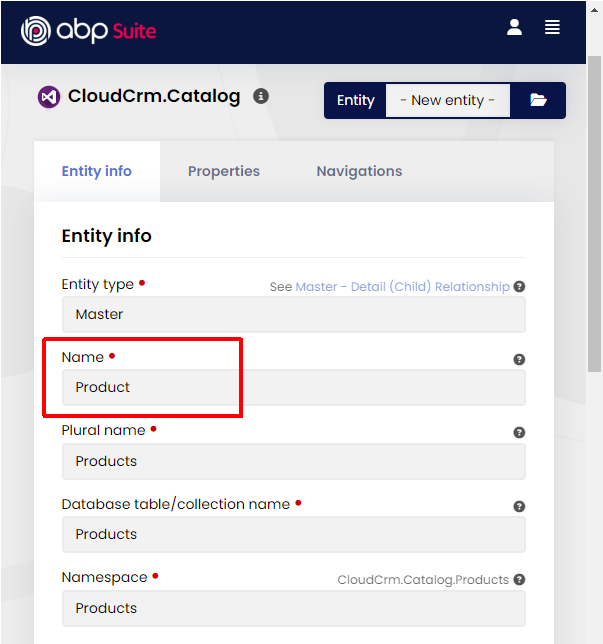

### Configuring Properties of the Product Entity

Open the *Properties* tab and create the properties shown in the following figure:

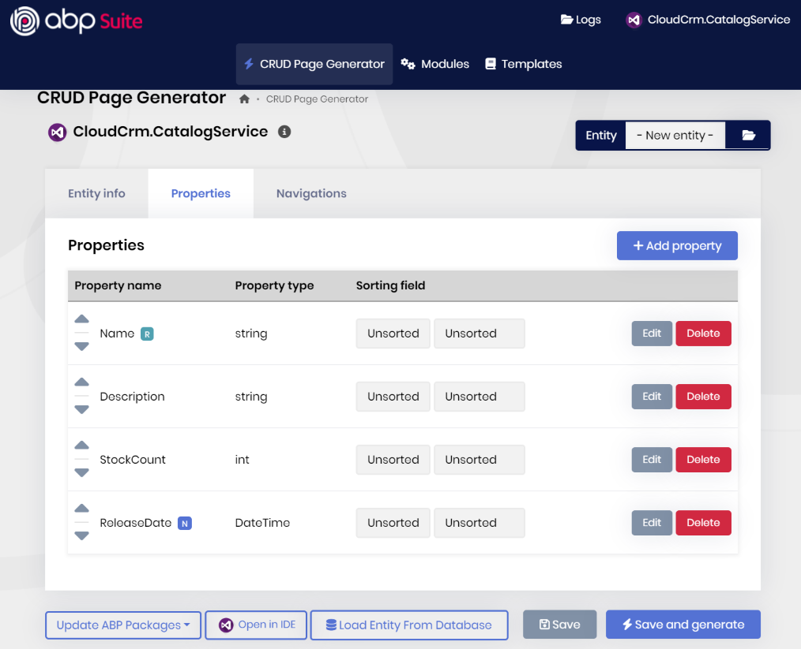

Here the details:

* `Name` is required, minimum length is `2` and maximum length is `120`.
* `Description` is not required, it is a *Text area*, not *Filterable*, not *Shown on the list page*.
* `StockCount` has a *Default value* `0`, minimum value `0` and maximum value `999999`.
* `ReleaseDate` is *Nullable*.

You can leave the other configurations as default.

### Generating the Code

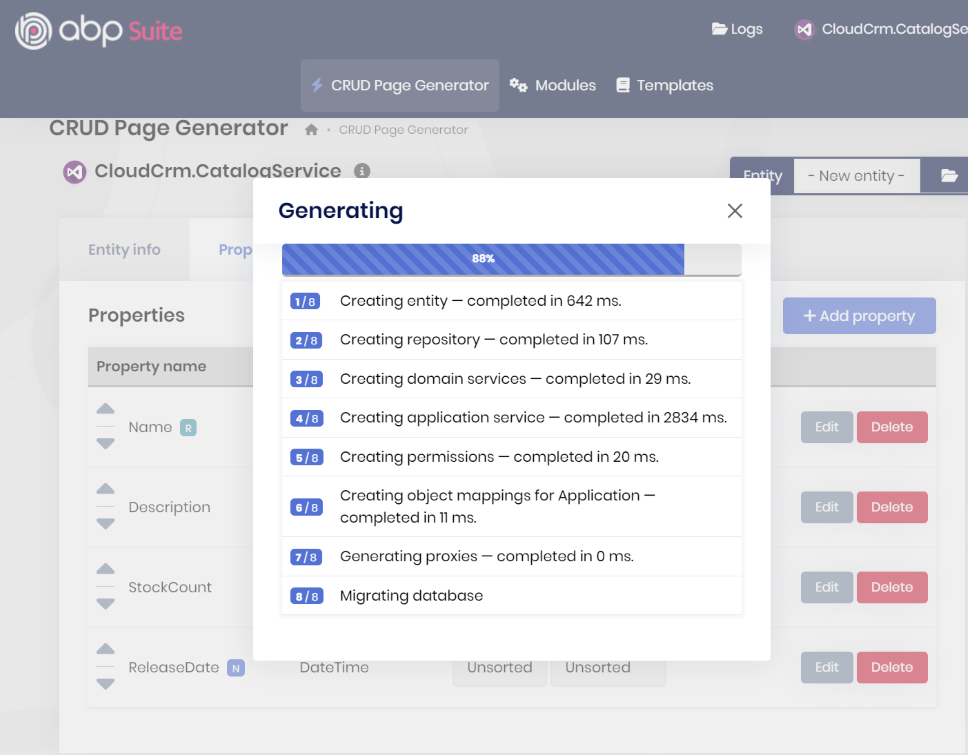

That's all. You can click the *Save and generate* button to start the code generation process.

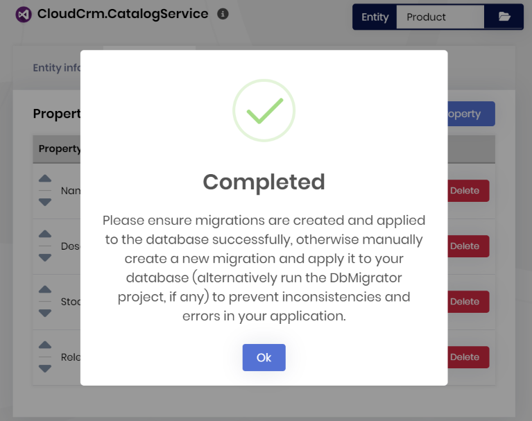

ABP Suite will generate the necessary code for you. It will take some time to complete the process. After the process is completed, you will see a success message click the *OK* button.


We can now build and start the `CloudCrm.CatalogService` application by clicking the *Run* -> *Build & Start* button in the *Solution Runner* panel.

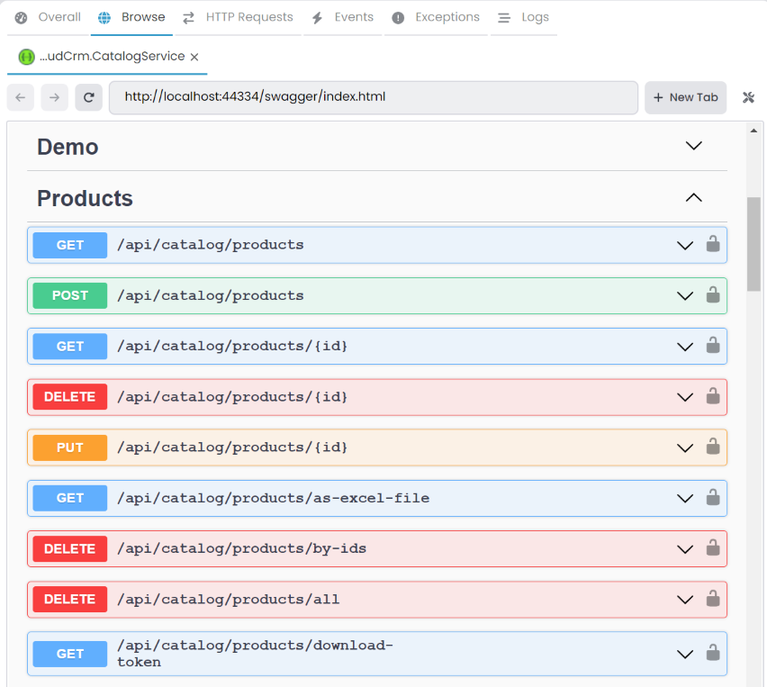

After the application is started, you can rigth-click and [Browse](../../studio/running-applications.md#monitoring) on the `CloudCrm.CatalogService` application to open it in the ABP Studio inside browser. You can see the *Products* controller in the Swagger UI.

### Generating the UI Proxy

Now, we need to generate the [Static API Proxy](../../framework/api-development/static-csharp-clients.md) for the *Web* project. Right-click the *CloudCrm.Web* [package](../../studio/concepts.md#package) and select the *ABP CLI* -> *Generate Proxy* -> *C#* command:

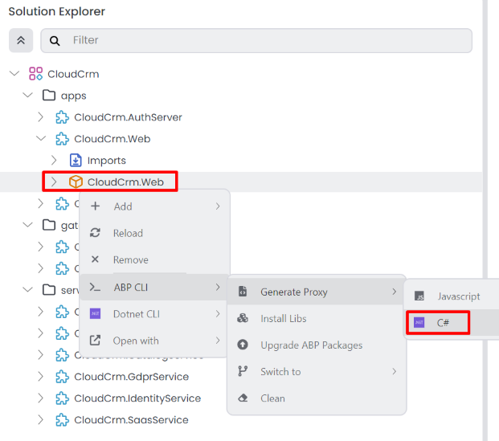

It will open the *Generate C# Proxies* window. Select the `CloudCrm.CatalogService` application, and it will automatically populate the *URL* field. Choose the *catalog* module, and check the *Without contracts* checkbox, since we already have a dependency on the `CloudCrm.CatalogService.Contracts` package in the `CloudCrm.Web` project.

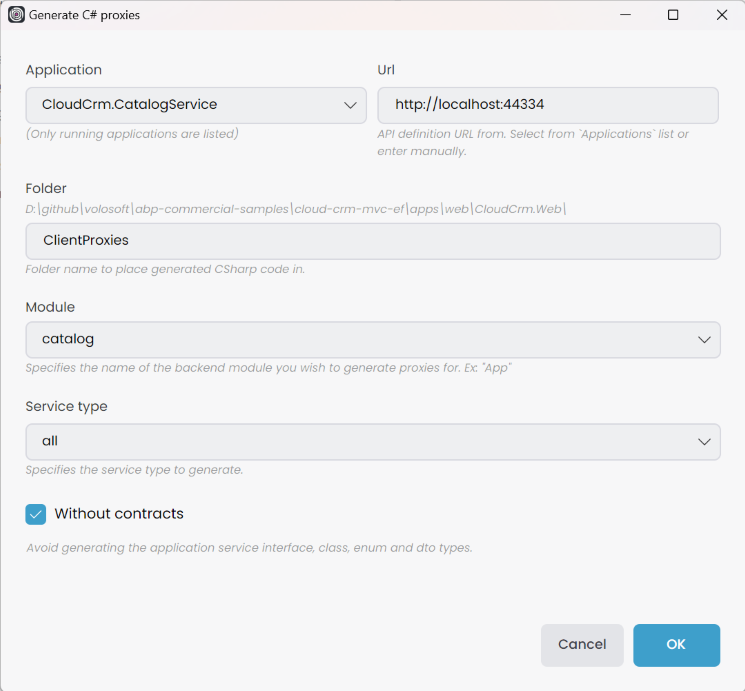

> To be able to select the *Application*, you must *Build & Start* the related application beforehand. You can start the application using [Solution Runner](../../studio/running-applications.md).

Lastly, we need to configure the use of a static HTTP client for the `CatalogService` in the `CloudCrm.Web` project. Open the `CloudCrmWebModule.cs` file in the `Web` project and add the following line to the `ConfigureServices` method:

```csharp
public override void ConfigureServices(ServiceConfigurationContext context)
{
    // Code omitted for brevity
    context.Services.AddStaticHttpClientProxies(
      typeof(CloudCrmCatalogServiceContractsModule).Assembly);
}
```

### Running the Application

Now, stop any application running in the *Solution Runner* panel, and then run the application by clicking the *Run* -> *Build & Start All* button on the root item in the *Solution Runner* panel.

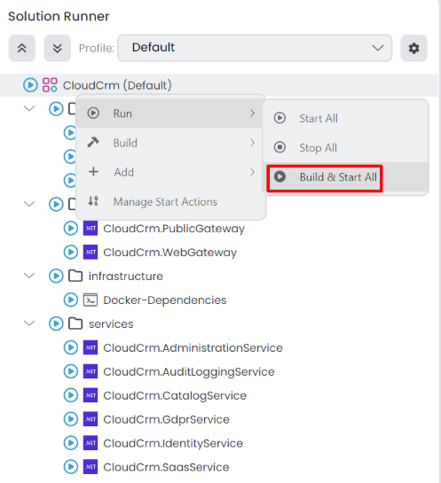

After the application is started, you can rigth-click and [Browse](../../studio/running-applications.md#monitoring) on the `CloudCrm.Web` application to open it in the ABP Studio inside browser:

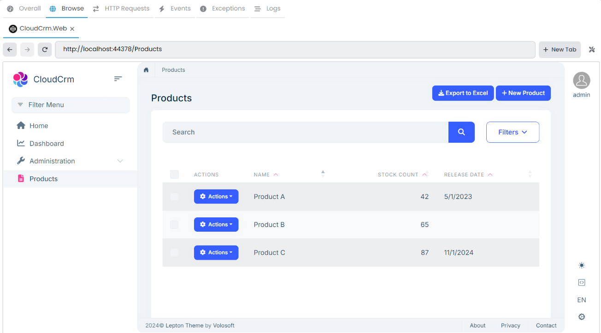

> If you can't see the *Products* menu item, you need to grant the `CatalogService` *Product* permission to the *admin* role. You can do this by navigating to *Identity Management* -> *Roles* and editing the *admin* role. Alternatively, you can restart the *CloudCrm.AdministrationService* application to automatically seed all permissions for the *admin* role.

You can open the Sql Server Management Studio to see the created tables and data:

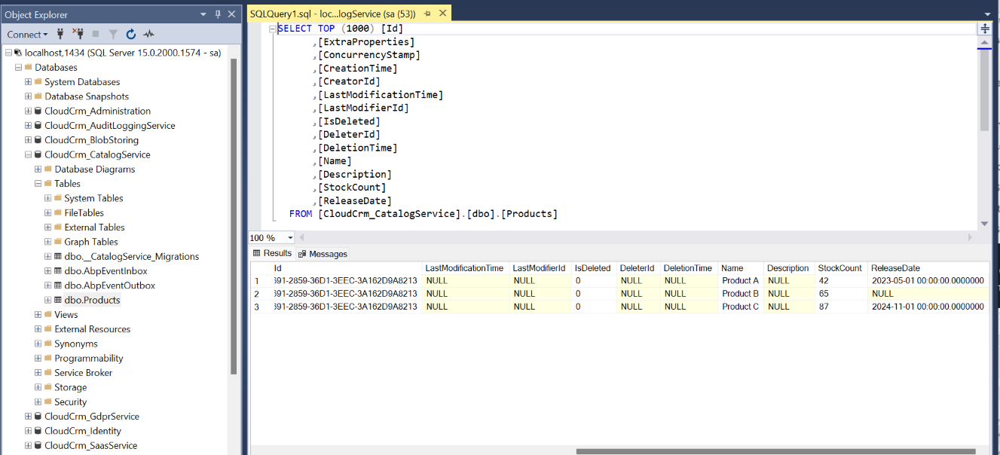

## Summary

In this part, we've created a new entity named *Product* and generated the necessary code for it. We've also generated the UI proxy for the `CatalogService` application and configured the static HTTP client for it in the `Web` project. We've run the application and tested the *Products* page.