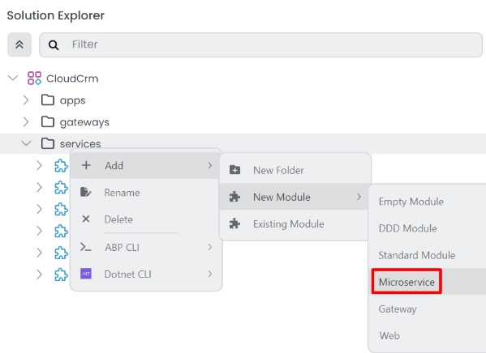
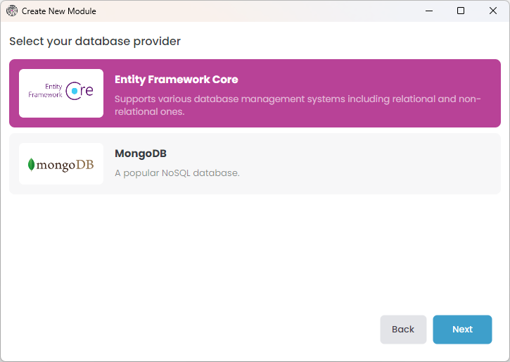
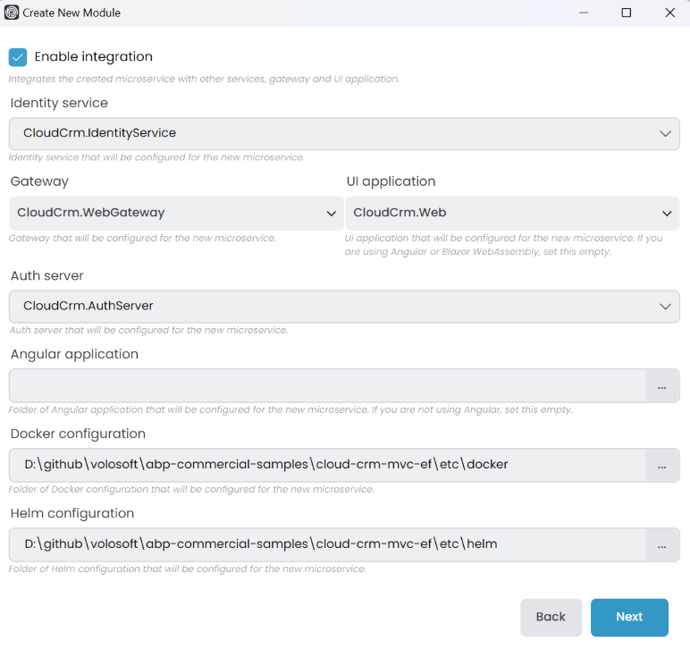
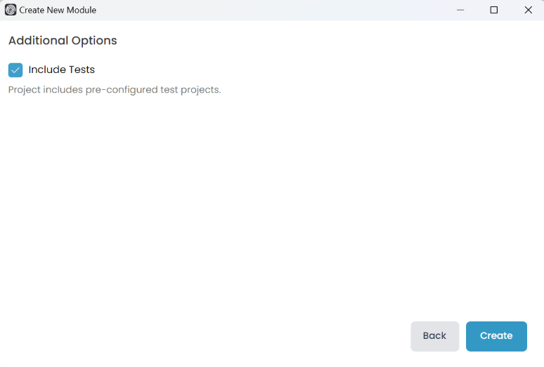
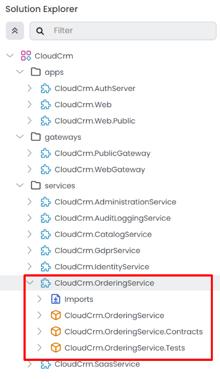
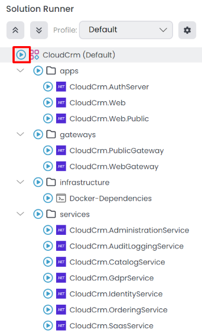
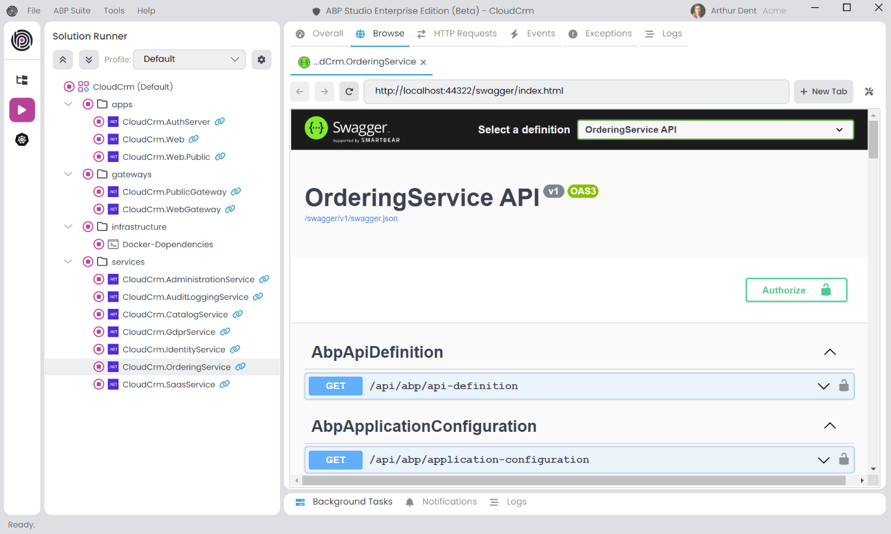
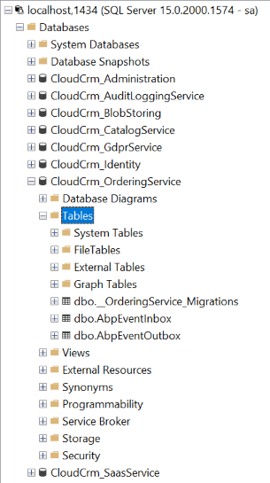

# Microservice Tutorial Part 04: Creating the initial Ordering service

````json
//[doc-nav]
{
  "Previous": {
    "Name": "Building the Catalog service",
    "Path": "tutorials/microservice/part-03"
  },
  "Next": {
    "Name": "Building the Ordering service",
    "Path": "tutorials/microservice/part-05"
  }
}
````

In the previous part, we implemented the Catalog microservice functionality using ABP Suite. In this part, we will create the Ordering microservice, and the following part will cover implementing its functionality manually.

## Creating the Ordering Microservice

Right-click the `services` folder in the *Solution Explorer* panel, select the *Add* -> *New Module* -> *Microservice* command:



This command opens a new dialog to define the properties of the new microservice. You can use the following values to create a new microservice named `OrderingService`:


When you click the *Next* button, you are redirected to the database provider selection step.

### Selecting the Database Type

Here, you can select the database provider to be used by the new microservice:



Select *Entity Framework Core* option and proceed the *Next* step.

### Integrating to the Solution

In this step, we can select the options for integrating the new microservice to the rest of the solution components:



ABP Studio intelligently selects the right values for you, but you should still check them carefully since they directly affect what we will do in the next parts of this tutorial.

**Ensure the options are configured the same as in the preceding figure**, and click the *Next* button.

### Additional Options



In this step, you can select additional options for the new microservice. You can leave them as default and click the *Create* button.

That's all, ABP Studio creates the new microservice and arranges all the integration and configuration for you.

## Exploring the New Ordering Microservice

In this section, we will investigate the new microservice in overall.

### Understanding the Solution Structure

Just like the Catalog microservice, the Ordering microservice is a .NET solution that contains multiple projects. You can see the solution structure in the *Solution Explorer* panel:



* `CloudCrm.OrderingService` is the main project that you will implement your service. It typically contains your [entities](../../framework/architecture/domain-driven-design/entities.md), [repositories](../../framework/architecture/domain-driven-design/repositories.md), [application services](../../framework/architecture/domain-driven-design/application-services.md), API controllers, etc.
* `CloudCrm.OrderingService.Contracts` project can be shared with the other services and applications. It typically contains interfaces of your [application services](../../framework/architecture/domain-driven-design/application-services.md), [data transfer objects](../../framework/architecture/domain-driven-design/data-transfer-objects.md), and some other types you may want to share with the clients of this microservice.
* `CloudCrm.OrderingService.Tests` is for building your unit and integration tests for this microservice.

### Running the New Service

You can run the solution using ABP Studio's *Solution Runner*. It will also run the new Ordering service as a part of the solution.

> Before running the solution, **ensure that all the applications are built**. If you are not sure, right-click the root item (`CloudCrm`) in the *Solution Explorer* panel and select the *Build* -> *Graph Build* command.

Click the *Play* button near to the solution root:



### Browsing the Ordering Service

After the application is started, you can right-click and [Browse](../../studio/running-applications.md#monitoring) on the `CloudCrm.OrderingService` application to open it in the ABP Studio's pre-integrated browser. You can see the *Orders* controller in the Swagger UI:



### Opening the Ordering Database

You can use the SQL Server Management Studio or any other tool to connect to the Ordering service's database. Use `localhost,1434` as the *Server name*, select the *SQL Server Authentication* as the *Authentication* type, use `sa` as the *Login* name and `myPassw@rd` as the *Password* value. You can find these values in the `appsettings.json` file in the `CloudCrm.OrderingService` project of the .NET solution of the Ordering microservice:



Similarly the Ordering service's database has only three initial table. The first one is for Entity Framework Core's migration system, and the others are for ABP's [distributed event bus](../../solution-templates/microservice/distributed-events.md) to properly apply transactional events using the outbox and inbox patterns. You don't need to care about these tables since they are created and managed by Entity Framework Core and ABP.

## Summary

In this part, we've created the initial Ordering microservice. We will implement its functionality in the next part.