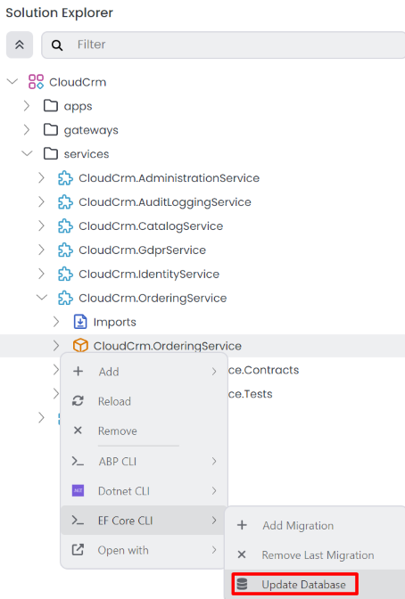
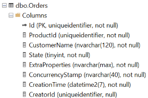

# Microservice Tutorial Part 05: Building the Ordering module

````json
//[doc-nav]
{
  "Previous": {
    "Name": "Creating the initial Ordering Microservice",
    "Path": "tutorials/microservice/part-04"
  },
  "Next": {
    "Name": "Integrating the modules: Implementing Integration Services",
    "Path": "tutorials/microservice/part-06"
  }
}
````

In the previous part, we created the Ordering microservice. In this part, we will implement the functionality of the Ordering microservice manually. We will not use ABP Suite to generate the code. Instead, we will create the necessary code step by step to understand the details better.

## Creating the Order Entity

We will start by creating the `Order` entity, which will represent an order in our system. We'll add this entity to the `CloudCrm.OrderingService` project. Open the `Entities` folder and place `Order.cs` into that folder.

```csharp
using CloudCrm.OrderingService.Enums;
using Volo.Abp.Domain.Entities.Auditing;

namespace CloudCrm.OrderingService.Entities;

public class Order : CreationAuditedAggregateRoot<Guid>
{
    public Guid ProductId { get; set; }
    public string CustomerName { get; set; }
    public OrderState State { get; set; }
}
```

To keep this example simple, we allow users to include only a single product within an order. The `Order` entity inherits from the [CreationAuditedAggregateRoot<>](../../framework/architecture/domain-driven-design/entities.md) class. This class, provided by the ABP Framework, includes common properties like `Id`, `CreationTime`, `CreatorId`, etc.

### Adding the OrderState Enum

We also need to define the `OrderState` enum. Open an `Enums` folder in the `CloudCrm.OrderingService.Contracts` project and create an `OrderState.cs` file inside it:

```csharp
public enum OrderState : byte
{
    Placed = 0,
    Delivered = 1,
    Canceled = 2
}
```

The final solution structure should look like this:


## Configuring the Database Mapping

First, we need to add the `Order` entity to the `OrderingServiceDbContext` class. Open the `OrderingServiceDbContext` class in the `CloudCrm.OrderingService` project, located in the `Data` folder, and add the following code to the `DbSet` properties:

```csharp
using CloudCrm.OrderingService.Entities;
using Microsoft.EntityFrameworkCore;
using Volo.Abp.Data;
using Volo.Abp.EntityFrameworkCore;
using Volo.Abp.EntityFrameworkCore.DistributedEvents;
using Volo.Abp.EntityFrameworkCore.Modeling;

namespace CloudCrm.OrderingService.Data;

[ConnectionStringName(DatabaseName)]
public class OrderingServiceDbContext :
    AbpDbContext<OrderingServiceDbContext>,
    IHasEventInbox,
    IHasEventOutbox
{
    public const string DbTablePrefix = "";
    public const string DbSchema = null;
    
    public const string DatabaseName = "OrderingService";
    
    public DbSet<IncomingEventRecord> IncomingEvents { get; set; }
    public DbSet<OutgoingEventRecord> OutgoingEvents { get; set; }
    public DbSet<Order> Orders { get; set; } // NEW: ADD DBSET PROPERTY

    // Code omitted for brevity
}
```

Next, we need to configure the database mapping for the `Order` entity. We'll use the [EF Core Fluent API](https://docs.microsoft.com/en-us/ef/core/modeling/relational/tables) for this configuration. In the `OrderingServiceDbContext` class add the following code to the `OnModelCreating` method:

```csharp
protected override void OnModelCreating(ModelBuilder builder)
{
    base.OnModelCreating(builder);

    builder.ConfigureEventInbox();
    builder.ConfigureEventOutbox();

    builder.Entity<Order>(b =>
    {
        // Configure table name
        b.ToTable("Orders");

        // Always call this method to set base entity properties
        b.ConfigureByConvention();

        // Properties of the entity
        b.Property(q => q.CustomerName).IsRequired().HasMaxLength(120);
    });
}
```

In this code snippet, we configure the `Order` entity to use the `Orders` table in the database. We also specify that the `CustomerName` property is required and has a maximum length of 120 characters.

### Add a Database Migration

Now, we can add a new database migration. You can use Entity Framework Core's `Add-Migration` (or `dotnet ef migrations add`) terminal command, but in this tutorial, we will use ABP Studio's shortcut UI.

Ensure that the solution has built. You can right-click the `CloudCrm.OrderingService` (under the `services` folder) on ABP Studio *Solution Explorer* and select the *Dotnet CLI* -> *Graph Build* command.

Right-click the `CloudCrm.OrderingService` package and select the *EF Core CLI* -> *Add Migration* command:


The *Add Migration* command opens a new dialog to get a migration name:


Once you click the *OK* button, a new database migration class is added to the `Migrations` folder of the `CloudCrm.OrderingService` project:


Now, you can return to ABP Studio, right-click the `CloudCrm.OrderingService` project and select the *EF Core CLI* -> *Update Database* command:



> Since we are using a Docker Compose setup, the *Docker-Dependencies* must be running to apply the migration. If it is not running, you can start it by right-clicking on the `Docker-Dependencies` [CLI application](../../studio/running-applications.md#cli-application-1) and selecting *Run* -> *Start* on the *Solution Runner*.

After the operation completes, you can check your database to see the new `Orders` table has been created:


